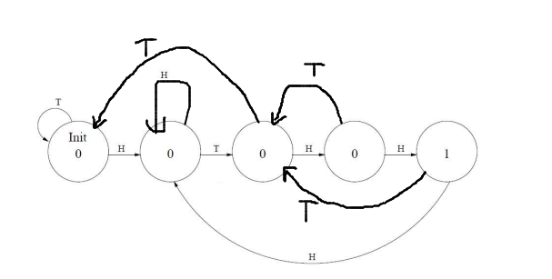

# ICS Homework 3

刘良宇 PB20000180

## T1

### (a)

100\*100\*4\*100\*4\*101\*2\*901 = 2912032000000.

2^41 < 2912032000000 < 2^42

所以至少需要 42 个 bit

### (b)

则依次对七个部分统计

总共需要 7*2+2+7+2+7+1+10 = 43 个 bit

### (c)

b 方式的编码更容易被译码

## T2

### (a)

### (b)

一共有 5 个状态，2^2 = 4 < 5 < 8 = 2^3

所以答案为 3

## T3

总内存大小：2^8 * 8 = 2^11 = 2048 字节

## T4

### (a)

选中第三个，则 A[1:0] 应该为 10

为了读取，WE（写使能） 应该为 0

### (b)

2^5 = 32 < 60 < 64 = 2^6

所以需要 6 根地址线。

但是寻址能力不变，仍然是 3 位。

### (c)

64 - 60 = 4

## T5

### (a)

地址空间： 2 位

### (b)

寻址能力：16 位

### (c)

4 * 2 = 8 bytes

### (d)

|  WE  | A[1:0] | Di[15:0] | D[15:0] | R/W  |
| :--: | :----: | :------: | :-----: | :--: |
|  0   |   01   |  xFADE   |  x4567  |  R   |
|  1   |   10   |  xDEAD   |  xDEAD  |  W   |
|  0   |   00   |  xBEEF   |  x0123  |  R   |
|  1   |   11   |  xFEED   |  xFEED  |  W   |

## T6

### (a)

2^8 = 256 > 255

至少需要 8 位

### (b)

2^7 = 128 > 120

至少需要 7 位

### (c)

32 - 8 - 3*7 = 3

## T7

N 总是会回到左上角。

## T8

|  C0  |  C1  |  C2  |  C3  |  C4  |  C5  |  C6  |  C7  |
| :--: | :--: | :--: | :--: | :--: | :--: | :--: | :--: |
|  0   |  1   |  1   |  1   |  1   |  0   |  0   |  0   |
|  0   |  1   |  1   |  0   |  0   |  1   |  1   |  0   |
|  0   |  1   |  0   |  1   |  0   |  1   |  0   |  1   |

逐位来看，可以改变时钟频率

整体是一个模 8 （自减）计数器。
