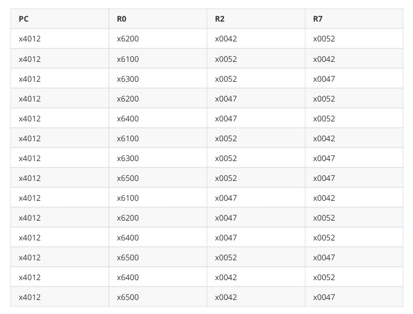
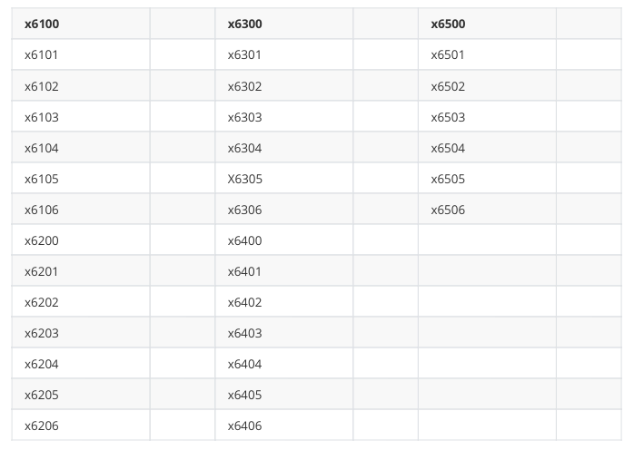

ICS Homework 5

&nbsp;
&nbsp;

 PB20000180 刘良宇

&nbsp;
&nbsp;

本文档是 2021 秋 ICS CS1002A.01 的第五次作业。

## t1

数组中的每一个数都相同。

## t2

没有递归出口。（例如 R0 = 1 则 RET）

## t3

在 R3 中存储一共有多少个奇数。

## t4

> 如果相邻的城市用不同的颜色着色，则更容易在地图上识别城市之间的边界。例如，在德克萨斯州的地图中，不会用相同的颜色为奥斯汀和普弗鲁格维尔上色，因为这样做会掩盖两个城市之间的边界。
>
> 下面显示的是递归函数 EXAMINE。EXAMINE 会检查代表地图的数据结构，以查看是否有任何一对相邻的城市具有相同的颜色。数据结构中的每个节点都包含城市的颜色和与它接壤的城市的地址。如果任意相邻城市颜色均不同，则 EXAMINE 通过 R1 返回 0。反之，EXAMINE 通过 R1 返回 1。主程序在执行 `JSR EXAMINE` 之前已经将其中一个城市的节点的地址存储在了 R0 中。

在执行 JSR EXAMINE 之前，R0 为 x6100（其中一个节点的地址），程序在 x4012 处设置了断点。下表显示了 EXAMINE 运行过程中每次遇到断点时的相关信息：

你的工作是构建表示该图的数据结构在执行完 EXAMINE 后的内存值，并填入到表内：

### 答案

分析遇到断点时：R2 是当前结点的颜色，R0 是当前访问的邻居结点的地址，R7 是当前正在访问的邻居结点的颜色。

首先对 R0 和 R7 分析，建立每个结点对应的颜色表：

| 结点  | 颜色  |
| :---: | :---: |
| x6100 | x0042 |
| x6200 | x0052 |
| x6300 | x0047 |
| x6400 | x0052 |
| x6500 | x0047 |

由于是图上的 DFS 搜索，下面即可分析结点访问次序：

x6100

x6100 - x6200

x6100 - x6200 - x6100

x6100 - x6200 - x6300

x6100 - x6200 - x6300 - x6200

x6100 - x6200 - x6300 - x6400

x6100 - x6200 - x6300 - x6400 - x6100

x6100 - x6200 - x6300 - x6400 - x6300

x6100 - x6200 - x6300 - x6400 - x6500

x6100 - x6200 - x6300 - x6400 - x6500 - x6100

x6100 - x6200 - x6300 - x6400 - x6500 - x6200

x6100 - x6200 - x6300 - x6400 - x6500 - x6400

x6100 - x6200 - x6500

x6100 - x6400

x6100 - x6500

于是即可填写下表。

| 内存  |  值   |   /   |   /   |   /   |   /   |
| :---: | :---: | :---: | :---: | :---: | :---: |
| x6100 | x8000 | x6300 | x8000 | x6500 | x8000 |
| x6101 | x6200 | x6301 | x6200 | x6501 | x6100 |
| x6102 | x0052 | x6302 | x0052 | x6502 | x0042 |
| x6103 | x6400 | x6303 | x6400 | x6503 | x6200 |
| x6104 | x0052 | x6304 | x0052 | x6504 | x0052 |
| x6105 | x6500 | x6305 | x0000 | x6505 | x6400 |
| x6106 | x0047 | x6306 |  Any  | x6506 | x0052 |
| x6200 | x8000 | x6400 | x8000 |       |       |
| x6201 | x6100 | x6401 | x6100 |       |       |
| x6202 | x0042 | x6402 | x0042 |       |       |
| x6203 | x6300 | x6403 | x6300 |       |       |
| x6204 | x0047 | x6404 | x0047 |       |       |
| x6205 | x6500 | x6405 | x6500 |       |       |
| x6206 | x0047 | x6406 | x0047 |       |       |

## t5

> 下面的程序，在插入两条缺失的指令后，将检查存储在连续顺序内存位置中的正整数列表，并将最小的一个存储在位置 x4000 中。列表中的整数数量包含在内存位置 x4001 中。列表本身从内存位置 x4002 开始。假设列表不为空（即 x4001 的内容不是 0） 

- ADD R0, R3, #0	; now min = R3
- BRp AGAIN			; next

## t6

> 补全缺失的指令到检测回文串的程序中。在这个程序中，我们的输入字符串保证只有小写字母。该程序将同时使用栈和队列。访问栈和队列的子程序如下所示。 
>
> 程序分为两个阶段：第一个阶段允许用户输入一个字符串，回车键结束（假定输入不超过 20 个字符），此时每个字符的 ASCII 码值会被压入栈中，同时其相反数会入队。
>
> 第二个阶段将通过出栈和出队操作判断字符串是否回文。

分析可知：R0 用于栈/队列操作时 pop/push 的值，R4 是队头指针，R5 是队尾指针，R6 是栈指针。

下面补全：

- LEA R0, PROMPT
- ADD R2, R0, R1
- NOT R0, R0
- ADD R0, R0, #1
- ADD R1, R0, #0
- ADD R3, R3, #-1
- BRz TRUE
