<div style="text-align:center;font-size:2em;font-weight:bold">中国科学技术大学计算机学院</div>


<div style="text-align:center;font-size:2em;font-weight:bold">《数字电路实验报告》</div>


<div style="display: flex;flex-direction: column;align-items: center;font-size:2em">
<div>
<p>实验题目：简单组合逻辑电路</p>
<p>学生姓名：刘良宇</p>
<p>学生学号：PB20000180</p>
<p>完成时间：2021. 10. 28</p>
</div>
</div>


<div style="page-break-after:always"></div>


## 实验题目

本次实验我们将进一步使用 Logisim 设计组合逻辑电路，并使用Verilog 语言对设计的电路进行描述。

Logisim 可以用来搭建数字逻辑电路并对其功能进行仿真，有助于初学者直观的掌握电路原理及内部构造以达到快速入门的目的，是一款非常实用的教学工具，但是它的功能仅限于仿真，是对实际电路行为的模拟，而不是真真正正的电路。为了将设计的电路切实的在硬件上运行，我们还需要借助硬件描述语言、综合工具、硬件平台的支持。本次实验中我们会介绍到一种叫做 Verilog HDL 的硬件描述语言，工具及平台我们会通过后续的课程逐步介绍。

## 实验目的

- 熟练掌握 Logisim 的基本用法

- 进一步熟悉 Logisim 更多功能

- 用 Logisim 设计组合逻辑电路并进行仿真

- 初步学习 Verilog 语法

## 实验环境

- PC 一台,能流畅的连接校园网

- Logisim 仿真工具
  
- vlab.ustc.edu.cn

## 实验过程

### Step1：用真值表自动生成电路

用户可以使用 Logisim 管理窗中的各种组件以及自己设计的子电路，设计出各种功能的组合逻辑电路，但是在搭建电路时大量的拖拽、布局、连线非常费时费力，这里介绍一种通过真值表生成电路的方法。

首先在 Logisim 中新建一个电路图，命名为“生成电路”（电路名可以任取），然后再电路图中放置输入脚，有几个输入就放几个引脚，按同样的方式放置输出引脚。放置完毕后，给所有引脚标上标号，并按高低位顺序排列。

在菜单栏的“Project”选项卡中找到“Analyze Circuit”选项，并选中。在弹出的窗口中选择“Table”选项，按照前面的真值表修改输出值（鼠标点击输出信号对应的叉号就可修改），最后点击“Build Circuit”便可生成电路（弹出的对话框都选择“是”）。

例如：对于真值表：


| 输入 | 输出 |
| :--: | :--: |
| 0001 | 1010 |
| 0011 | 0111 |
| 1010 | 0011 |
| 1011 | 0110 |
| 1111 | 0101 |

按照如上步骤在 Logisim 中操作后，即可得到逻辑电路：

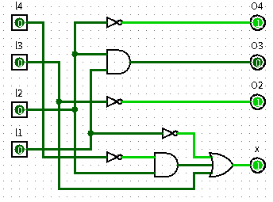

### Step2：用表达式生成电路

我们可以在 Logisim 中直接输入表达式生成电路，在“Project”--> “Analyze Circuit”的弹出窗口中选择“Expression”选项，填入每个输出信号的表达式。最后点击“Build Circuit”生成电路。有时候手动输入的表达式并不是最简形式，最终生成的电路也会占用较多的逻辑门，我们可以借助“Minimized”选项卡对表达式进行简化，进而减少电路使用的逻辑门数量，电路输入信号不多的情况下，该窗口还能显示卡诺图。

对实验报告中的表达式生成电路得：

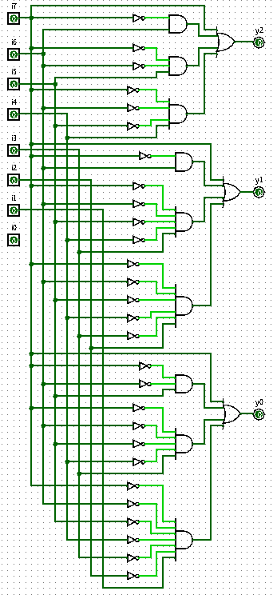

我们还可以通过“Project”--> “Get Circuit Statistics”选项统计电路的基本信息。

Logisim 的自动生成电路功能，能为用户带来便利，节省大量时间，但也有一点小小的不足，其输入输出信号必须是单 bit 位宽，对于多 bit 位宽的输入信号并不支持，需要将其拆分成多个单 bit 信号才可以。

### Step3：Verilog HDL 语法入门

下面我们通过对照 Logisim 中设计的简单电路来学习 Verilog 语法。

这里给出了三个示例：

#### 例1.

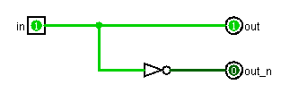

对应的 Verilog HDL 语言描述为：

```verilog
module test (		// 模块名称
input in,		// 输入信号声明
output out,		// 输出信号声明
output out_n);
    
	// 下面是逻辑描述部分
	assign out = in;
	assign out_n = ~in;
    
endmodule // 模块名结束关键词
```

上述代码虽然简单，但包含了 Verilog 模块的最基本结构。

```verilog
module 模块名(
	输入端口声明,
	输出端口声明);
	内部信号声明<可选>;
    
	逻辑描述（模块主体）
endmodule
```

任何一个有实际功能的电路都应该有输入输出，但也存在例外，比如后续讲到对电路进行仿真时，其仿真激励文件一般就没有输入输出信号。

如果模块功能较复杂的话，可能会用到一些中间信号，那就要在模块内部声明，此例中没有用到，所以没有声明。

逻辑描述部分是每个模块的主体，用于描述该电路的行为特性，其语法还算简单，相信读者可很容易就能看懂。这里用到了一个非常重要的关键字“assign”，该关键字放在逻辑表达式之前，用于表明后面是一条连续赋值语句，一般来说，对组合逻辑的赋值都可以使用该关键字实现。

#### 例2.

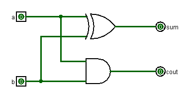

这是一个半加器。

Verilog 内部已经封装了加法，所以从行为级描述得到的 Verilog 代码如下：

```verilog
module add(
input a,b,
output sum,cout);
    
    assign {cout,sum} = a + b;
endmodule
```

这里的大括号是位拼接符号。将两个单 bit 的信号拼接成了一个 2bit 信号，用于接收相加的结果。

#### 例3.

利用前面例子中所设计的半加器，构造一个如图所示的全加器。

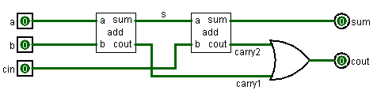

本例中用到了内部信号声明，关键字 wire 表明声明的信号为线网类型，对于这种信号类型，可以简单的理解为电路中的导线，可以通过 assign 关键字进行赋值的信号都是这种类型， wire 类型是 Verilog 中的默认类型，凡是没有明确声明类型的信号，都被当作 wire 类型处理。

例 2 中的半加器在这里可以作为一个模块被调用。

对应 Verilog 代码如下：

```verilog
module full_add(
input a,b,cin,
output sum,cout);
    
    wire s,carry1,carry2;
    
    add add_inst1(.a(a),.b(b),.sum(s),.cout(carry1));
    add add_inst2(.a(s),.b(cin),.sum(sum),.cout(carry2));
    assign out = carry1 | carry2;
endmodule
```

在本例中，我们调用了两个半加器，以实现全加器的功能，其中 add 为被调用模块的模块名，此名称不可随意改动，必须与被调用模块的名称完全一致，add_inst1、add_inst2 为实例化称，该名称可自行指定。add 模块被实例化了两次，那在最终的电路中就会实实在在的出现两个半加器，它们的行为特性完全一样，只不过各自的输入输出信号不同，工作时也相互独立，互不影响。

从这里我们就能体会到模块调用的好处。

## 实验练习

### 题目1

依据如下真值表，通过 Logisim 编辑真值表功能，完成电路设计。电路下方需标注姓名学号。

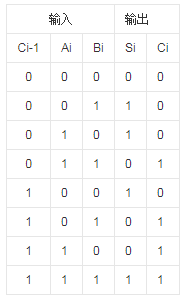

与上述实验步骤类似，在 Logisim 中操作后得到：

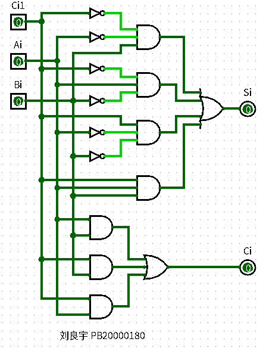

### 题目2

根据下列真值表，通过 Logisim 的编辑表达式功能完成电路设计，电路下方需标注姓名学号。

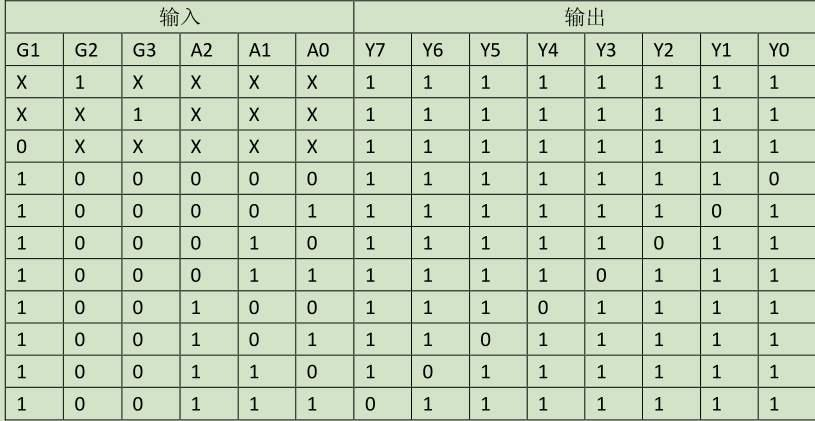

化简表达式：

Y7=~(G1 ~G2 ~G3 A2 A1 A0)

Y6=~(G1 ~G2 ~G3 A2 A1 ~A0)

Y5=~(G1 ~G2 ~G3 A2 ~A1 A0)

Y4=~(G1 ~G2 ~G3 A2 ~A1 ~A0)

Y3=~(G1 ~G2 ~G3 ~A2 A1 A0)

Y2=~(G1 ~G2 ~G3 ~A2 A1 ~A0)

Y1=~(G1 ~G2 ~G3 ~A2 ~A1 A0)

Y0=~(G1 ~G2 ~G3 ~A2 ~A1 ~A0)

导入后即得：

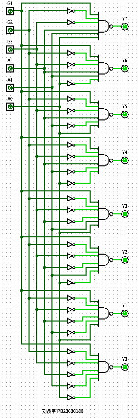

### 题目3

使用 Logisim 绘制 1bit 位宽的二选一选择器电路图，并根据生成的电路图编写 Verilog 代码。输入信号为 a,b,sel，输出信号为 out, sel 为 0 时选通 a 信号。

电路图如图所示：

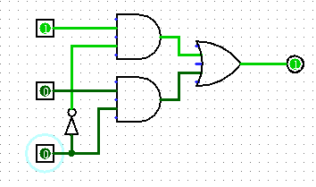

输入从上到下依次为 a, b, sel 。输出为 out。

下面编写 Verilog 代码：

```verilog
module select(
input a,b,sel,
output out);
    
    wire and1,and2,not1;
    
    not(not1,sel);
    and(and1,a,not1);
    and(and2,b,sel);
    assign out = and1 | and2;
    
endmodule
```

### 题目4

通过例化题目 3 中的二选一选择器，用 Verilog 实现一个四选一选择器，并画出对应的电路图。信号为 a,b,c,d,sel1,sel0,out 。当 sel1 和 sel0 都为 0 时选中 a 信号。

画出电路图如下：

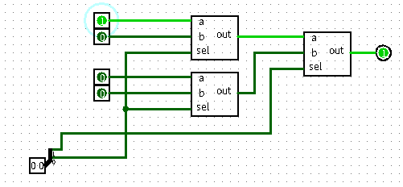

输入从上到下为 a, b, c, d

Verilog 代码如下：

```verilog
module select4(
input a,b,c,d,sel1,sel0,
output out);
    
    wire out1,out2;
    select select_inst1(.a(a),.b(b),.sel(sel0),.out(out1));
    select select_inst2(.a(c),.b(d),.sel(sel0),.out(out2));
    select select_inst3(.a(out1),.b(out2),.sel(sel1),.out(out));
    
endmodule
```

### 题目5

根据前面用到的八位优先编码器真值表，编写 verilog 代码。

因为表达式：

y2 = i7 + ~i7 i6 + ~i7 ~i6 i5 + ~i7 ~i6 ~i5 i4

y1 = i7 + ~i7 i6 + ~i7 ~i6 ~i5 ~i4 i3 + ~i7 ~i6 ~i5 ~i4 ~i3 i2

y0 = i7 + ~i7 ~i6 i5 + ~i7 ~i6 ~i5 ~i4 i3 + ~i7 ~i6 ~i5 ~i4 ~i3 ~i2 i1

所以可以据此编写 Verilog 代码如下：

```verilog
module encode(
input i7,i6,i5,i4,i3,i2,i1,i0;
output y2,y1,y0);
    
    assign y2 = i7 | ~i7 & i6 | ~i7 & ~i6 & i5 | ~i7 & ~i6 & ~i5 & i4;
    assign y1 = i7 | ~i7 & i6 | ~i7 & ~i6 & ~i5 & ~i4 & i3 | ~i7 & ~i6 & ~i5 & ~i4 & ~i3 & i2;
    assign y0 = i7 | ~i7 & ~i6 & i5 | ~i7 & ~i6 & ~i5 & ~i4 & i3 | ~i7 & ~i6 & ~i5 & ~i4 & ~i3 & ~i2 & i1;
    
endmodule
```

### 题目6

阅读如下 Verilog 代码，描述其功能，并画出其对应的电路图。

```verilog
module test(
input a,b,c,
output s1,s2);
    
	assign s1= ~a &~b & c | ~a & b &~c | a &~b &~c | a & b & c;
	assign s2= ~a & b & c | a &~b & c | a & b &~c | ~a &~b &~c;
    
endmodule
```

注意到 ：

s1 取 1 $\Longleftrightarrow$ 取 1 的输入有奇数个

s2 取 1 $\Longleftrightarrow$ 取 1 的输入有偶数个

故：

$S1 = a\oplus b\oplus c$

$S2 = \overline{a\oplus b\oplus c}$

s1 可以用来描述全加器的输出 sum

电路：

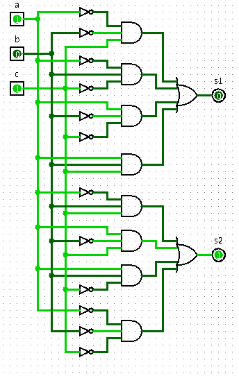

也即为：

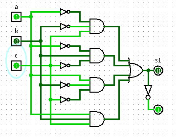

## 总结与思考

- 收获：基本熟练掌握 Logisim 的基本用法，进一步熟悉 Logisim 更多功能用 Logisim 设计组合逻辑电路并进行仿真，初步学习 Verilog 语法。
- 难易程度：适中
- 任务量：重复性操作有点多，比如利用表达式生成电路图。