<div style="text-align:center;font-size:2em;font-weight:bold">中国科学技术大学计算机学院</div>


<div style="text-align:center;font-size:2em;font-weight:bold">《数字电路实验报告》</div>


<div style="display: flex;flex-direction: column;align-items: center;font-size:2em">
<div>
<p>实验题目：简单时序逻辑电路</p>
<p>学生姓名：刘良宇</p>
<p>学生学号：PB20000180</p>
<p>完成时间：2021. 11. 04</p>
</div>
</div>


<div style="page-break-after:always"></div>


## 实验题目

本次实验我们将使用 Logisim 设计简单时序电路，并学习用 Verilog 语言描述简单时序逻辑电路。

## 实验目的

- 掌握时序逻辑相关器件的原理及底层结构

- 能够用基本逻辑门搭建各类时序逻辑器件

- 能够使用 Verilog HDL 设计简单逻辑电路

## 实验环境

- vlab.ustc.edu.cn

- Logisim

- verilogoj.ustc.edu.cn

## 实验过程

### Step1：搭建双稳态电路

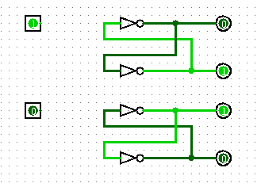

如图搭建即可。

### Step2：搭建 SR 锁存器

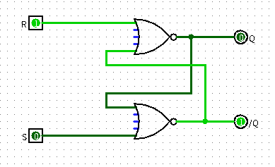

如图搭建即可。

### Step3：搭建 D 锁存器

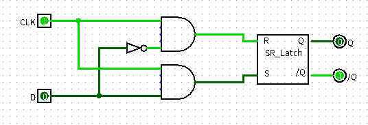

如图搭建即可。

### Step4：搭建 D 触发器

下面依次给出 D 触发器，同步复位 D 触发器，异步复位 D 触发器的搭建方式。

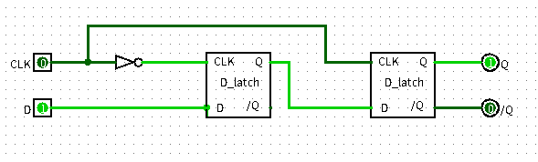

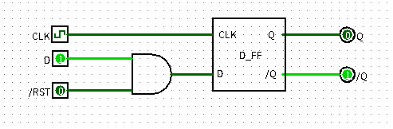

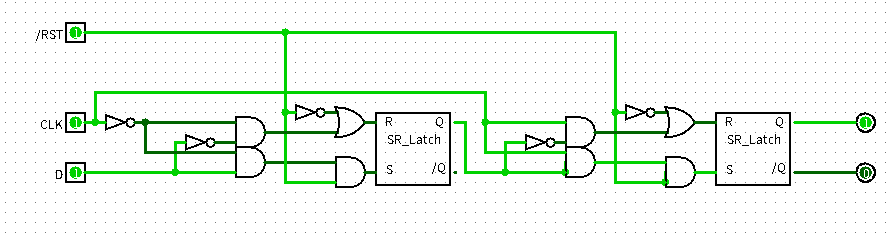

### Step5：搭建寄存器

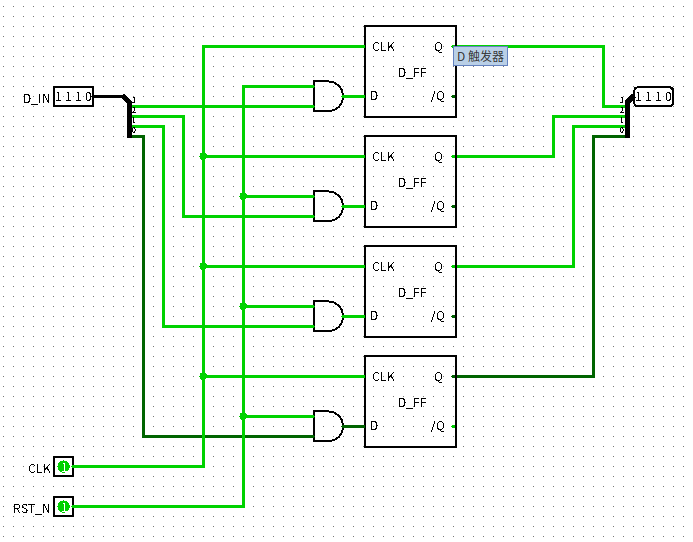

如果复位值不为 0，只要把对应的与门改为或门，并在或门前对 RST_N 信号取反即可。

### Step6：搭建简单时序逻辑电路

如图所示：

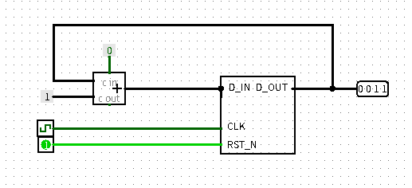

## 实验练习

### 题目 1.

在 Logisim 中用与非门搭建 SR 锁存器，画出电路图，并分析其行为特性，列出电路在不同输入时的状态。

如图所示：

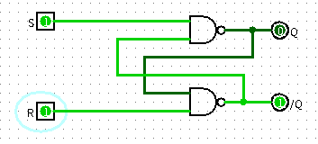

- 当 $S=1$ , $R = 0$ 时，电路置 0
- 当 $S=0$ , $R = 1$ 时，电路置 1
- 当 $S=1$ , $R = 1$ 时，电路保持之前状态
- 当 $S=0$ , $R = 0$ 时，Q 和 $\overline{Q}$ 都为 1，应该避免出现此状态

### 题目 2.

在 Logisim 中搭建一个支持同步置位功能的 D 触发器，画出其电路图，并编写对应的 Verilog 代码。

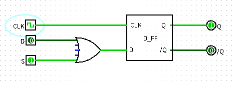

如图所示。对应 Verilog 代码如下：

```verilog
module DFF_S(
input CLK, D, S,
output reg Q);
    always@(posedge CLK)
    begin
        if(S == 1'b1)
            Q <= 1;
        else
            Q <= D;
    end
endmodule
```

### 题目 3.

在 Logisim 中搭建一个带有异步复位功能的 D 触发器，画出其完整电路图，并进一步调用该触发器设计一个从 0~15 循环计数的 4bit 计数器（可使用 Logisim 中的加法器模块，也可自行设计计数器），写出计数器的 Verilog 代码。

异步复位 D 触发器电路图已经在 [实验步骤 4](#Step4：搭建 D 触发器) 中体现。

Verilog 代码：

```verilog
module d_ff_r(
input clk,rst_n,d,
output reg q);
	always@(posedge clk or negedge rst_n)
	begin
		if(rst_n==0)
			q <= 0;
		else
			q <= d;
	end
endmodule
```

下面调用该触发器设计循环计数器。

先设计寄存器：

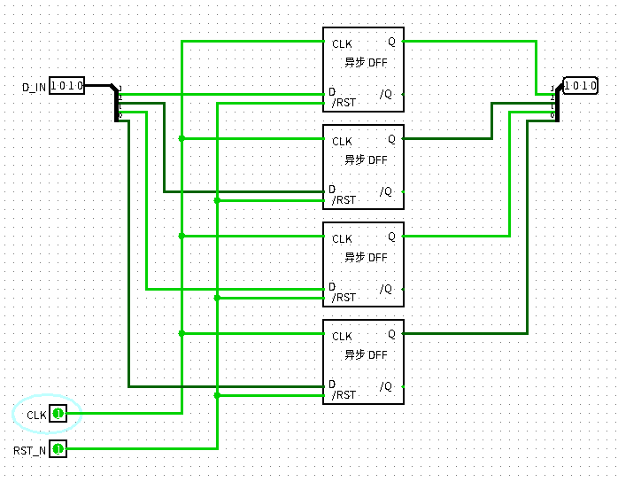

然后得计数器：

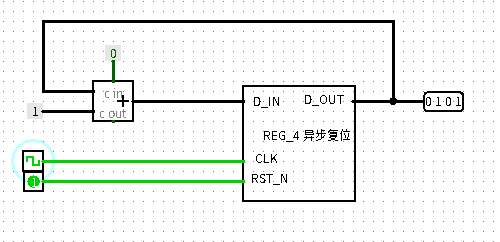

Verilog 代码如下：

```verilog
module CTR_R(
input CLK, R_n,
output reg [3:0] CNT);
    always@(posedge CLK or negedge R_n)
    begin
        if(R_n == 0)
            CNT <= 0;
        else
            CNT <= CNT + 1;
    end
endmodule
```

### 题目 4.

在 Logisim 中搭建一个 9~0 循环递减的计数器，复位值为 9，每个周期减一（可使用 Logisim 中的减法器模块，也可自行设计计数器），画出电路图，进行正确性测试，并写出其对应的 Verilog 代码。

首先对同步复位寄存器修改默认复位的值：

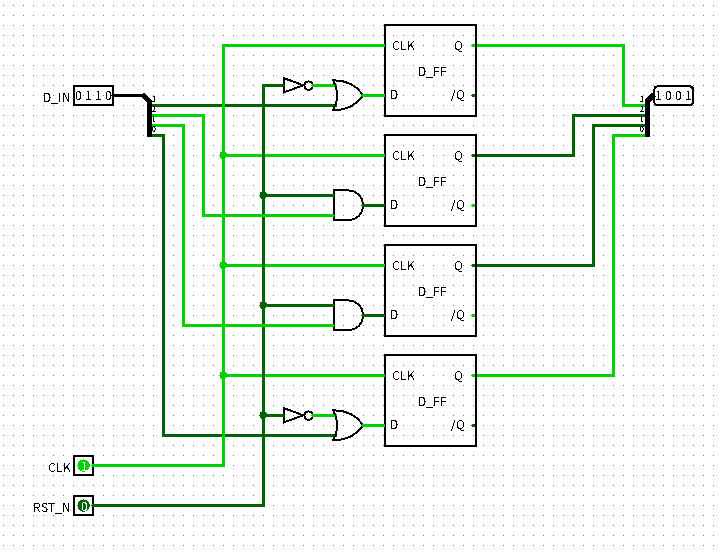

然后即可设计计数器：

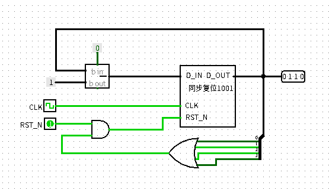

对应 Verilog 代码如下：

```verilog
module REG(
input CLK, R, [3:0] D,
output reg [3:0] CNT);
    always@(posedge CLK)
    begin
        if(R == 0 || D == 4'b0000)
            CNT <= 4'b1001;
        else
            CNT <= CNT - 1;
    end
endmodule
```

### 题目 5.

手册中给出的示例电路的复位信号都是低电平有效，如要使
复位信号高电平有效，应如何实现？试用 Logisim 画出一个示例电路，
并编写 Verilog 代码。

以之前的同步复位 D 触发器为例：在本身的电路的基础上，将复位信号后加一个非门即可，电路图如下：

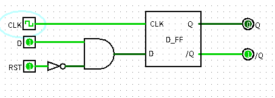

对应 Verilog 代码如下：

```verilog
module d_ff_r(
input clk,rst,d,
output reg q);
	always@(posedge clk)
	begin
        if(rst == 1)
			q <= 0;
		else
			q <= d;
	end
endmodule
```

## 总结与思考

- 经过本次实验，我基本掌握时序逻辑相关器件的原理及底层结构，能够用基本逻辑门搭建各类时序逻辑器件，能够使用 Verilog HDL 设计简单逻辑电路。
- 本次实验的难度相比之前稍有增加，但总体难度合理。
- 本次试验任务量较大。
- 建议：
  - 实验部分进度与理论课进度协调一致，如本次实验中计数器和寄存器的内容领先了理论课。
  - 第五题建议口头回答即可。
