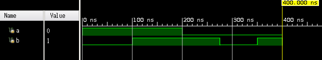
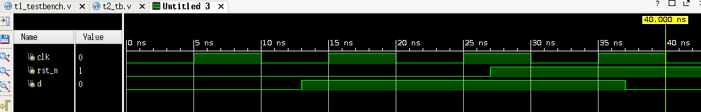
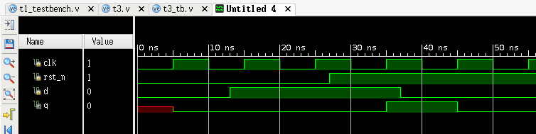
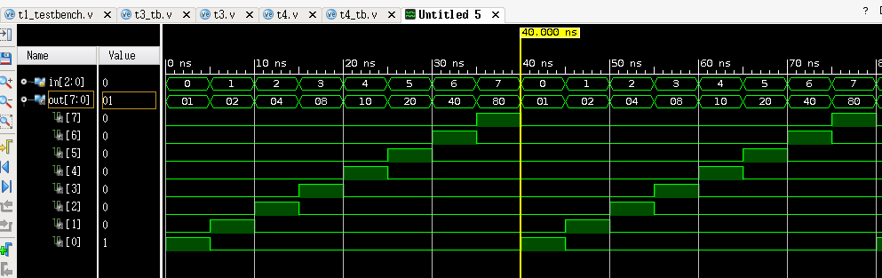

<div style="text-align:center;font-size:2em;font-weight:bold">中国科学技术大学计算机学院</div>


<div style="text-align:center;font-size:2em;font-weight:bold">《数字电路实验报告》</div>


<div style="display:flex;justify-content:center;font-size:2em">
<div>
<p>实验题目：使用 Vivado 进行仿真</p>
<p>学生姓名：刘良宇</p>
<p>学生学号：PB20000180</p>
<p>完成时间：2021. 11. 18</p>
</div>
</div>


<div style="page-break-after:always"></div>

## 实验题目

用 Verilog 完成电路的编码工作以后，如何确保电路功能正确呢？直接使用 Vivado 工具进行综合，并烧写到实验平台是一种最直接的办法。

但是这种做法效率并不高，首先 Vivado 工具的综合过程比较慢，再者如果电路功能不正确，也无法快速定位问题所在，随着电路复杂度的增加，这一情况会更加凸显。

因此我们更加推荐的是先通过 Vivado 提供的仿真功能对电路进行仿真。

用 Vivado 进行仿真与用 Logisim 验证电路功能大体步骤思想类似，主要分为编写 Verilog 代码，编写 Verilog 仿真文件，以及在 Vivado 中观察波形

## 实验目的

- 熟悉 Vivado 软件的下载、安装及使用

- 学习使用 Verilog 编写仿真文件

- 学习使用 Verilog 进行仿真，查看并分析波形文件

## 实验环境

- PC 一台

- vlab.ustc.edu.cn

- Vivado 工具

## 实验练习

### 题目 1.

请编写 Verilog 仿真文件，生成如题图所示的波形，并在 Vivado 中进行仿真。

观察波形，写出仿真文件：

```verilog
`timescale 1ns / 1ps

module t1_tb();
    reg a,b;
    initial begin
        a = 1;b = 0; #100
        a = 1;b = 1; #100
        a = 0;b = 1; #75
        a = 0;b = 0; #75
        a = 0;b = 1; #50
        $finish;
    end
endmodule
```

仿真波形图如下：

### 题目 2.

请编写 Verilog 仿真文件，生成如题图所示的波形，并在 Vivado 中进行仿真。

观察波形，写出仿真文件：

```verilog
`timescale 1ns / 1ps

module t2_tb();
    reg clk, rst_n,d;
    initial begin
        clk            = 0;
        forever #5 clk = ~clk;
    end
    initial begin
        rst_n = 0; #27
        rst_n = 1;
    end
    initial begin
        rst_n = 0; #27
        rst_n = 1;
    end
    initial begin
        d = 0; #13
        d = 1; #24
        d = 0;
    end
endmodule
```

仿真波形图如下：



### 题目 3.

利用题目 2 中的信号作为以下代码的输入，在 Vivado 中对其仿真，并观察仿真波形。

```verilog
module d_ff_r(input clk,
              rst_n,
              d,
              output reg q);
    always@(posedge clk)
    begin
        if (rst_n == 0)
            q <= 1'b0;
        else
            q <= d;
    end
endmodule
```

按照题目说明，仿真文件编写如下：

```verilog
module t3_tb();
    reg clk, rst_n, d;
    wire q;
    d_ff_r d1(.clk(clk),.rst_n(rst_n),.d(d),.q(q));
    initial begin
        clk            = 0;
        forever #5 clk = ~clk;
    end
    initial begin
        rst_n = 0; #27
        rst_n = 1;
    end
    initial begin
        rst_n = 0; #27
        rst_n = 1;
    end
    initial begin
        d = 0; #13
        d = 1; #24
        d = 0;
    end
endmodule
```

也即增加了 `wire` 型变量 q，然后对 `d_ff_r` 实例化。

波形如图所示：



### 题目 4.

设计一个 3-8 译码器，编写仿真测试文件，在 Vivado 中对其进行仿真。要求仿真时遍历所有的输入情况组合，给出源代码和仿真截图。

首先需要设计一个 3-8 译码器：

```verilog
module decode_3_8 (input [2:0] in,
                   output [7:0] out);
    assign out[0] = ~in[2]&~in[1]&~in[0];
    assign out[1] = ~in[2]&~in[1]&in[0];
    assign out[2] = ~in[2]&in[1]&~in[0];
    assign out[3] = ~in[2]&in[1]&in[0];
    assign out[4] = in[2]&~in[1]&~in[0];
    assign out[5] = in[2]&~in[1]&in[0];
    assign out[6] = in[2]&in[1]&~in[0];
    assign out[7] = in[2]&in[1]&in[0];
endmodule
```

然后编写测试文件：

```verilog
module t4_tb();
    reg [2:0] in;
    wire [7:0] out;
    decode_3_8 d(.in(in),.out(out));
    initial begin
        in            = 3'b000;
        forever #5 in = in + 1;
    end
    initial begin
    end
endmodule
```

可以得出波形图：



## 总结与思考

- 本次实验让我熟悉 Vivado 软件的下载、安装及使用，学习使用 Verilog 编写仿真文件，学习使用 Verilog 进行仿真，查看并分析波形文件

- 本次实验难易程度适中。

- 本次实验任务量适中。

- 改进建议：无。