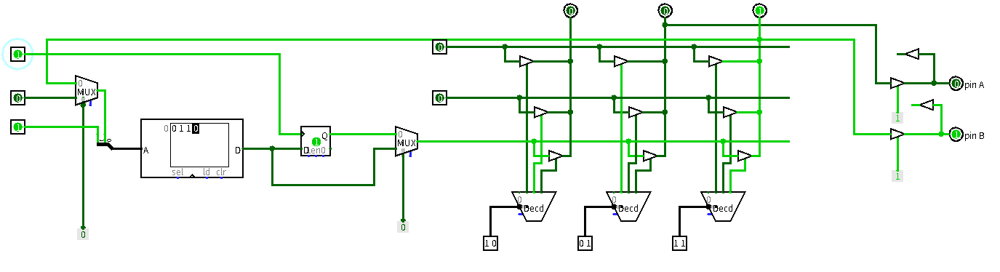
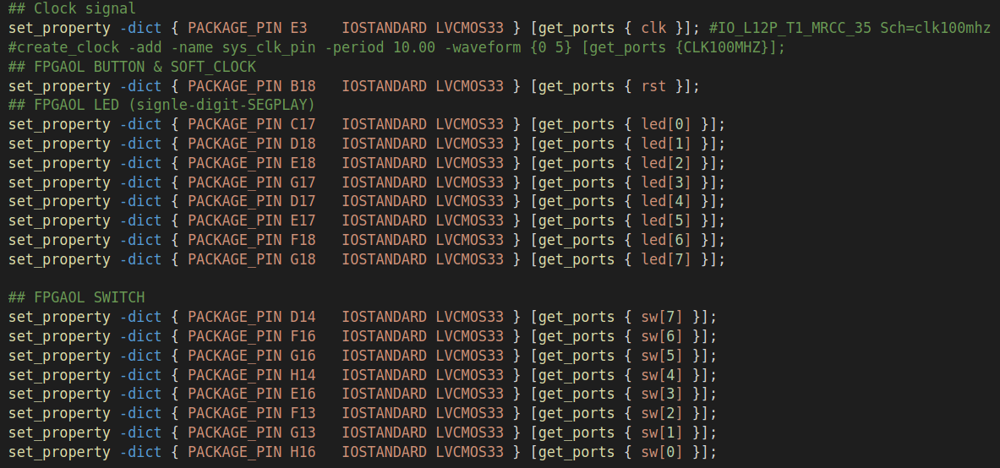
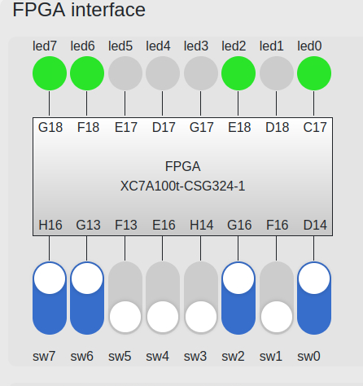

<div style="text-align:center;font-size:2em;font-weight:bold">中国科学技术大学计算机学院</div>


<div style="text-align:center;font-size:2em;font-weight:bold">《数字电路实验报告》</div>


<div style="display:flex;justify-content:center;font-size:2em">
<div>
<p>实验题目：FPGA 原理及 Vivado 综合</p>
<p>学生姓名：刘良宇</p>
<p>学生学号：PB20000180</p>
<p>完成时间：2021. 11. 23</p>
</div>
</div>


<div style="page-break-after:always"></div>

## 实验题目

前文说到过,电路设计的最终目标是运行,本课程所设计的电路最终运行载体是 FPGA 实验平台,FPGA 中文名为现场可编程逻辑门阵列,是目前最为流行的一种可编程逻辑器件,本次实验我们将学习FPGA 的基本工作原理,并通过 Logisim 搭建一个最基本的 FPGA 原型,力图使读者明白为何这种器件能够实现硬件编程。

## 实验目的

- 了解 FPGA 工作原理

- 了解 Verilog 文件和约束文件在 FPGA 开发中的作用

- 学会使用 Vivado 进行 FPGA 开发的完整流程

## 实验环境

- VLAB 平台: vlab.ustc.edu.cn

- FPGAOL 实验平台:fpgaol.ustc.edu.cn

- Logisim

- Vivado 工具

## 实验练习

### 题目 1

请通过实验中给出的可编程逻辑单元、交叉互连矩阵及 IOB 电路图，实现如下代码，并将其输出到引脚 B 上。给出配置数据和电路截图。

```verilog
module test(input clk,
            output reg a);
    always@(posedge clk)
        a <= a ^ 1'b1;
endmodule
```

这里对原电路略做更改：第三个输出端对应引脚 B ，所以应该由它给予反馈信号。按要求改变配置数据后（见电路图中），即可实现上述的代码功能。

电路图：



### 题目 2.

实验中的开关和 LED 的对应关系是相反的，即最左侧的开关控制最右侧的 LED，最右侧的开关控制最左侧的 LED，请修改实验中给出的 XDC 文件，使开关和 LED 一一对应（最左侧的开关控制最左侧的 LED）

更改相关端口，写出约束文件如下：



生成 `.bit` 文件，平台上烧写后结果如下：



### 题目 3

设计一个 30 位计数器，每个时钟周期加 1，用右侧的 8 个 LED 表示计数器的高 8 位，观察实际运行结果。将该计数器改成 32 位，将高 8 位输出到 LED，与前面的运行结果进行对比，分析结果及时钟信号在其中所起的作用。

首先写出计数器设计：

```verilog
module test(input clk,
            output reg [7:0] led);
    reg [29:0] count = 0;
    always@(posedge clk) begin
        count <= count + 1;
        led   <= count[29:22];
    end
endmodule
```

约束文件不再需要开关。删除掉开关部分即可。

实际运行结果在实验检查过程中已经检查。此处不再体现。

更改为 32 位只需要稍微调整计时器模块设计即可：

```verilog
module test(input clk,
            output reg [7:0] led);
    reg [31:0] count = 0;
    always@(posedge clk) begin
        count <= count + 1;
        led   <= count[31:24];
    end
endmodule
```

即可得到新的 bit 文件。相比前面的运行结果，变化慢了四倍。

## 总结与思考

- 本次实验使我初步认识了 FPGA，并了解了通过 Vivado 综合 FPGA 的过程，总体收获较大。
- 本次实验难度适中。
- 任务量合适，但是  Generate Bitstream 需要时间较长。
- 建议：无。