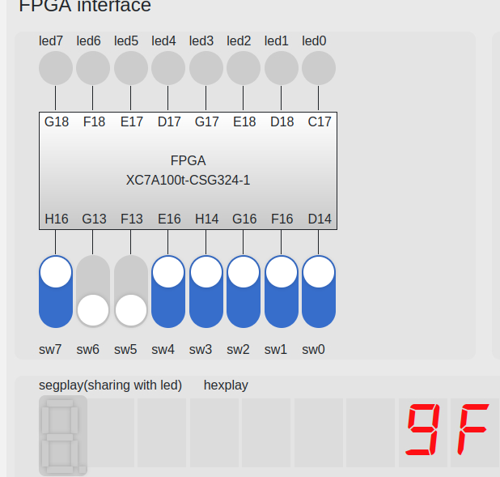
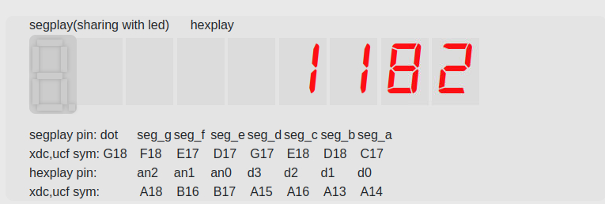

<div style="text-align:center;font-size:2em;font-weight:bold">中国科学技术大学计算机学院</div>


<div style="text-align:center;font-size:2em;font-weight:bold">《数字电路实验报告》</div>


<div style="display:flex;justify-content:center;font-size:2em">
<div>
<p>实验题目：FPGA 平台及 IP 核使用</p>
<p>学生姓名：刘良宇</p>
<p>学生学号：PB20000180</p>
<p>完成时间：2021. 11. 25</p>
</div>
</div>


<div style="page-break-after:always"></div>

## 实验题目

前面的实验中，我们完成了一个简单的电路设计，并顺利的烧写到 FPGA 实验平台上。但可能会有部分读者对于其中的一些步骤并不了解，本次实验中，我们将对所使用的 FPGA 实验平台进行介绍，以帮助读者加深对 FPGA 开发流程各环节的理解。此外，我们还会介绍到如何使用 IP 核进行电路设计。

## 实验目的

- 熟悉 FPGAOL 在线实验平台结构及使用
- 掌握 FPGA 开发各关键环节
- 学会使用 IP 核（知识产权核）

## 实验环境

- VLAB 平台：vlab.ustc.edu.cn
- FPGAOL 平台：fpgaol.ustc.edu.cn
- Vivado
- Logisim

## 实验练习

### 题目 1.

例化一个 16 * 8bit 的 ROM，并对其进行初始化，输入端口由 4 个开关控制，输出端口连接到七段数码管上（七段数码管与 LED 复用相同的一组管脚），控制数码管显示与开关相对应的十六进制数字，例如四个开关输入全为零时，数码管显示“0”，输入全为 1 时，数码管显示“F”。

首先需要使用 ip 核得到我们所需要的 ROM：


然后编写 Verilog 文件：

```verilog
module test(input [3:0] sw,
           output [7:0] led);
dist_mem_gen_0 inst(.a(sw),.spo(led));
endmodule
```

由于七段数码管与 LED 共用端口，所以 XDC 文件：


随后即可 `Generate Bitstream` 。

效果：


### 题目 2.

采用 8 个开关作为输入，两个十六进制数码管作为输出，采用时分复用的方式将开关的十六进制数值在两个数码管上显示出来，例如高四位全为 1，低四位全为 0 时，数码管显示“F0”。

编写 Verilog 文件，利用手动实现计数器实现分时复用。

```verilog
module test(input CLK100MHZ,
            [7:0] sw,
            output reg hexplay_an,
            reg [3:0] hexplay_data);
reg [2:0] count;
always@(posedge CLK100MHZ)
begin
    count      = count + 1;
    hexplay_an = count[2];
    if (hexplay_an)      hexplay_data <= sw[7:4];
    else                 hexplay_data <= sw[3:0];
end
endmodule
```

xdc 约束文件：


效果：



### 题目 3.

利用本实验中的时钟管理单元或周期脉冲技术，设计一个精度为 0.1 秒的计时器，用 4 位数码管显示出来，数码管从高到低，分别表示分钟、秒钟十位、秒钟个位、十分之一秒，该计时器具有复位功能（可采用按键或开关作为复位信号），复位时计数值为 1234，即 1 分 23.4 秒

主要分为以下两个步骤：

- 设计十分之一秒的计数器，然后构建题目需要的计时器。
- 分时复用显示四位数字

端口：

```verilog
module test(input CLK100MHZ,
            rst,
            output reg [1:0] hexplay_an,
            output reg [3:0] hexplay_data);
    ......
endmodule
```

首先设计十分之一秒的计数器：

```verilog
reg [23:0] cnt;
wire pulse_10hz;
assign pulse_10hz = (cnt == 24'h1);

always@(posedge CLK100MHZ)
    begin
        if (rst)
            cnt <= 24'h0;
        else if (cnt > 9999998)
            cnt <= 24'h0;
        else
            cnt <= cnt + 24'h1;
    end
```

接下来构建计时器的四位：

```verilog
reg [3:0] t_1of10s;
reg [3:0] t_1s;
reg [3:0] t_10s;
reg [3:0] t_1min;

always @(posedge CLK100MHZ) begin
    if (rst) t_1of10s               <= 4'b0100;
    else if (t_1of10s > 9) t_1of10s <= 4'b0;
    else if (pulse_10hz) t_1of10s   <= t_1of10s + 4'b1;
    else t_1of10s                   <= t_1of10s;
end

always@(posedge CLK100MHZ) begin
    if (rst) t_1s               <= 4'b0011;
    else if (t_1s > 9) t_1s     <= 4'b0;
    else if (t_1of10s > 9) t_1s <= t_1s + 4'b1;
    else t_1s                   <= t_1s;
end

always@(posedge CLK100MHZ) begin
    if (rst) t_10s            <= 4'b0010;
    else if (t_10s > 5) t_10s <= 4'b0;
    else if (t_1s > 9) t_10s  <= t_10s + 4'b1;
    else t_10s                <= t_10s;
end

always @(posedge CLK100MHZ) begin
    if (rst) t_1min             <= 4'b0001;
    else if (t_1min > 9) t_1min <= 4'b0;
    else if (t_10s > 5) t_1min  <= t_1min + 4'b1;
    else t_1min                 <= t_1min;
end
```

然后分时显示四位数字：

```verilog
reg [3:0] count;
always@(posedge CLK100MHZ)
begin
    count      = count + 1;
    hexplay_an = count[3:2];
    case (count[3:2])
        2'b00 : hexplay_data <= t_1of10s;
        2'b01 : hexplay_data <= t_1s;
        2'b10 : hexplay_data <= t_10s;
        2'b11 : hexplay_data <= t_1min;
    endcase
end
```

效果图：



## 总结与思考

- 本次实验让我加深了对 FPGA 开发流程各环节的理解，学会使用 IP 核心
- 本次实验难度略高
- 任务量适中
- 改进建议：无