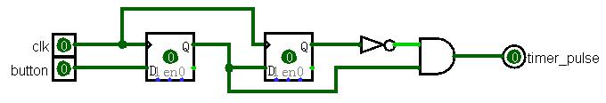

<div style="text-align:center;font-size:2em;font-weight:bold">中国科学技术大学计算机学院</div>


<div style="text-align:center;font-size:2em;font-weight:bold">《数字电路实验报告》</div>


<div style="display:flex;justify-content:center;font-size:2em">
<div>
<p>实验题目：信号处理及有限状态机</p>
<p>学生姓名：刘良宇</p>
<p>学生学号：PB20000180</p>
<p>完成时间：2021. 12. 2</p>
</div>
</div>


<div style="page-break-after:always"></div>

## 实验题目

通过前面实验的学习，我们已经将数字电路实验课程相关的工具、软件、语言、平台等全部介绍完毕，至此读者应当已经基本掌握了使用 FPGA 进行数字电路设计开发全流程的各关键环节。

本次实验中，我们将介绍几种常用的数字信号处理技巧并学习一种数字电路开发中非常重要的设计方法：有限状态机（FSM：Finite State Machine）。

## 实验目的

- 进一步熟悉 FPGA 开发的整体流程

- 掌握几种常见的信号处理技巧

- 掌握有限状态机的设计方法

- 能够使用有限状态机设计功能电路

## 实验环境

- VLAB: vlab.ustc.eud.cn
- FPGAOL: fpgaol.ustc.edu.cn
- Logisim
- Vivado

## 实验练习

### 题目 1

**在不改变电路功能和行为的前提下，将前面 Step5 中的代码改写成三段式有限状态机的形式，写出完整的 Verilog 代码。**

代码如下：

```verilog
module test (input clk,
             rst,
             output led);
    parameter S_0 = 2'b00;
	parameter S_1 = 2'b01;
	parameter S_2 = 2'b10;
	parameter S_3 = 2'b11;
    reg [1:0] curr_state;
    reg [1:0] next_state;
    // 状态转换组合逻辑
    always@(*) begin
        case (curr_state)
            S_0: next_state <= S_1;
            S_1: next_state <= S_2;
            S_2: next_state <= S_3;
            S_3: next_state <= S_0;
        endcase
    end
    // 时序逻辑
    always@(posedge clk or posedge rst) begin
        if (rst) curr_state <= 2'b0;
        else curr_state     <= next_state;
    end
    // 输出组合逻辑
    assign led = (curr_state == 2'b11) ? 1'b1 : 1'b0;
endmodule
```

### 题目 2

**请在 Logisim 中设计一个 4bit 位宽的计数器电路，如题图所示，clk 信号为计数器时钟，复位时（rst == 1）计数值为 0，在输入信号 sw 电平发生变化时，计数值 cnt 加 1，即在 sw 信号上升沿时刻和下降沿时刻各触发一次计数操作，其余时刻计数器保持不变。**

实验文档说明中已经给出了取信号边沿（上升沿为例）得到一个周期的脉冲信号的技巧：



对输入信号取反，再应用该技巧，即可得到上升沿和下降沿两个脉冲信号。两个信号或后即可得到状态转换的输入信号。据此原理，即可得到最终设计的电路图：


### 题目 3

**设计一个 8 位的十六进制计数器，时钟采用板载的 100MHz 时钟，通过 sw[0]控制计数模式，开关为 1 时为累加模式，为 0 时为递减模式，按键控制计数，按下的瞬间根据开关的状态进行累加或递减计数。计数值用数码管显示，其复位值为 1F。**

如代码所示即可。

```verilog
module test(input clk,
            rst,
            sw,
            btn,
            output reg [2:0] hexplay_an,
            output reg [3:0] hexplay_data);
    
    // 取按钮边沿
    reg button_r1,button_r2;
    always@(posedge clk) button_r1 <= btn;
    always@(posedge clk) button_r2 <= button_r1;
    assign btn_pulse = button_r1 & (~button_r2);
    
    // 计数器
    reg [7:0] count;
    always @(posedge clk) begin
        if (rst) count            <= 8'h1f;
        else if (btn_pulse) count <= sw ? (count + 1) : (count - 1);
        else count                <= count;
    end
    
    // 分时复用
    reg [2:0] show_count;
    always@(posedge clk) begin
        show_count <= show_count + 1;
        hexplay_an <= {2'b00, show_count[2]};
        case (show_count[2])
            1'b0 : hexplay_data <= count[3:0];
            1'b1 : hexplay_data <= count[7:4];
        endcase
    end
endmodule
```

xdc 文件：


测试效果：


### 题目 4

**使用有限状态机设计一个序列检测电路，并进行计数，当检测到输入序列为“1100”时，计数器加一，用一个数码管显示当前状态编码，一个数码管显示检测到目标序列的个数，用 4 个数码管显示最近输入的 4 个数值，用 sw[0]进行数据的串行输入，按键每按下一次将输入一次开关状态，时钟采用板载的 100MHz 时钟。要求画出状态跳转图，并在 FPGA 开发板上实现电路，例如当输入“0011001110011”时，目标序列个数应为 2，
最近输入数值显示 0011，状态机编码则与具体实现有关。**

先确定状态机编码。这里采用 Moore 型编码：

写出状态转换表：

| 当前状态 |  0   |  1   | 输出 |
| :------: | :--: | :--: | :--: |
|   初始   | 初始 |  1   |  0   |
|    1     | 初始 |  11  |  0   |
|    11    | 110  |  11  |  0   |
|   110    | 1100 |  1   |  0   |
|   1100   | 初始 |  1   |  1   |

从上到下对状态依次编号为 0, 1, 2, 3, 4

下面画出状态跳转图：


编写有限自动状态机：

```verilog
module test(input clk,
            input sw,
            input btn,
            output reg [2:0] hexplay_an,
            output reg [3:0] hexplay_data);
    reg [2:0] curr_state;
    reg [2:0] next_state;
    
    // 取按钮边沿
    reg button_r1,button_r2;
    always@(posedge clk) button_r1 <= btn;
    always@(posedge clk) button_r2 <= button_r1;
    assign btn_pulse = button_r1 & (~button_r2);
    
    // 取状态边沿（因为是 Moore 型，需要取边沿来统计计数）
    reg state_r1,state_r2;
    always@(posedge clk) state_r1 <= curr_state[2];
    always@(posedge clk) state_r2 <= state_r1;
    assign state_pulse = state_r1 & (~state_r2);
    
    // 状态转换
    always@(*) begin
        if (sw)
            case (curr_state)
                3'b000: next_state  = 3'b001;
                3'b001: next_state  = 3'b010;
                3'b010: next_state  = 3'b010;
                3'b011: next_state  = 3'b001;
                3'b100: next_state  = 3'b001;
                default: next_state = 3'b000;
            endcase
        else
            case (curr_state)
                3'b010: next_state  = 3'b011;
                3'b011: next_state  = 3'b100;
                default: next_state = 3'b000;
            endcase
    end
    
    // 时序逻辑（检测按钮）
    reg [3:0] recent_num;
    always@(posedge clk) begin
        if (btn_pulse) begin
            curr_state    <= next_state;
            recent_num    <= recent_num << 1;
            recent_num[0] <= sw;
        end
        else begin
            curr_state <= curr_state;
            recent_num <= recent_num;
        end
    end
    
    // 输出部分，需要输出 6 个数字, 分时复用输出
    reg [3:0] success_count;
    always@(posedge clk) begin
        if (state_pulse) success_count <= success_count + 1;
        else success_count             <= success_count;
    end
    reg [4:0] time_count;
    always @(posedge clk) begin
        if (time_count == 5'b10111)
            time_count <= 5'b00000;
        else
            time_count <= time_count + 1;
    end
    
    always@(posedge clk) begin
        hexplay_an <= time_count[4:2];
        case (time_count[4:2])
            3'b000 : hexplay_data <= {1'b0, curr_state};
            3'b001 : hexplay_data <= success_count;
            3'b010 : hexplay_data <= {3'b000, recent_num[0]};
            3'b011 : hexplay_data <= {3'b000, recent_num[1]};
            3'b100 : hexplay_data <= {3'b000, recent_num[2]};
            3'b101 : hexplay_data <= {3'b000, recent_num[3]};
            default: hexplay_data <= 4'b0000;
        endcase
    end
endmodule
```

文件已按照注释划分模块。

xdc 文件与上一题类似，此处不再列出。

## 总结与思考

1. 掌握了几种常用的数字信号处理技巧并学习一种数字电路开发中非常重要的设计方法：有限状态机，进一步巩固熟悉了使用 FPGA 进行数字电路设计开发全流程的各关键环节

2. 本次实验难度适中，之前实验已经做了合理的铺垫

3. 本次实验任务量适中

4. 改进建议：无