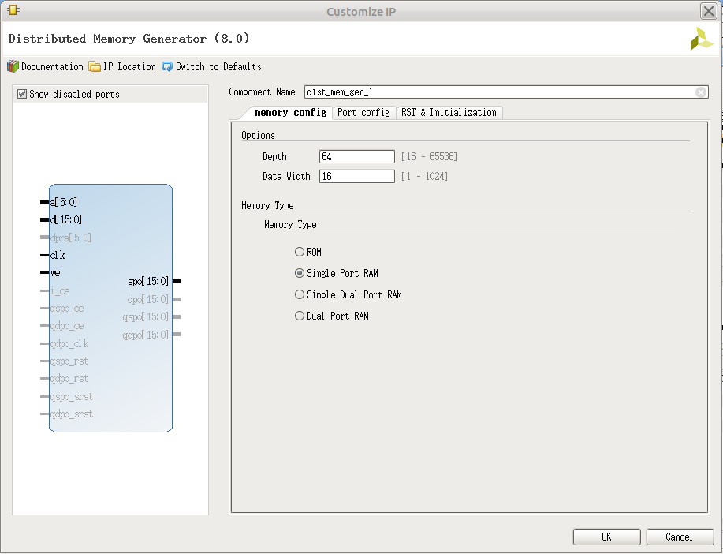
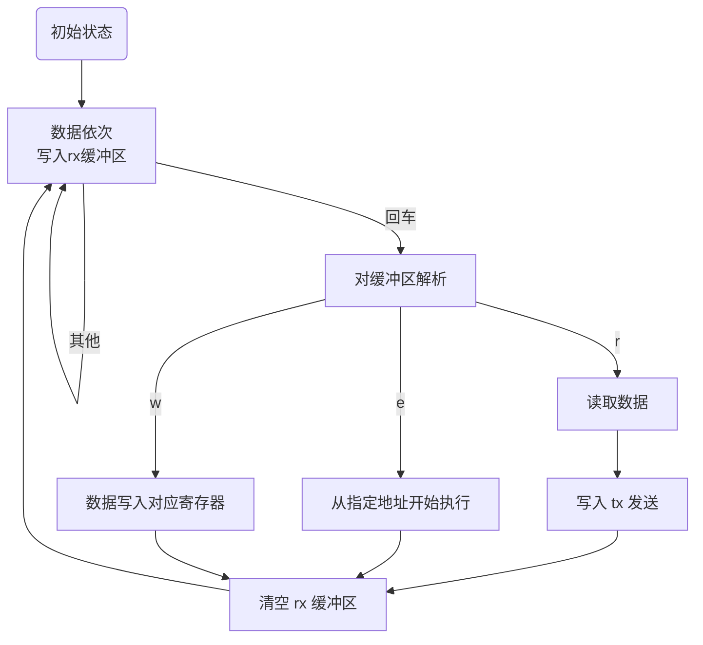
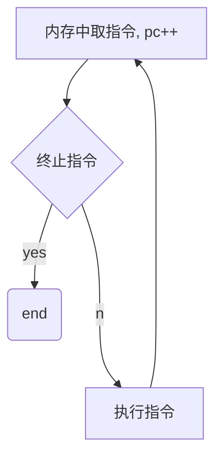

<div style="text-align:center;font-size:2em;font-weight:bold">中国科学技术大学计算机学院</div>


<div style="text-align:center;font-size:2em;font-weight:bold">《数字电路实验报告》</div>


<div style="display:flex;justify-content:center;font-size:2em">
<div>
<p>实验题目：综合实验</p>
<p>学生姓名：刘良宇</p>
<p>学生学号：PB20000180</p>
<p>完成时间：2021. 12. 14</p>
</div>
</div>


<div style="page-break-after:always"></div>

## 实验题目

该实验是本课程系列实验的最后一个，我们将通过本次实验学习几种通用接口，并要求读者完成一个综合实验题目，以达到对本系列实验复习巩固的目的。

## 实验目的

- 熟练掌握前面实验中的所有知识点
- 熟悉几种常用通信接口的工作原理及使用
- 独立完成具有一定规模的功能电路设计

## 实验环境

- VLAB：vlab.ustc.edu.cn
- FPGAOL: fpgaol.ustc.edu.cn（或 Nexys4 DDR）
- Logisim
- Vivado
- 自选外设

## 实验练习

本次实验选择通过 FPGAOL 平台，设计基本满足 lc-3 指令集的 cpu，并提供基本终端交互。

### RAM 设计

此次实验设计的 lc-3 指令集内存地址从 x000 到xfff，每个内存地址存放 16bit 数据。所以在 Vivado 中利用 IP 核生成如下的 RAM：



将 `depth` 根据需求改设为 4096，对应需要 12 根地址线寻址。

于是可以例化调用：

```verilog
reg [11:0] address;
reg [15:0] write;
reg write_enable;
wire [15:0] mem_out;
dist_mem_gen_0 mem(.a(address),.d(write),.clk(clk),.we(write_enable),.spo(mem_out));
```

### 输入输出设计

基本上来说，我们需要能够读写内存以及运行程序。（本次实验不直接操作寄存器）

实验练习的题目一已经给出了一种终端交互格式，我们在此基础上拓展：

|   命令   |    格式     |     示例     |        说明        |
| :------: | :---------: | :----------: | :----------------: |
|  写命令  | w addr data | > w 300 ffff |   向指定内存写入   |
|  读命令  |   r addr    |   > r 300    |  回显指定内存数据  |
| 执行命令 |   e addr    |   > e 300    | 从指定内存开始执行 |
| 其他命令 |   ......    |    ......    |      非法命令      |

（地址均默认为 16 进制）

从指定命令开始执行后，如果遇到 TRAP 指令，则停止执行。

之后用户可以通过读命令来回显指定内存的数据，查看执行结果。

### 串口交互

确定了输入输出格式后，下面问题就是如何与串口交互。文档中给出了串口接受字符和发送字符的两个模块： `rx` 和 `tx` 。

阅读源码可知：当串口有字符传入，且 `rx` 模块解析完毕后，会产生脉冲信号 `rx_vld` ，此时可以从 `rx_data` 中读取解析到的字符 ASCII 码值。

发送信号需要先将 `tx_data` 设为要发送的字符的 ASCII 码值，然后产生脉冲信号 `tx_ready` 通知 `tx` 模块发送。需要间隔一定时间后再次发送下一个字符。

### 有限状态自动机设计



其中， `从指定地址开始执行` 需要细分出子图：



下面考虑编码设计：

```verilog
parameter S_INPUT = 4'b0000;		// 等待数据写入，可作为初始状态
parameter S_PARSE = 4'b0001;		// 等待解析缓冲区指令
parameter S_READ  = 4'b0010;		// 从内存中读取数据
parameter S_SEND  = 4'b0011;		// 发送内存数据 
```


## 总结与思考

1. 本次综合实验使我对本系列实验总体上进行了复习巩固，复习了前面实验中的知识点，熟悉几种常用通信接口的工作原理及使用，最终可以独立完成具有一定规模的功能电路设计。
2. 本次实验作为综合实验，难度整体较大。
3. 本次实验作为综合实验，任务量整体较大。
4. 可以对 FPGAOL 平台上串口终端的使用进行更为详细的介绍。