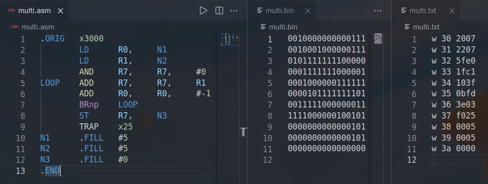

<div style="text-align:center;font-size:2em;font-weight:bold">中国科学技术大学计算机学院</div>


<div style="text-align:center;font-size:2em;font-weight:bold">《数字电路实验报告》</div>


<div style="display:flex;justify-content:center;font-size:2em">
<div>
<p>实验题目：综合实验</p>
<p>学生姓名：刘良宇</p>
<p>学生学号：PB20000180</p>
<p>完成时间：2021. 12. 14</p>
</div>
</div>


<div style="page-break-after:always"></div>

## 实验题目

该实验是本课程系列实验的最后一个，我们将通过本次实验学习几种通用接口，并要求读者完成一个综合实验题目，以达到对本系列实验复习巩固的目的。

## 实验目的

- 熟练掌握前面实验中的所有知识点
- 熟悉几种常用通信接口的工作原理及使用
- 独立完成具有一定规模的功能电路设计

## 实验环境

- VLAB：vlab.ustc.edu.cn
- FPGAOL: fpgaol.ustc.edu.cn，采用串口输入，LED 输出
- Vivado

## 实验练习

本次实验选择通过 FPGAOL 平台，设计基本满足 lc-3 指令集运算指令的 cpu，并利用串口给用户提供了如下操作：

- 写入内存，可以用于写入程序
- 从指定地址开始执行指令，会自动连续执行，直到遇上 Trap 指令或者空指令停止
- 通过查看内存获取程序执行的结果，通过 LED 显示给用户对应内存地址的值。

### LC-3 ISA

本实验中使用的 LC-3 有以下存储单元：

- Register File（寄存器文件），从 R0 到 R7 七个供运算使用的寄存器。
- 条件码寄存器（n, z, p）
- 内存：给出 256 个地址空间，即从 0x00 到 0xff，共计 256 * 16bit
- PC, IR 寄存器，分别指示当前指令地址和当前指令

LC-3 ISA 的指令集具体指令见下图：


本次实验实现其中所有的计算指令。

### RAM 设计

直接声明一个寄存器的向量数组即可。

```verilog
reg [15:0] mem[127:0];
```

### 输入输出格式

基本上来说，我们需要能够读写内存以及运行程序。（本次实验考虑提供内存级别的抽象，不直接操作寄存器）

实验练习的题目一已经给出了一种终端交互格式，我们在此基础上拓展：

|   命令   |    格式     |    示例     |        说明        |
| :------: | :---------: | :---------: | :----------------: |
|  写命令  | w addr data | > w 30 ffff |   向指定内存写入   |
|  读命令  |   r addr    |   > r 30    |  LED 显示指定内存  |
| 执行命令 |   e addr    |   > e 30    | 从指定内存开始执行 |
| 其他命令 |   ......    |   ......    |      非法命令      |

（地址均默认为 16 进制）

从指定命令开始执行后，如果遇到 TRAP 指令或者空指令，则停止执行。

之后用户可以通过读命令来回显指定内存的数据，查看执行结果。

### 串口输入

确定了输入输出格式后，下面问题就是如何与串口交互。文档中给出了串口接受字符和发送字符的两个模块： `rx` 和 `tx` 。

阅读源码可知：当串口有字符传入，且 `rx` 模块解析完毕后，会产生脉冲信号 `rx_vld` ，此时可以从 `rx_data` 中读取解析到的字符 ASCII 码值。

本次实验我们仅使用串口读入，输出采用 LED 灯显示。因此，只需要实现对串口输入的解析。这里我们设置一个 buffer 区，如果读到回车，代表用户本次指令输入完毕，那么产生一个脉冲信号，交由状态机判断状态转换。

串口读入的代码设计如下：

```verilog
wire        [7:0]   rx_data;
wire                rx_vld;
// 例化
rx                  rx_inst(
.clk                (clk),
.rst                (rst),
.rx                 (rx),
.rx_vld             (rx_vld),
.rx_data            (rx_data)
);
// 考虑 buffer 每个字符 [7:0]，最长 w 30 ffff buffer 长度为 9
reg [3:0] input_cnt;        // 计数，当前在写 buffer 什么位置
initial input_cnt = 4'h0;
reg [7:0] buffer[8:0];
reg read_finished;
initial read_finished = 1'b0;
always @(posedge clk) begin
    if (rx_vld) begin
        if (rx_data == 8'h0a) begin
            read_finished <= 1'b1;  // 产生 1 tick 的脉冲信号
            input_cnt     <= 4'h0;
        end
        else begin
            read_finished <= 1'b0;
            input_cnt     <= input_cnt + 1;
            case (input_cnt)
                4'h0: buffer[0]    <= rx_data;
                4'h1: buffer[1]    <= rx_data;
                4'h2: buffer[2]    <= rx_data;
                4'h3: buffer[3]    <= rx_data;
                4'h4: buffer[4]    <= rx_data;
                4'h5: buffer[5]    <= rx_data;
                4'h6: buffer[6]    <= rx_data;
                4'h7: buffer[7]    <= rx_data;
                4'h8: buffer[8]    <= rx_data;
                default: buffer[8] <= rx_data;
            endcase
        end
    end
    else
        read_finished <= 1'b0;
end
```

每次根据计数，输入的数据读到对应 buffer 中。输入的数据是 ascii 码，我们想要得到十六进制数，所以编写以下模块进行转换：

```verilog
module bytestohex(input [7:0] bytes,
                  output reg [3:0] address);
// 从 1 个字节 ascii 转换成 4 位的地址，例如 f 转换成 1111
always @(*) begin
    case (bytes)
        8'h30: address   = 4'h0;
        8'h31: address   = 4'h1;
        8'h32: address   = 4'h2;
        8'h33: address   = 4'h3;
        8'h34: address   = 4'h4;
        8'h35: address   = 4'h5;
        8'h36: address   = 4'h6;
        8'h37: address   = 4'h7;
        8'h38: address   = 4'h8;
        8'h39: address   = 4'h9;
        8'h61: address   = 4'ha;
        8'h62: address   = 4'hb;
        8'h63: address   = 4'hc;
        8'h64: address   = 4'hd;
        8'h65: address   = 4'he;
        8'h66: address   = 4'hf;
        default: address = 4'h0;
    endcase
end
endmodule
```

即组合逻辑直接枚举即可。下面在 top 模块中调用：

```cpp
wire [7:0] read_address;       // 直接翻译成读的地址
wire [15:0] write_value;       // 直接翻译成要写的值
bytestohex r1(.bytes(buffer[2]),.address(read_address[7:4]));
bytestohex r2(.bytes(buffer[3]),.address(read_address[3:0]));
bytestohex w1(.bytes(buffer[5]),.address(write_value[15:12]));
bytestohex w2(.bytes(buffer[6]),.address(write_value[11:8]));
bytestohex w3(.bytes(buffer[7]),.address(write_value[7:4]));
bytestohex w4(.bytes(buffer[8]),.address(write_value[3:0]));
```

分别将 buffer 对应地址区和数据区的 ascii 码译成十六进制数。

### 输出显示

本次实验的输出显示采用 LED 分时复用完成。具体格式如下：

```verilog
reg [4:0] time_count;
always @(posedge clk) begin
    time_count <= time_count + 1;
end

always@(posedge clk) begin
    hexplay_an <= time_count[4:2];
    case (time_count[4:2])
        3'b000 : hexplay_data <= mem_out_reg[3];
        3'b001 : hexplay_data <= mem_out_reg[2];
        3'b010 : hexplay_data <= mem_out_reg[1];
        3'b011 : hexplay_data <= mem_out_reg[0];
        3'b100 : hexplay_data <= pc[3:0];
        3'b101 : hexplay_data <= pc[7:4];
        3'b110 : hexplay_data <= {1'b0, n, z, p};
        3'b111 : hexplay_data <= {1'b0, curr_state};
        default: hexplay_data <= 4'b0000;
    endcase
end
```

如代码所示，8 个 LED 从左到右依次显示：当前状态， nzp， 2 位 pc， 四位回显数字。

### 有限状态自动机设计

#### 状态图


其中， `执行指令` 需要细分出子图：


#### 编码

```verilog
parameter S_INPUT   = 3'b000;		// 等待数据写入，初始状态
parameter S_PARSE   = 3'b001;		// 解析缓冲区
parameter S_FETCH   = 3'b010;       // 取指令
parameter S_OP      = 3'b011;       // 执行操作
parameter S_COND    = 3'b101;       // 更新操作码
```

这里我们采用 Moore 型有限状态自动机。

需要编写：

- 状态转换组合逻辑
- 时序逻辑（此处每个时钟上升沿更新状态）
- 每个时钟上升沿，根据当前状态对各寄存器进行更新操作。

#### 状态转换

```verilog
always @(posedge clk) begin				// 时钟上升沿转换
    curr_state <= next_state;
end

always@(*) begin
    case (curr_state)
        S_INPUT: begin					// 输入状态，等待输入完成
            if (read_finished)
                next_state = S_PARSE;
            else
                next_state = S_INPUT;
        end
        S_PARSE: begin					// 解析缓冲区
            if (buffer[0] == 8'h65)		// 执行指令
                next_state = S_FETCH;
            else
                next_state = S_INPUT;
        end
        S_FETCH: begin					// 取指令，等待执行
            next_state = S_OP;
        end
        // 执行指令，判断是否需要终止，是否需要更新操作码
        S_OP: begin
            if (ir == 16'h0 || ir[15:12] == 4'hf)
                next_state = S_INPUT;
            else if (ir[15:12] == LC3_LD || ir[15:12] == LC3_LDR || ir[15:12] == LC3_NOT 
                    || ir[15:12] == LC3_ADD || ir[15:12] == LC3_AND)
                next_state = S_COND;
            else
                next_state = S_FETCH;
        end
        S_COND: begin					// 重新取指令
            next_state = S_FETCH;
        end
        default: next_state = S_INPUT;
    endcase
end
```

#### 时序逻辑

此部分需要根据当前状态更新寄存器。

为了便于阅读，每个指令的四位操作码用 parameter 列出：

```verilog
parameter LC3_BR    = 4'b0000;
parameter LC3_ADD   = 4'b0001;
parameter LC3_AND   = 4'b0101;
parameter LC3_NOT   = 4'b1001;
parameter LC3_LD    = 4'b0010;
parameter LC3_ST    = 4'b0011;
parameter LC3_LDR   = 4'b0110;
parameter LC3_STR   = 4'b0111;
parameter LC3_LEA   = 4'b1110;
parameter LC3_JMP   = 4'b1100;
parameter LC3_TRAP  = 4'b1111;
```

随后即可编写代码：

```verilog
always @(posedge clk) begin
    case (curr_state)
        S_PARSE: begin
            if (buffer[0] == 8'h72) begin       // r, 更新 LED
                mem_out_reg[0] <= mem[read_address][15:12];
                mem_out_reg[1] <= mem[read_address][11:8];
                mem_out_reg[2] <= mem[read_address][7:4];
                mem_out_reg[3] <= mem[read_address][3:0];
            end
            else if (buffer[0] == 8'h77) begin  // w, 内存写入值
                mem[read_address] <= write_value;
            end
            else if (buffer[0] == 8'h65) begin  // e, 写入 pc
                pc <= read_address;
            end
        end
        S_FETCH: begin				// 取指令，pc++
            ir <= mem[pc];
            pc <= pc + 1;
        end
        S_COND: begin				// 更新条件码
            if (R[ir[11:9]] == 16'b0)
                {n, z, p} <= {1'b0, 1'b1, 1'b0};  
            else if (R[ir[11:9]][15] == 1'b0)
                {n, z, p} <= {1'b0, 1'b0, 1'b1};
            else
                {n, z, p} <= {1'b1, 1'b0, 1'b0};
        end
        S_OP: begin
            case (ir[15:12])
                LC3_ADD: begin		// add
                    if (ir[5])
                        R[ir[11:9]] <= (R[ir[8:6]] + {{11{ir[4]}}, ir[4:0]});
                    else
                        R[ir[11:9]] <= R[ir[8:6]] + R[ir[2:0]];
                end
                LC3_AND: begin		// and
                    if (ir[5])
                        R[ir[11:9]] <= (R[ir[8:6]] & {{11{ir[4]}}, ir[4:0]});
                    else
                        R[ir[11:9]] <= R[ir[8:6]] & R[ir[2:0]];
                end
                LC3_NOT: ......		// 其余指令操作见下附图
            endcase
        end
    endcase
end
```

附图：


### 运行代码示例测试

因为本学期 ICS 课程的实验恰好有 LC-3 汇编器的编写，所以直接编写汇编语言然后脚本处理一下即可得到载入程序需要的操作串口的输入。

以编写两个数相加的程序为例，示意如下：


于是可以很方便地载入程序测试。

#### 加法

首先载入程序：


程序作用如汇编代码所示，取出 x36 和 x37 处的数相加，结果存储到 x38

例如测试 5 + 5：


LED 灯后四位显示 xA，结果正确。

再测试 2 + 3：

 

可以利用补码来实现减法运算，例如：


即计算 x3ef3 - 1，结果为 x3ef2。

#### 乘法

同理先编写汇编代码，并转换：



载入程序：


计算 x5 * x5 = 25 = x19


计算 x11 * xf = xff （即 17 * 15 = 255）


#### 递推数列

接下来我们来计算符合以下定义的递推数列的第 n 项：

$$f(0)=1,\ f(1)=1,\ f(2)=2,\ f(n)=(f(n-1)+2f(n-3))\ \%\ 1024$$

简单计算可以从 0 开始列出数列前几项：$1,1,2,4,6,10,18,30,50,86,146\cdots$

这是本学期 ICS 的一道实验题。同上操作，我们得到应该写入的程序：


下面我们实际计算 $f(7)$ 和 $f(9)$ 作为演示：


如图所示，$f(7) = (1e)_{hex} = 30$ ，$f(9) = (56)_{hex} = 86$

## 总结与思考

1. 本次综合实验使我对本系列实验总体上进行了复习巩固，复习了前面实验中的知识点，熟悉几种常用通信接口的工作原理及使用，最终可以独立完成具有一定规模的功能电路设计。
2. 本次实验作为综合实验，难度整体较大。
3. 本次实验作为综合实验，任务量整体较大。
4. 可以对 FPGAOL 平台上串口终端的使用进行更为详细的介绍。

### 心得体会

- 本学期 CS 的专业课有数据结构，计算系统概论，模拟与数字电路，数字电路实验这四门，处了数据结构之外，其他几门课程都从底层介绍起了计算机的构造，恰逢本次数字电路实验课程来到了最后一次大实验，可以利用这个机会编写一个 lc-3 ISA 的小计算机，整体加深自己对本学期所学课程的理解。
- 使我思考通用计算机（通用计算设备）的意义，用户只需要软件层面编程就可以让硬件实现各种不同的功能，加深了我对计算机的基础：冯诺依曼结构的理解。
- Verilog HDL 是一门硬件描述语言，应当时刻记得自己在写的是电路，而不是程序。这句话虽然一开始就听过，但是却总归需要实践来巩固：在我本次实验的第一个版本中，所有的寄存器更新都放在了状态转换的组合逻辑中，采用锁存器达到自己的目的，这使得整体代码结构和代码时序都很混乱，调试过程中的 bug 也很难分析，最终重构了代码后，才加深了我对 “硬件描述语言” 的理解，达到了对代码的精简和优化（~~直接从三四百行砍到两百行~~）~~顺便消灭了 Vivado 界面的几十个 warning~~
- 本次实验中，我在用户层面提供了内存级别的抽象，并不直接操作寄存器，使我进一步体会了计算机自底向上逐层抽象，封装的思想。
- Vivado 工程整体调试难度比高级语言的调试要高出不少，所以一方面在设计之初就要仔细考虑整体架构，另一方面在遇到问题时也要积极查阅资料解决，不要自己钻牛角尖。

### 课程总结

- 没有摸过实体板子，~~有点遗憾~~
- 整体课程体验良好，可能是因为 20 年开始数字电路实验课程的简化？
- 大作业跨度有点大，但是写完还是会比较有收获的
- 整体加深了我对于计算机底层硬件的理解
- ~~Vivado 生成 bitstream 是真的慢~~

