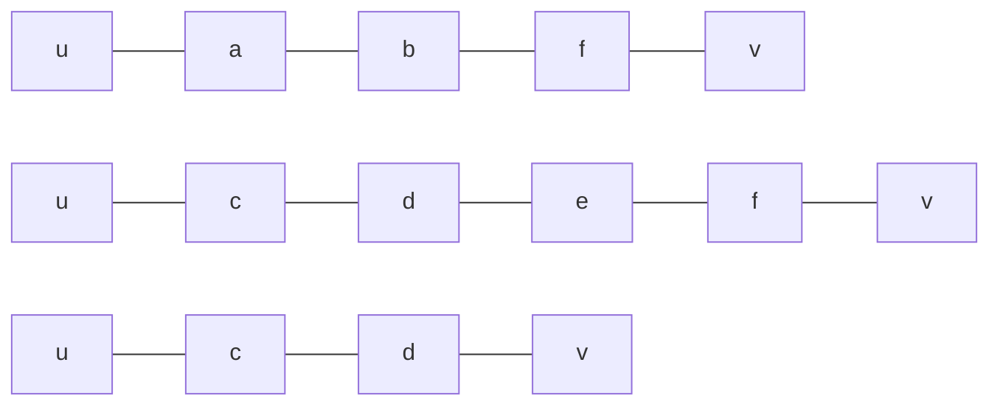

<div style="text-align:center;font-size:2.5em;font-weight:bold">数据结构 hw11</div>

<div style="text-align:center;font-size:1.5em">刘良宇 PB20000180</div>

## 7.28

编写算法求 u 到 v 所有简单路径。

```cpp
// 假设所有路径存储在二维数组 int[100][100] 中

int path_num = 0;            // 一共多少条路径
int path[100][100] = {{0}};  // 路径。每条路径以 v 结束

void find_path(Graph& G, int u, int v, int depth = 0) {
    if (u == v) {
        path_num++;
        path[path_num][depth] == v;
        for (int i = 0; i < depth; i++) {
            path[path_num][i] = path[path_num - 1][i];
        }
        return;
    }
    // 每次先看当前的 u 在之前路径中是否出现过
    for (int i = 0; i < depth; i++) {
        if (path[path_num][i] == u)
            return;
    }
    path[path_num][depth] = u;
    // 递归遍历相邻顶点
    for (ArcNode* p = G.vertices[u]->firstArc; p; p = p->nextArc) {
        find_path(G, p->adjVex, v, depth + 1);
    }
}
```

手工执行算法。得到下面几条简单路径：



## 7.31

试完善求有向图的强连通分量的算法。采用十字链表完成。

```cpp
bool visited[MAX];
int count;          // 完成搜索的结点个数
int finished[MAX];  // 完成的次序映射到结点编号

int set[MAX][MAX];  // 储存每个强连通分量有哪些顶点
int set_num[MAX];   // 每个强连通分量顶点个数
int pieces;         // 一共有多少个强连通分量

void strong_connect(Graph& G) {
    for (int i = 0; i < G.vexnum; i++) {
        visited[i] = false;
    }
    int count = 0;
    for (int i = 0; i < G.vexnum; i++) {
        if (!visited[i])
            dfs(G, i);
    }
    // 已经完成了一遍 dfs 搜索，得到了完成顺序
    // 下面从最后一个完成的顶点开始逆序遍历
    for (int i = 0; i < G.vexnum; i++) {
        visited[i] = false;
        set_num[i] = 0;
    }
    pieces = 0;
    for (int i = G.vexnum; i >= 1; i--) {
        if (!visited[i])
            head_dfs(G, i);
        else
            pieces++;
    }
}

void dfs(Grapg& G, int v) {
    visited[v] = true;
    for (ArcBox* p = G.xlist[v]->firstout; p; p = p->tlink) {
        if (!visited[p->headvex])
            dfs(G, p->headvex);
    }
    finished[++count] = v;
}

// 逆序遍历
void head_dfs(Graph& G, int v) {
    visited[v] = true;
    set[pieces][set_num[pieces]] = v;
    set_num[pieces]++;
    for (ArcBox* p = G.xlist[v]->firstin; p; p = p->hlink) {
        if (!visited[p->tailvex])
            dfs(G, p->tailvex);
    }
}
```

## 7.37

试设计一个求有向无环图中最长路径的算法并估计其时间复杂度。假设以邻接表方式存储：

```cpp
int path[MAX];  // 最长路径中，从某一点出发，下一个顶点应该是什么
int start_posi;  // 起点
int dp[MAX];  // 记录每一点开始的"最深深度"。也就是假设v没有out，则dp[v] = 1

// 返回长度。路径存储在 path 数组中
int longest_path(Graph& G) {
    int max = 0;
    for (int i = 0; i < G.vexnum; i++) {
        int path_length_i = longest_v_path(G, i);
        if (path_length_i > max) {
            max = max_length_i;
            start_posi = i;
        }
    }
    return max - 1;  // max 实际是深度，不是路径长度
}

// 以 v 为起点的最长路径长度
int longest_v_path(Graph& G, int v) {
    if (dp[v])
        return dp[v];

    int max = 0;
    for (ArcNode* p = G.vertices[v]->firstArc; p; p = p->nextArc) {
        int path_length_p = longest_v_path(G, p->adjVex);
        if (path_length_p > max) {
            max = path_length_p;
            path[v] = p->adjVex;  // 路径的后继
        }
    }
    dp[v] = max + 1;

    return dp[v];
}
```

## 9.26

试将折半查找的算法改写成递归算法。

```cpp
int binary_search(table& st, int key) {
    return search(st, key, 1, st.length);
}

int search(table& st, int key, int low, int high) {
    if (low > high)
        return 0;
    mid = (low + high) / 2;
    if (st.elem[mid].key == key)
        return mid;
    else if (st.elem[mid].key > key)
        return search(st, key, low, mid - 1);
    else
        return search(st, key, mid + 1, high);
}
```


## 9.28

试编写利用折半查找确定记录所在块的分块查找算法。

```cpp
// 假设 1 到 n 项存储数据， n == length
// 假设 max_key[length + 1] = +\infin
// 假设 max_key[0] = -\infin
// 假设 start_loca[kength + 1] = 原表长 + 1
struct index_table {
    int length;  // 索引表多少项
    int* start_loca;
    int* max_key;
}

int block_search(table& st, index_table& idx,int key){
    // 先利用折半查找确定元素在哪一块
    if (key > idx.max_key[length])  // 否则一定在索引表范围内
        return 0;
    // 找到 key 恰小于等于 哪个结点 的 max_key
    int res = 0;
    int low = 1, high = idx.length - 1;
    while (!res) {
        int mid = (low + high) / 2;
        if (key > idx.max_key[mid - 1] && key <= idx.max_key[mid]) {
            res = mid;
        } else if (key <= idx.max_key[mid - 1]) {
            high = mid - 1;
        } else {
            low = mid + 1;
        }
    }
    // 确定了在索引表 res 项指示的范围，下面开始顺序查找
    for (int i = idx.start_loca[res]; i < idx.start_loca[res + 1]; i++) {
        if (st.elem[i].key == key)
            return i;
    }
    return 0;
}
```


讨论块中顺序查找时使用监视哨的优缺点，并指出必要时如何实现。

顺序查找时若要使用监视哨，则需要在块与块之间添加一个空结点，每次查找时置对应的空结点为待查找的 key。这样做优点是省略了每次查找时的判断边界的过程，缺点是增大了空间占用，尤其是当每一块元素个数比较少的时候。

如果必要时需要实现，那么例如对于索引表：

|            |      |      |      |          |
| :--------: | ---- | ---- | ---- | -------- |
| 最大关键字 | 22   | 48   | 86   | $\infin$ |
|  起始地址  | 1    | 7    | 13   | 34       |
|            |      |      |      |          |

不妨增加末尾一个空结点表示表长。

6，12，33 结点都应是空结点，可用于被设置为监视哨。当顺序查找返回这些值时，查找函数返回 0 （没找到）。
