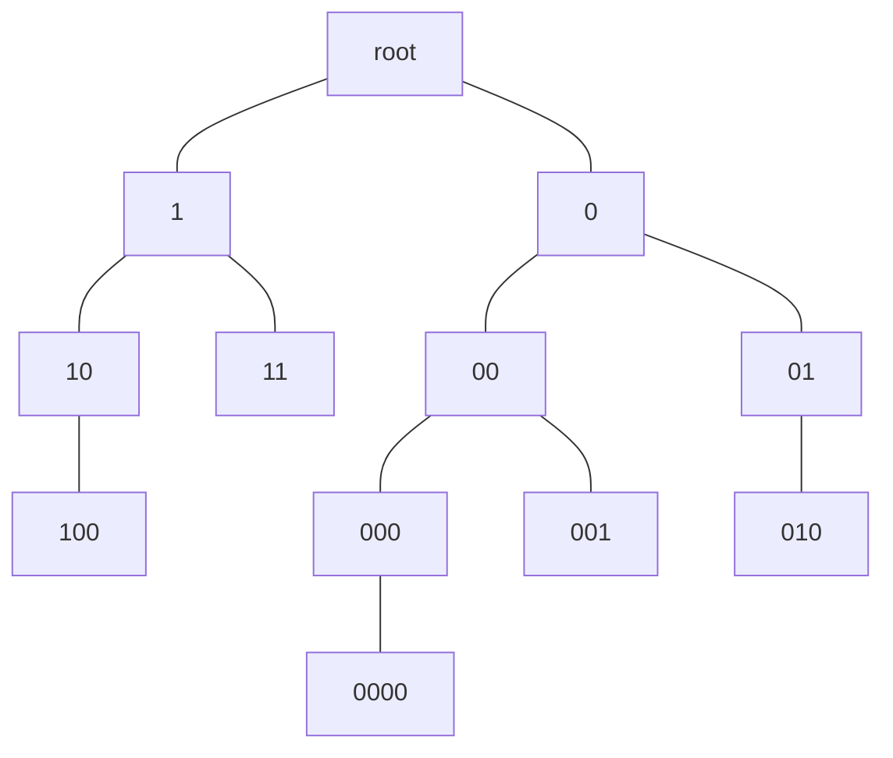

<div style="text-align:center;font-size:2.5em;font-weight:bold">数据结构 hw12</div>

<div style="text-align:center;font-size:1.5em">刘良宇 PB20000180</div>

## 编写二叉排序树的非递归查找算法

```cpp
BTree searchBTree(BTree t, int key) {
    while (t) {
        if (t->data.key == key)
            return t;
        if (t->data.key < key)
            t = t->rchild;
        else
            t = t->lchild;
    }
    return nullptr;
}
```

## 9.31

> 试写一个判别给定二叉树是否为二叉排序树的算法，树中结点的关键字均不同。

```cpp
bool isBinarySortTree(BTree t) {
    if (t == nullptr)  // 防止传入空指针
        return false;

    if (t->lchild) {
        if (t->lchild->data.key >= t->data.key)
            return false;
        if (!isBinarySortTree(t->lchild))
            return false;
    }

    if (t->rchild) {
        if (t->rchild->data.key <= t->data.key)
            return false;
        if (!isBinarySortTree(t->rchild))
            return false;
    }
    return true;
}
```

## 9.33

> 递归 O(log2n + m) 算法从大到小输出给定二叉排序树中所有关键字不小于 x 的数据。

从大到小输出，需要类似中序遍历，但先访问右子树

```cpp
void outMoreThanKey(BTree t, int key) {
    if (t == nullptr)
        return;

    outMoreThanKey(t->rchild, key);
    if (t->data.key >= key) {
        std::cout << t->data;
    }
    if (t->data.key > key) {
        outMoreThanKey(t->lchild, key);
    }
}
```

## 9.11

> 试推导含 12 个结点的平衡二叉树的最大深度，并画出一颗这样的树

为了达到这一目的，我们尽可能让结点失衡：这里不妨假设每个结点的平衡因子都为 1

设深度为 n 的平衡二叉树结点个数最多为 $a(n)$，则有：

$$ a(n) = a(n-1) + a(n-2) + 1 $$

即左子树结点数加右子树结点数加根节点。

注意到： $a(0) = 0,\ a(1) = 1$

带入递推公式，恰好有 $a(5) = 12$

所以最大深度为 5。下面给出图示：



即可。

## 9.38

> 试写一算法合并两个二叉排序树

```cpp
void merge(BTree t, BTree s) {
    // 把 s 中结点都插入到 t 中
    // 无法确定有无重复元素，所以逐个元素遍历
    if (!s)
        return;
    insert_data(t, s->data.key);
    merge(t, s->lchild);
    merge(t, s->rchild);
}

void insert_data(BTree t, int key) {  // 插入数据
    // 以 int 为例，写插入算法
    BTree now = new BTree();
    now->data = data;
    now->lchild = nullptr;
    now->rchild = nullptr;
    BTree* p = t;  // 指向结点（指针）的指针
    while (*p) {
        if (key == *p->data.key)  // 去重
            return;
        else if (key < *p->data.key)
            p = &(*p->lchild);
        else
            p = &(*p->rchild);
    }
    // 否则应该使 p 指向的指针指向插入的结点
    *p = now;
}
```

## 9.40

> 平衡二叉树结点增设 lsize 域，为左子树结点数 + 1，写一算法确定树中第 k 小结点

```cpp
BTree get_location(BTree t, int k) {
    if (!t)
        return nullptr;
    if (t->lsize == k)
        return t;
    else if (t->lsize < k)
        return get_location(t->rchild, k - t->lsize);
    else
        return get_location(t->lchild, k);
}
```
