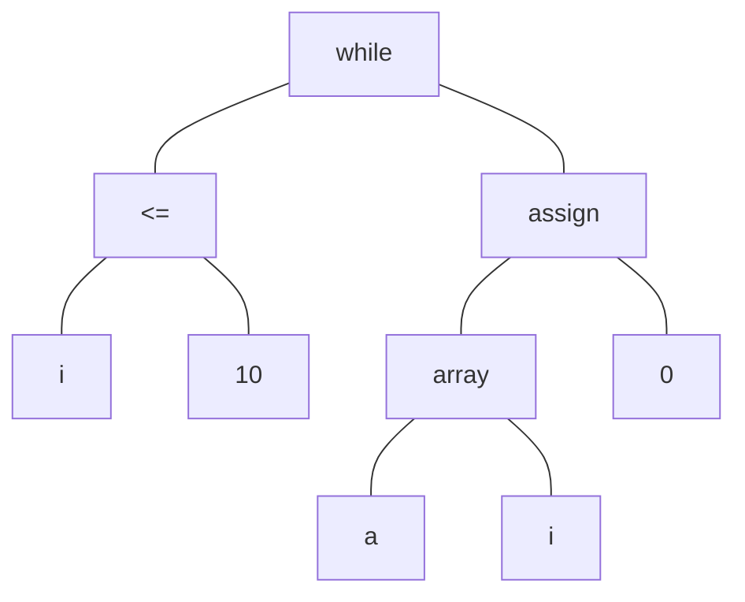

# H10-2 多态重载和中间表示

PB20000180 刘良宇

## 习题 5.21

使用例 5.9 的规则，确定下列哪些表达式有唯一类型（假定 z 是复数）：

(a) 1 * 2 * 3

不唯一，1 * 2 和 3 都是 i，乘法结果可能是 i 或 c

(b) 1 * (z * 2)

唯一，c

(c) (1 * z ) * z

唯一，c

## 习题 7.2

把 C 程序

```c
main() {
    int i;
    int a[10];
    while (i <= 10) {
        a[i] = 0;
    }
}
```

的可执行语句翻译成： 

(a) 语法树。



(b) 后缀表示。

$i\ 10\ \le\ a\ i\ array\ 0\ assign\ while$

(c) 三地址代码。

```c
(1) if i <= 10 goto(3)
(2) goto(6)
(3) t = 4 * i
(4) a[t] = 0
(5) goto(1)
(6) // return 0
```

