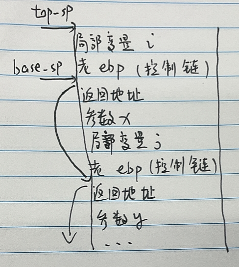

# H13 运行时空间的组织与中间代码生成

PB2000180 刘良宇

## 6.6



## 6.18

下面是一个C语言程序：

```c
#include <stdio.h>
int main() {
     long i;
     long a[0][4];
     long j;
     i = 4; j = 8;
     printf("%ld, %d\n", sizeof(a), a[0][0]);
 }
```

虽然出现 `long a[0][4]` 这样的声明，但在 x86/Linux 系统上，用编译器 GCC 7.5.0 (Ubuntu 7.5.0-3ubuntu1~16.04) 编译时，该程序能够通过编译并生成目标代码。请在你自己的机器上实验，回答下面两个问题（说明你使用的编译器及版本并给出汇编码）：
(a) `sizeof(a)` 的值是多少，请说明理由。 

0，大小在编译器已经确定（由汇编代码也可以看出），是逻辑上这个数组占的字节数（第一个维度大小是 0，所以是 0）

(b) `a[0][0]` 的值是多少，请说明理由。

可以推断出应该是栈上某处的值，实际测试运行结果每次不同

汇编分析：

```asm
movq    $4, -32(%rbp)    # i
movq    $8, -24(%rbp)    # j
......
movq    -16(%rbp), %rax  # a[0][0]，未初始化
```

GCC 版本：`GCC: (Ubuntu 9.4.0-1ubuntu1~20.04.1) 9.4.0`

汇编代码（`gcc -S test.c`）：

```asm
        .file   "test.c"
        .text
        .section        .rodata
.LC0:
        .string "%ld, %ld\n"
        .text
        .globl  main
        .type   main, @function
main:
.LFB0:
        .cfi_startproc
        endbr64
        pushq   %rbp
        .cfi_def_cfa_offset 16
        .cfi_offset 6, -16
        movq    %rsp, %rbp
        .cfi_def_cfa_register 6
        subq    $32, %rsp
        movq    %fs:40, %rax
        movq    %rax, -8(%rbp)
        xorl    %eax, %eax
        movq    $4, -32(%rbp)
        movq    $8, -24(%rbp)
        movq    -16(%rbp), %rax
        movq    %rax, %rdx
        movl    $0, %esi
        leaq    .LC0(%rip), %rdi
        movl    $0, %eax
        call    printf@PLT
        movl    $0, %eax
        movq    -8(%rbp), %rcx
        xorq    %fs:40, %rcx
        je      .L3
        call    __stack_chk_fail@PLT
.L3:
        leave
        .cfi_def_cfa 7, 8
        ret
        .cfi_endproc
.LFE0:
        .size   main, .-main
        .ident  "GCC: (Ubuntu 9.4.0-1ubuntu1~20.04.1) 9.4.0"
        .section        .note.GNU-stack,"",@progbits
        .section        .note.gnu.property,"a"
        .align 8
        .long    1f - 0f
        .long    4f - 1f
        .long    5
0:
        .string  "GNU"
1:
        .align 8
        .long    0xc0000002
        .long    3f - 2f
2:
        .long    0x3
3:
        .align 8
4:
```

## strcpy

1) 因为 cp1 和 cp2 指向的是常量区的地址，这两个字符串在常量区可能是连续分配的（cp2 指向的字符串在 cp1 指向的字符串之后）
2) 限制了常量区不可写

## 汇编码注释

```asm
        .file   "test.c"
        .text
        .globl  f
        .type   f, @function
f:
.LFB0:
        .cfi_startproc
        endbr64
        pushq   %rbp                  # save base stack pointer
        .cfi_def_cfa_offset 16
        .cfi_offset 6, -16
        movq    %rsp, %rbp            # update base stack pointer
        .cfi_def_cfa_register 6
        movl    %edi, %eax            # set a to current "return value" (eax)
        movss   %xmm0, -8(%rbp)       # save param f in stack
        movw    %ax, -4(%rbp)         # save param a in stack
        cmpw    $2, -4(%rbp)          # a == 2?
        jne     .L2                   # a != 2, then goto return a
        movss   -8(%rbp), %xmm0       # move to float register
        cvttss2sil      %xmm0, %eax   # set f(converted to int) to current "return value" (eax)
        jmp     .L3
.L2:
        movzwl  -4(%rbp), %eax        # set return value a as short value(set higher bits with 0)
.L3:
        popq    %rbp                  # recover base stack pointer
        .cfi_def_cfa 7, 8
        ret                           # return
        .cfi_endproc
.LFE0:
        .size   f, .-f
        .ident  "GCC: (Ubuntu 9.4.0-1ubuntu1~20.04.1) 9.4.0"
        .section        .note.GNU-stack,"",@progbits
        .section        .note.gnu.property,"a"
        .align 8
        .long    1f - 0f
        .long    4f - 1f
        .long    5
0:
        .string  "GNU"
1:
        .align 8
        .long    0xc0000002
        .long    3f - 2f
2:
        .long    0x3
3:
        .align 8
4:
```

