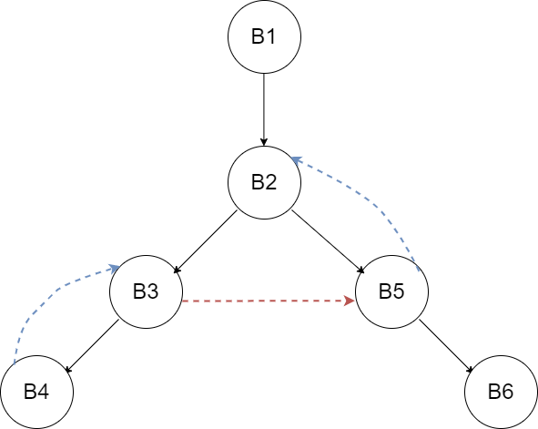

# H14 循环与代码生成

PB20000180 刘良宇

## 9.15

对图 9.32 的流图：

(a) 计算支配关系。

B1 支配 B1, B2, B3, B4, B5, B6，

B2 支配 B2, B3, B4, B5, B6，

B3 支配 B3, B4，

B4 支配 B4，

B5 支配 B5, B6，

B6 支配 B6。

(b) 找出一种深度优先排序。

B1, B2, B5, B6, B3, B4.

(c) 对 (b) 的结果，标明前进边、后撤边和交叉边。



前进边为黑色，后撤边为蓝色，交叉边为红色。

(d) 该流图是否可归约。

是。因为 (a) 中已得出 B3 支配 B4，B2 支配 B5。

(e) 计算该流图的深度。

深度为 2。B4 -> B3 -> B5 -> B2

(f) 找出该流图的自然循环。

{B3, B4}

{B2, B3, B4, B5}, {B2, B3, B4, B5, B6}

## 8.3

为下列 C 语句产生 8.2 节目标机器的代码，假定所有的变量都是静态的，并假定有 3 个寄存器可用于保存计算结果。

```c
x    = a[i] + 1;
a[i] = b[c[i]];
a[i] = a[i] + b[j];
```

a)

```assembly
MOV a, R0
MOV *i(R0), R0
ADD #1, R0
MOV R0, x
```

b)

```assembly
MOV i, R0
MOV a(R0), R1
MOV *c(R0), R0
MOV *b(R0), R0
MOV R0, *R1
```

c)

```assembly
MOV j, R0
MOV *b(R0), R1
MOV i, R0
MOV *a(R0), R2
ADD R1, R2
MOV R2, *a(R0)
```
