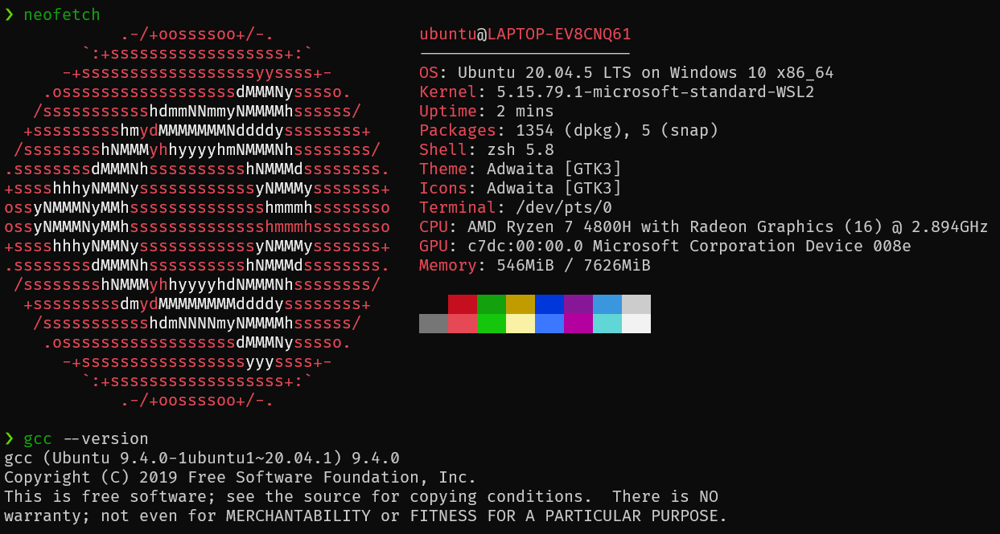

# 编译原理 H15-1

本次作业的任务是题目设计与解答。

设计了一道大题，三个小问。

三问分别考察了编译链接的过程，内存分配和代码优化。

## 问题

小鱼同学最近正在学习 LLVM IR，为此，他尝试翻译以下 C 语言程序：

```c
int main() {
    int ret = 0;
    while (1) {
        int i = getchar();
        putchar(i);
    }
    return ret;
}
```

他编写了以下的 LLVM IR 中间代码：

```llvm
define dso_local i32 @main() #0 {
loop:
  %i = alloca i32
  %char = call i32 @getchar()
  store i32 %char, i32* %i
  %char_ = load i32, i32* %i
  call void @putchar(i32 %char_)
  br label %loop
}

declare dso_local i32 @getchar() #1
declare dso_local void @putchar(i32) #1
```

随后，小鱼使用 `clang xiaoyu.ll -o test` 成功生成了可执行文件 `test`，小鱼很开心。

### 第一问

为什么小鱼的 LLVM IR 能够直接「调用」`getchar` 和 `putchar` 函数？从编译链接的过程考虑。尝试给出 `test` 可能链接的库。

### 第二问

开心过后，小鱼希望进一步测试自己的可执行文件 `test`。于是他想到一个主意，Linux 下，`/dev/random` 是一个不断产生随机数的文件，他决定向自己的程序输入大量随机字符测试：

```
./test < /dev/random
```

很遗憾，仅仅运行了几秒，小鱼的程序就惨遭 segmentation fault。

小鱼百思不得其解，你能帮助他解决这个问题吗？

提示：可以观察 clang 对于 C 语言源程序生成的 LLVM IR，然后对比小鱼的实现。

### 第三问

解决了上面的问题后，小鱼同学尝试翻译以下的 C 语言代码到 LLVM IR：

```cpp
int fact(int n, int acc) {
    if (n == 1) {
        return acc;
    }
    return fact(n - 1, acc * n);
}

int main() { return fact(1000000, 1); }
```

他翻译的结果是：

```llvm
define dso_local i32 @fact(i32 %0, i32 %1) {
  %nAlloca = alloca i32
  %accAlloca = alloca i32
  store i32 %0, i32* %nAlloca
  store i32 %1, i32* %accAlloca
  br label %start

start:
  %n = load i32, i32* %nAlloca
  %n_eq_1 = icmp eq i32 %n, 1
  br i1 %n_eq_1, label %true, label %false

true:
  %acc = load i32, i32* %accAlloca
  ret i32 %acc

false:
  %n_ = load i32, i32* %nAlloca
  %n_minus_1 = sub nsw i32 %n_, 1
  %acc_ = load i32, i32* %accAlloca
  %acc_times_n = mul nsw i32 %acc_, %n_
  %recur_res = call i32 @fact(i32 %n_minus_1, i32 %acc_times_n)
  ret i32 %recur_res
}

define dso_local i32 @main() {
  %r = call i32 @fact(i32 1000000, i32 1)
  ret i32 %r
}
```

小鱼通过 lli 来执行他翻译后的代码。

这次，小鱼的程序依然惨遭 segmentation fault。很显然，这是因为递归深度太深了。

此时，路过一旁的小亮说了一句话：只要将递归调用语句

```llvm
%recur_res = call i32 @fact(i32 %n_minus_1, i32 %acc_times_n)
ret i32 %recur_res
```

改成两条其他指令再加上一条跳转语句，就能顺利计算出结果了。你知道该如何修改吗？


## 答案

### 第一问

LLVM IR 中，小鱼对所用到的函数进行了声明，而后续编译过程中，clang 默认链接的标准库中包含了小鱼用到的 `getchar()` 和 `putchar()`，因此最终可以找到这两个符号。

使用 ` clang xiaoyu.ll -o test -v` 可以列出 clang 具体的编译过程。取最后一行：

```bash
 "/usr/bin/ld" -z relro --hash-style=gnu --eh-frame-hdr -m elf_x86_64 -dynamic-linker /lib64/ld-linux-x86-64.so.2 -o test /usr/lib/gcc/x86_64-linux-gnu/9/../../../x86_64-linux-gnu/crt1.o /usr/lib/gcc/x86_64-linux-gnu/9/../../../x86_64-linux-gnu/crti.o /usr/lib/gcc/x86_64-linux-gnu/9/crtbegin.o -L/usr/lib/gcc/x86_64-linux-gnu/9 -L/usr/lib/gcc/x86_64-linux-gnu/9/../../../x86_64-linux-gnu -L/usr/lib/gcc/x86_64-linux-gnu/9/../../../../lib64 -L/lib/x86_64-linux-gnu -L/lib/../lib64 -L/usr/lib/x86_64-linux-gnu -L/usr/lib/../lib64 -L/usr/lib/x86_64-linux-gnu/../../lib64 -L/usr/lib/gcc/x86_64-linux-gnu/9/../../.. -L/home/ubuntu/programs/llvm11.0.0/bin/../lib -L/lib -L/usr/lib /tmp/xiaoyu-a5ccd9.o -lgcc --as-needed -lgcc_s --no-as-needed -lc -lgcc --as-needed -lgcc_s --no-as-needed /usr/lib/gcc/x86_64-linux-gnu/9/crtend.o /usr/lib/gcc/x86_64-linux-gnu/9/../../../x86_64-linux-gnu/crtn.o
```

可以看出，以上的库都是可能被链接的（本题答案，方式不唯一）。

### 第二问

根据提示，观察 C 语言源程序生成的 LLVM IR：

`clang -S -emit-llvm test.c -o test.ll`

```llvm
define dso_local i32 @main() #0 {
  %1 = alloca i32, align 4
  %2 = alloca i32, align 4
  store i32 0, i32* %1, align 4
  br label %3

3:                                                ; preds = %0, %3
  %4 = call i32 @getchar()
  store i32 %4, i32* %2, align 4
  %5 = load i32, i32* %2, align 4
  %6 = call i32 @putchar(i32 %5)
  br label %3
}
```

可以发现，相比小鱼自己编写的版本，一个很显著的区别是变量 `i` 的分配放在了入口基本块内。

而小鱼的版本中，每次循环都会 `%i = alloca i32`，这一操作会扩充栈空间，实际是发生了内存泄漏，很快就用满了默认的 8MB 栈空间，引发段错误，程序退出。

因此解决问题的办法就是将变量内存的分配放在函数入口基本块（或者不要放在有循环的基本块内）

### 第三问

改为：

```llvm
store i32 %acc_times_n, i32* %accAlloca
store i32 %n_minus_1, i32* %nAlloca
br label %start
```

函数参数都作为栈上变量在第一个基本块分配了，我们只需要修改栈上这些变量的值，重新「调用」函数即可。

### 出题动机

出题的时候想了很久，要出什么样的题目。当然可以从书上/网上找一些编译原理的题目改编，但套路化的题目总是不够有趣，也不是很 real world。最后艰难地出了这三小问，个人觉得还算有趣。

第二问起因是最近几天一直在写 IR Builder，偶然间注意到了可能的内存泄漏问题。

内存管理一直都是一个很好玩的话题，这道题之外，或许还有以下的思考：

- C89 规定，变量只能在作用域的开头声明，这如何方便了代码生成？
- 对于现代的编译器开发而言，可以灵活使用各种封装好的数据结构及类，可以使用怎么样的逻辑来解决这种潜在的内存泄漏？

关于第二个问题，我自己的 IR Builder 是这样实现的：

```cpp
// 统一在最开始的基本块分配变量，防止循环造成的内存泄漏
auto *entryBB =
    builder->get_insert_block()->get_parent()->get_entry_block();
// 事实上创建了一条新指令，所以需要先移除，再添加到开头
alloca = AllocaInst::create_alloca(type, entryBB);
entryBB->get_instructions().pop_back();
entryBB->add_instr_begin(static_cast<Instruction *>(alloca));
```

所有的新的局部变量，统一放在入口基本块的开头申请栈空间。另外，在别的地方需要保证，控制流不会跳回入口基本块。

代码写起来很方便，这很大程度上是由于实验提供的代码生成框架做了一个很漂亮的抽象：每条指令并不是实际保存 `%op0` 这样的字符串作为指令 id，而是只保存 `Value*` 指针指向其他指令。这样就形成了 SSA 的一个图结构。在最后生成指令时，可以根据指令顺序（每个基本块保存自己的指令链表，每个函数又保存自己的基本块链表）为不同的指令及跳转基本块分配数字 id。

第三问的动机是尾递归。

> 如果一个函数尾调用了自己，那么这个调用就是尾递归的。尾递归的好处在于：通常情况下，调用一个新的函数会需要开辟新的函数栈，但是尾递归调用因为原函数的函数栈中信息已经无用，所以递归调用可以直接在原函数环境的基础上继续运算，不需要开辟新的空间。

用 LLVM IR 实现了一个尾递归优化的 example。

## 出题环境

