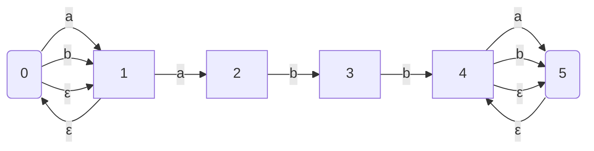
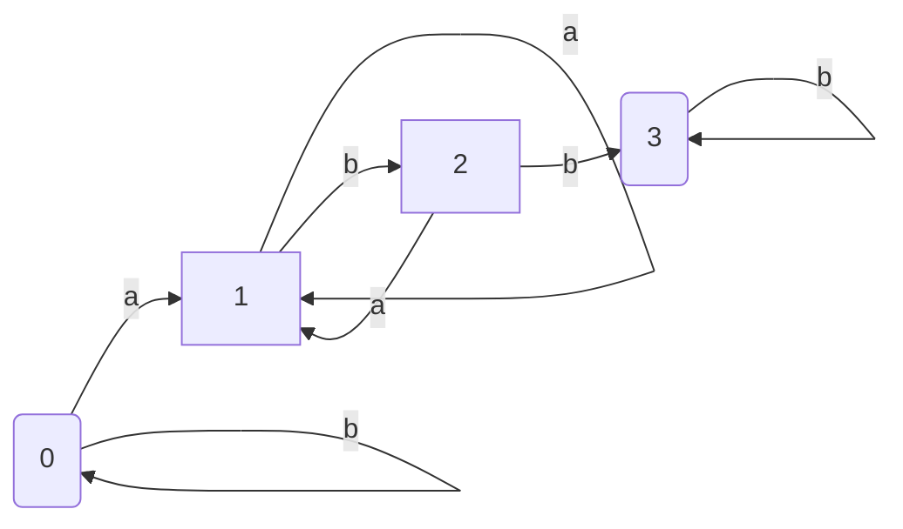
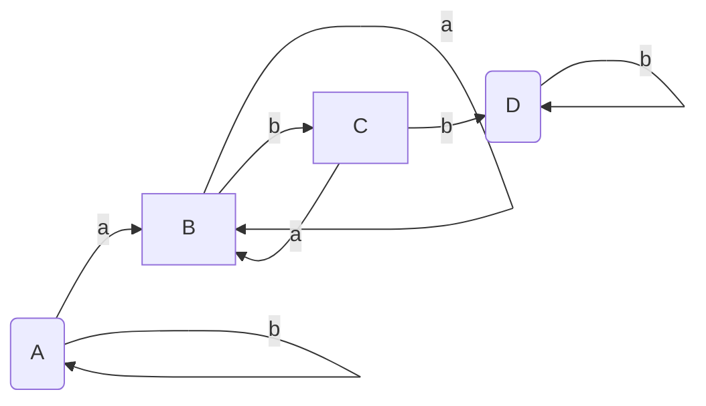

# 编译原理 H3-1 词法分析

PB20000180 刘良宇

为下列正规式手工构造 NFA 和 DFA, 再用算法将 NFA 变换成 DFA，并构造最简的 DFA： 

$(a|b)^*abb(a|b)^*$

## 手工构造 NFA

其中 $0$ 状态是起始状态，$5$ 状态是接受状态

## 手工构造 DFA

其中 $0$ 状态是开始状态，$3$ 状态是接受状态

## NFA 变换为 DFA

$A = \{0, 1\}$

$B = \{0, 1, 2\}$

$C = \{0, 1, 3\}$

$D = \{0, 1, 4, 5\}$

| 状态 | 输入 $a$ | 输入 $b$ |
| :--: | :------: | :------: |
| $A$  |   $B$    |   $A$    |
| $B$  |   $B$    |   $C$    |
| $C$  |   $B$    |   $D$    |
| $D$  |   $D$    |   $D$    |

其中 $A$ 状态是开始状态，$D$ 状态是接受状态

## 最简 DFA

上述 DFA 不存在可区别的状态，所以已经是最简

