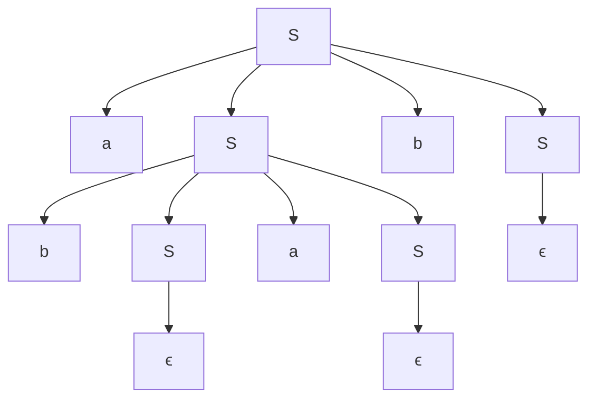
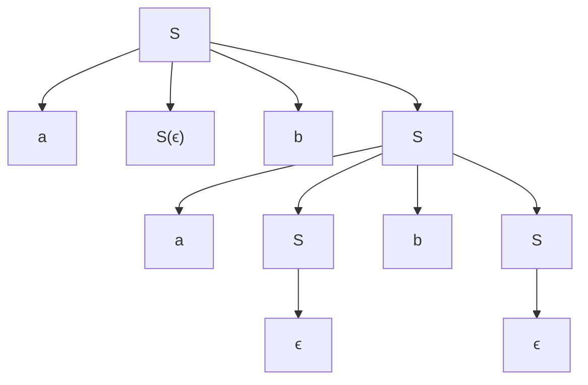
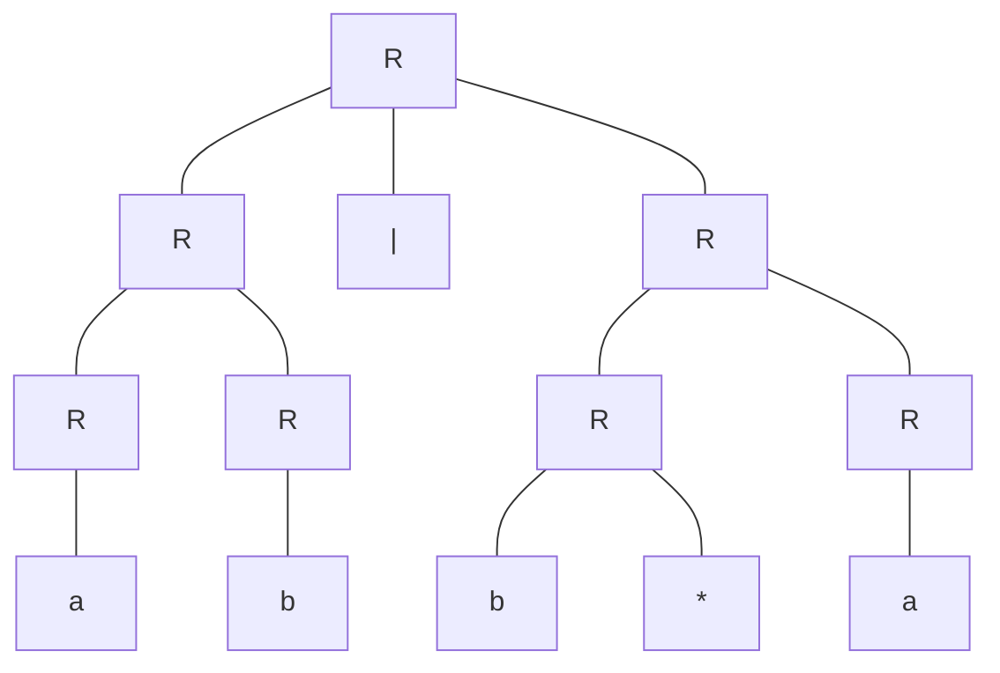
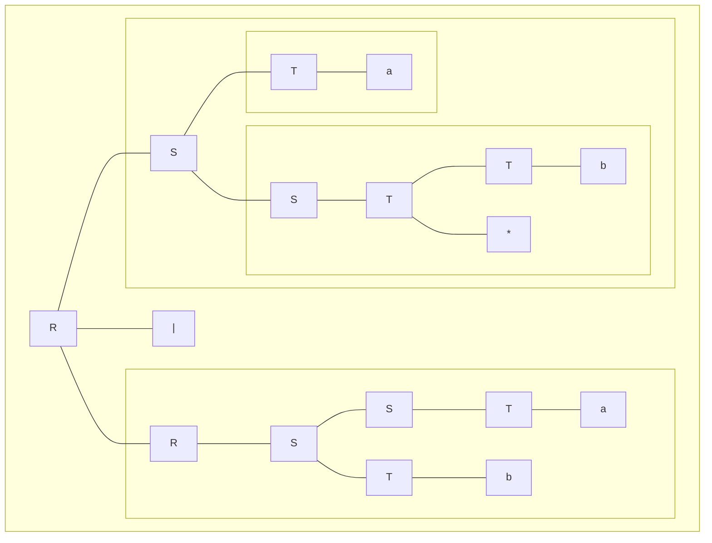

# 编译原理 H3-2

PB20000180 刘良宇

## 3.2

考虑文法 $S \rarr aSbS\ |\ bSaS\ |\ ϵ $

(a) 为句子 $abab$ 构造两个不同的最左推导，以此说明该文法是二义的。

一方面：

$$
\begin{align*}
S &\implies aSbS\\
  &\implies a(bSaS)bS\\
  &\implies a(bϵaS)bS\\
  &\implies a(bϵaϵ)bS\\
  &\implies a(bϵaϵ)bϵ\\
  &\implies abab
\end{align*}
$$

另一方面：

$$
\begin{align*}
S &\implies aSbS\\
  &\implies aϵbS\\
  &\implies aϵb(aSbS)\\
  &\implies aϵb(aϵbS)\\
  &\implies aϵb(aϵbϵ)\\
  &\implies abab\\
\end{align*}
$$

所以该文法是二义的

(b) 为 $abab$ 构造对应的最右推导。 

一方面：

$$
\begin{align*}
S &\implies aSbS\\
  &\implies aSbϵ\\
  &\implies a(bSaS)bϵ\\
  &\implies a(bSaϵ)bϵ\\
  &\implies a(bϵaϵ)bϵ\\
  &\implies abab
\end{align*}
$$

另一方面：

$$
\begin{align*}
S &\implies aSbS\\
  &\implies aSb(aSbS)\\
  &\implies aSb(aSbϵ)\\
  &\implies aSb(aϵbϵ)\\
  &\implies aϵb(aϵbϵ)\\
  &\implies abab\\
\end{align*}
$$

(c) 为 $abab$ 构造对应的分析树。

一方面：

另一方面：

(d) 这个文法产生的语言是什么？

字母表 $\{a, b\}$ 上 $a$ 和 $b$ 的个数相等的所有串

## 3.4

文法 $R \rarr R '|' R\ |\ R R\ |\ R^*\ |\ ( R )\ |\ a\ |\ b$ 产生字母表 ${a, b}$ 上所有不含 *ϵ* 的正规式。注意，第一条竖线加了引号，它是正规式的或运算字符，而不是文法产生式右部各选择之间的分隔符，另外 \* 在这儿是一个普通的终结符。该文法是二义的。 

(a) 证明该文法产生字母表 ${a, b}$ 上的所有正规式。

按照正规式中出现的运算符次数 $n$ 归纳（此处把连接也看做一个运算符）

- $n=0$ 时，则正规式只能是 $a, b$ ，都符合 $R$

- 假设 $n\le k$ 时成立，考虑 $n=k+1$ ，对于一个正则式，根据优先级，我们总能找到最后的运算符：

  - 连接运算：则正则式可写成 $R_1R_2$ ，两部分运算符数均不超过 $k$ ，由归纳假设，正则式符合 $R$
  - 或运算：则正则式可写成 $R_1\ |\ R_2$ ，两部分运算符数均不超过 $k$ ，由归纳假设，正则式符合 $R$
  - 闭包运算：则正则式可写成 $R_1^*$ ，$R_1$ 运算符数为 $k$ ，由归纳假设，正则式符合 $R$
  - （注：上面的 $R_1$ 和 $R_2$ 可能外层包含括号，但不影响结果，方便起见不再单独讨论）

  综上，$n=k+1$ 时，正规式也都符合 $R$

根据数学归纳法，就证明了该文法产生字母表 ${a, b}$ 上的所有正规式

(b) 为该文法写一个等价的非二义文法。它给予算符 \*、连接和 | 的优先级和结合性同 2.2 节中定义的一致。 
$$
\begin{align*}
R &\rarr R'|'S\ |\ S\\
S &\rarr ST\ |\ T\\
T &\rarr T^*\ |\ '('R')'\ |\ a\ |\ b 
\end{align*}
$$
(c) 按上面两个文法构造句子 $ab|b^*a$ 的分析树。

由题目给定的文法（不唯一，此处给出一个作为示例）：

由非二义文法：

## 3.6

为字母表 $Σ = \{a, b\}$ 上的下列每个语言设计一个文法，其中哪些语言是正规的？

(c) $a$ 和 $b$ 的个数不相等的所有串。 

终结符 $a, b, ϵ$，非终结符 $S, A, B$，开始符号 $S$，产生式：
$$
\begin{align*}
S &\rarr A\ |\ B \\
A &\rarr a\ |\ aA\ |\ AAb \ |\ AbA\ |\ bAA\\
B &\rarr b\ |\ bB\ |\ BBa \ |\ BaB\ |\ aBB
\end{align*}
$$
（$A$ 表示串中 $a$ 个数更多，$B$ 表示串中 $b$ 个数更多）

注：$A\rarr AbA$ 的情况不是很显然，解释如下：

- 首先，通过 $A \rarr bAA$ 和 $A \rarr AAb$ 已经描述了开头结尾是 $b$ 的情况，此处不妨假设串以 $a$ 开头结尾
- $AbA$ 中 $a$ 个数更多，我们不妨在第一个出现的 $b$ 处添加 $b$，使得串中 $a$ 总共恰好比 $b$ 多出现一次
- 从左往右统计 $a,b$ 出现的次数，由于最后一个字符是 $a$，因此一定在某处第一次发生 $a$ 与 $b$ 出现次数相等，又因为第一个字符是 $a$，所以第一次发生 $a$ 和 $b$ 出现次数相等时，当前字符一定是 $b$，这个 $b$ 的左边子串和右边子串都恰好满足 $a$ 的个数比 $b$ 的个数多 $1$
- 这就说明我们添加了一些 $b$ 的子串满足 $AbA$ 的形式，删去多添加的 $b$，说明原串也满足这一形式

该语言不是正规的，因为无法用正则式表达（考虑 $aaaa....aaabbbb...bbb$，不难发现有限的状态无法表达）

(d) 不含 $abb$ 作为子串的所有串。

终结符 $a, b, ϵ$，非终结符 $S, A, B$，开始符号 $S$，产生式：
$$
\begin{align*}
S &\rarr ϵ\ |\ aA\ |\ bS\\
A &\rarr ϵ\ |\ aA\ |\ bB\\
B &\rarr ϵ\ |\ aA\
\end{align*}
$$

该语言是正规的（由定义即得）

## 3.8  (a)

消除习题 3.1 文法的左递归。 注：习题 3.1 的文法如下：
$$
\begin{align*}
S &→ (L)\ |\ a\\
L &→ L,S\ |\ S
\end{align*}
$$
改写为：
$$
\begin{align*}
S &→ (L)\ |\ a\\
L &→ SL'\\
L' &→ ,SL'\ |\ ϵ
\end{align*}
$$
