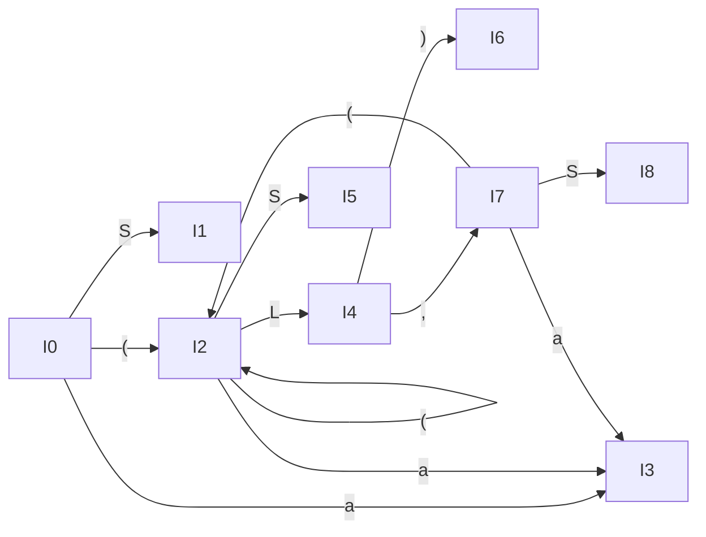

# H6-1 语法分析 4

PB20000180 刘良宇

## 3.17

给出接受文法

$$
\begin{align*}
S &\rarr (L)\ |\ a\\
L &\rarr L, S\ |\ S
\end{align*}
$$

的活前缀的一个 DFA。

$$
\begin{align*}
I_0: S' &\rarr \cdot S\\
S &\rarr \cdot (L)\\
S &\rarr \cdot a\\
\end{align*}
$$

记 $I_1 = goto(I_0, S)$

$$
\begin{align*}
I_1: S' &\rarr S\cdot
\end{align*}
$$

记 $I_2 = goto(I_0, '(')$

$$
\begin{align*}
I_2:
S &\rarr ( \cdot L)\\
L &\rarr \cdot L, S\\
L &\rarr \cdot S\\
S &\rarr \cdot (L)\\
S &\rarr \cdot a\\
\end{align*}
$$

记 $I_3 = goto(I_0, a)$

$$
\begin{align*}
I_3:
S &\rarr a \cdot
\end{align*}
$$

记 $I_4 = goto(I_2, L)$

$$
\begin{align*}
I_4:
S &\rarr (L\cdot)\\
L &\rarr L\cdot, S
\end{align*}
$$

记 $I_5 = goto(I_2, S)$

$$
\begin{align*}
I_5:
L &\rarr S\cdot
\end{align*}
$$

另外有

- $I_2 = goto(I_2, '(')$

- $I_3 = goto(I_2, 'a')$

记 $I_6 = goto(I_4, ')')$
$$
\begin{align*}
I_6:
S &\rarr (L)\cdot
\end{align*}
$$

记 $I_7 = goto(I_4, ',')$

$$
\begin{align*}
I_7:
L &\rarr L,\cdot S\\
S &\rarr \cdot (L)\\
S &\rarr \cdot a\\
\end{align*}
$$

记 $I_8 = goto(I_7, S)$

$$
\begin{align*}
I_8:
L &\rarr L, S\cdot
\end{align*}
$$

另外有

- $I_2 = goto(I_7, '(')$

- $I_3 = goto(I_7, 'a')$

如上定义下，DFA 如图所示：

## 3.19

考虑下面的文法

$$
\begin{align*}
E &\rarr E + T\ |\ T\\
T &\rarr T F\ |\ F\\
F &\rarr F^*\ |\ a\ |\ b
\end{align*}
$$

首先，为产生式编号：
$$
\begin{align*}
(0)&:E' \rarr E\\
(1)&:E \rarr E + T\\
(2)&:E \rarr T\\
(3)&:T \rarr TF\\
(4)&:T \rarr F\\
(5)&:F \rarr F^*\\
(6)&:F \rarr a\\
(7)&:F \rarr b\\
\end{align*}
$$

(a) 为此文法构造 SLR 分析表。

列出 SLR 闭包表（简洁起见，只保留 kernel）：

<table border="1"><thead><tr><th colspan="4">SLR closure table</th></tr><tr><th>Goto</th><th>Kernel</th><th>State</th></tr></thead><tbody id="lrClosureTableRows"><tr><td></td><td>{E' -&gt; .E}</td><td style="color: blue;">0</td></tr><tr><td>goto(0, E)</td><td>{E' -&gt; E.; E -&gt; E.+ T}</td><td style="color: blue;">1</td></tr><tr><td>goto(0, T)</td><td>{E -&gt; T.; T -&gt; T.F}</td><td style="color: blue;">2</td></tr><tr><td>goto(0, F)</td><td>{T -&gt; F.; F -&gt; F.*}</td><td style="color: blue;">3</td></tr><tr><td>goto(0, a)</td><td>{F -&gt; a.}</td><td style="color: blue;">4</td></tr><tr><td>goto(0, b)</td><td>{F -&gt; b.}</td><td style="color: blue;">5</td></tr><tr><td>goto(1, +)</td><td>{E -&gt; E +.T}</td><td style="color: blue;">6</td></tr><tr><td>goto(2, F)</td><td>{T -&gt; T F.; F -&gt; F.*}</td><td style="color: blue;">7</td></tr><tr><td>goto(2, a)</td><td>{F -&gt; a.}</td><td style="color: blue;">4</td></tr><tr><td>goto(2, b)</td><td>{F -&gt; b.}</td><td style="color: blue;">5</td></tr><tr><td>goto(3, *)</td><td>{F -&gt; F *.}</td><td style="color: blue;">8</td></tr><tr><td>goto(6, T)</td><td>{E -&gt; E + T.; T -&gt; T.F}</td><td style="color: blue;">9</td></tr><tr><td>goto(6, F)</td><td>{T -&gt; F.; F -&gt; F.*}</td><td style="color: blue;">3</td></tr><tr><td>goto(6, a)</td><td>{F -&gt; a.}</td><td style="color: blue;">4</td></tr><tr><td>goto(6, b)</td><td>{F -&gt; b.}</td><td style="color: blue;">5</td></tr><tr><td>goto(7, *)</td><td>{F -&gt; F *.}</td><td style="color: blue;">8</td></tr><tr><td>goto(9, F)</td><td>{T -&gt; T F.; F -&gt; F.*}</td><td style="color: blue;">7</td></tr><tr><td>goto(9, a)</td><td>{F -&gt; a.}</td><td style="color: blue;">4</td></tr><tr><td>goto(9, b)</td><td>{F -&gt; b.}</td><td style="color: blue;">5</td></tr></tbody></table>

根据定义，给出 SLR 分析表：

<table border="1"><thead><tr><th colspan="10">SLR table</th></tr><tr><th rowspan="2">State</th><th rowspan="1" colspan="5">ACTION</th><th colspan="4">GOTO</th></tr>
<tr><th>+</th><th>*</th><th>a</th><th>b</th><th>$</th><th>E'</th><th>E</th><th>T</th><th>F</th></tr></thead><tbody><tr><td style="color: blue;">0</td><td>&nbsp;</td><td>&nbsp;</td><td>s4</td><td>s5</td><td>&nbsp;</td><td>&nbsp;</td><td>1</td><td>2</td><td>3</td></tr>
<tr><td style="color: blue;">1</td><td>s6</td><td>&nbsp;</td><td>&nbsp;</td><td>&nbsp;</td><td>acc</td><td>&nbsp;</td><td>&nbsp;</td><td>&nbsp;</td><td>&nbsp;</td></tr>
<tr><td style="color: blue;">2</td><td>r2</td><td>&nbsp;</td><td>s4</td><td>s5</td><td>r2</td><td>&nbsp;</td><td>&nbsp;</td><td>&nbsp;</td><td>7</td></tr>
<tr><td style="color: blue;">3</td><td>r4</td><td>s8</td><td>r4</td><td>r4</td><td>r4</td><td>&nbsp;</td><td>&nbsp;</td><td>&nbsp;</td><td>&nbsp;</td></tr>
<tr><td style="color: blue;">4</td><td>r6</td><td>r6</td><td>r6</td><td>r6</td><td>r6</td><td>&nbsp;</td><td>&nbsp;</td><td>&nbsp;</td><td>&nbsp;</td></tr>
<tr><td style="color: blue;">5</td><td>r7</td><td>r7</td><td>r7</td><td>r7</td><td>r7</td><td>&nbsp;</td><td>&nbsp;</td><td>&nbsp;</td><td>&nbsp;</td></tr>
<tr><td style="color: blue;">6</td><td>&nbsp;</td><td>&nbsp;</td><td>s4</td><td>s5</td><td>&nbsp;</td><td>&nbsp;</td><td>&nbsp;</td><td>9</td><td>3</td></tr>
<tr><td style="color: blue;">7</td><td>r3</td><td>s8</td><td>r3</td><td>r3</td><td>r3</td><td>&nbsp;</td><td>&nbsp;</td><td>&nbsp;</td><td>&nbsp;</td></tr>
<tr><td style="color: blue;">8</td><td>r5</td><td>r5</td><td>r5</td><td>r5</td><td>r5</td><td>&nbsp;</td><td>&nbsp;</td><td>&nbsp;</td><td>&nbsp;</td></tr>
<tr><td style="color: blue;">9</td><td>r1</td><td>&nbsp;</td><td>s4</td><td>s5</td><td>r1</td><td>&nbsp;</td><td>&nbsp;</td><td>&nbsp;</td><td>7</td></tr>
</tbody></table>

(b) 为此文法构造 LALR 分析表。

由于该文法是 SLR 的，所以最终化简得到的分析表与上述分析表几乎一致，区别只在于搜索符：

对于即将到达 acc 的状态，搜索符为 $，否则搜索符为任意终结符，此处不再单独列表
