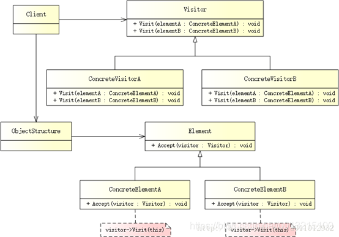

### 任务描述


本关任务：熟悉SysYF语言以及本项目提供的SysYF解析器`sysYFParser`及其构造的抽象语法树。


### 相关知识
#### SysYF语言定义
SysYF语言定义见`SysYF语言定义.pdf`。该文档包含了部分语义说明(如同名标识符的约定等)。

#### 抽象语法树的结构
本项目提供的抽象语法树AST的结构说明见`doc/AST.md`,对应的AST及其打印器的声明和定义见`include/SyntaxTree.h, SyntaxTreePrinter.h`，`src/SyntaxTree.cpp,SyntaxTreePrinter.cpp`。

#### 访问者模式
访问者模式是一种设计模式，它的应用场景主要为：
- 要遍历某个数据结构的每个节点，并对每个节点做一些操作
- 数据结构相对固定
- 操作有多种

访问者模式的UML类图和角色构成如下图所示：



- 抽象访问者（Visitor）：声明了一个或者多个访问操作，形成所有的具体元素角色必须实现的接口。
- 具体访问者（ConcreteVisitor）：实现抽象访问者角色所声明的接口，也就是抽象访问者所声明的各个访问操作。
- 抽象节点（Element）：声明一个接受操作，接受一个访问者对象作为一个参量。
- 具体节点（ConcreteElement）：实现了抽象元素所规定的接受操作。
- 结构对象（ObjectStructure）：有如下的一些责任，可以遍历结构中的所有元素；如果需要，提供一个高层次的接口让访问者对象可以访问每一个元素；如果需要，可以设计成一个复合对象或者一个聚集，如列（List）或集合（Set）。

从以上的UML类图可以概括出访问者模式的实现做法：

- 每个节点类（被访问）预留出通用的接口`accept()`
- 提供一个访问者基类
- 为每种操作编写访问者类，它继承自访问者基类

##### 示例

[示例网址](https://blog.csdn.net/lcl_data/article/details/11607377)

其中

`Visitor`类即抽象访问者

`IncomeVisitor`,`VacationVisitor`即具体访问者

`Element`即抽象节点

`Employee`即具体节点

`Employees`即结构对象，包含`list<Employee*>`


### 本关具体任务
1. 熟悉本项目提供的SysYF解析器，编译运行它，用它处理SysYF程序，输出语法树。编译流程为(在项目根目录下在bash中以user用户身份执行)

```
mkdir build; cd build
cmake ..
make
```

2. 在`doc/answer.md`文件中回答以下问题。

**问题1-1**. 请阅读`include/SyntaxTreePrinter.h`和`src/SyntaxTreePrinter.cpp`，总结`VarDef`、`InitVal`、`LVal`、`FuncDef`、`FuncFParamList`、`FuncParam`、`BlockStmt`等节点类的结构及其`visit`方法的实现特点。
