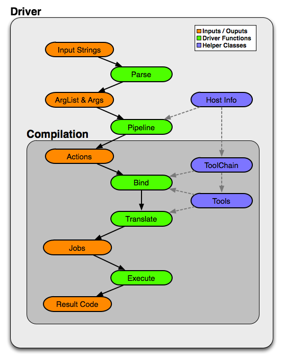

- [任务描述](#任务描述)
- [相关知识](#相关知识)
  - [Clang driver处理流程](#clang-driver处理流程)
  - [自定义可扩展Driver类及其使用](#自定义可扩展driver类及其使用)
    - [1. 定义一个`Driver`类，它包含`Clang driver`成员对象`_TheDriver`](#1-定义一个driver类它包含clang-driver成员对象_thedriver)
    - [2. 在主程序初始化`Driver`类的实例](#2-在主程序初始化driver类的实例)
    - [3. 通过`Driver`实例解析参数并构建编译任务实例](#3-通过driver实例解析参数并构建编译任务实例)
    - [4. 通过`Driver`实例执行编译任务](#4-通过driver实例执行编译任务)
    - [5. 构建JIT执行引擎来执行代码](#5-构建jit执行引擎来执行代码)
  - [快速排序算法以及链接系统库函数](#快速排序算法以及链接系统库函数)
- [本关具体任务](#本关具体任务)
- [思考题](#思考题)

### 任务描述

**本关任务**：了解`Clang driver`的结构，弄清楚`driver`加载c文件、得到中间表示 `AST` 和 `LLVM IR` 、并将其打印的流程。根据 `LLVM IR API` 提供的中间表示构建方式，构建快速排序（QuickSort）算法的 `LLVM IR` 代码，并在`driver`中加载`LLVM IR`程序，通过`JIT`执行。


### 相关知识

#### Clang driver处理流程

`Clang`是`LLVM`的`C/C++`前端，它能为输入的`C/C++`源程序产生`LLVM IR`中间表示。`Clang driver`是连接`LLVM`整个编译过程和其他工具的一个驱动程序，它可以生成可执行文件或目标代码。你可以参考[main.cpp](../Student/task3/main.cpp)了解一个`Clang driver`程序的构成。本小节参考了[Clang Driver官方文档](https://releases.llvm.org/11.0.0/tools/clang/docs/DriverInternals.html)，并根据具体的`Clang`版本展示了其驱动的使用效果。



上图展示了`Clang driver`的整体架构，其处理流程可以分为五个阶段：

1. `Parse`：将命令行中的参数字符串解析为若干个参数(`Arg`类的实例)。`Clang driver`可以通过`-###`选项查看`Parse`阶段的结果，例如：

```
$ clang -### --target=x86_64 -fomit-frame-pointer -Wa, -Ifoo helloworld.c
clang version 11.0.0
Target: x86_64
Thread model: posix
InstalledDir: /usr/local/bin
 "/usr/local/bin/clang-11" "-cc1" "-triple" "x86_64" "-emit-obj" "-mrelax-all" "-disable-free" "-disable-llvm-verifier" "-discard-value-names" "-main-file-name" "helloworld.c" "-mrelocation-model" "static" "-mframe-pointer=none" "-fmath-errno" "-fno-rounding-math" "-mconstructor-aliases" "-munwind-tables" "-target-cpu" "x86-64" "-fno-split-dwarf-inlining" "-debugger-tuning=gdb" "-resource-dir" "/usr/local/lib/clang/11.0.0" "-I" "foo" "-fdebug-compilation-dir" "/mnt/cgshare/project/SysYF/Parser-Lab/src" "-ferror-limit" "19" "-fgnuc-version=4.2.1" "-fcolor-diagnostics" "-faddrsig" "-o" "/tmp/helloworld-06c0c2.o" "-x" "c" "helloworld.c"
 "/usr/bin/gcc" "-fomit-frame-pointer" "-Wa," "-I" "foo" "-m64" "-o" "a.out" "/tmp/helloworld-06c0c2.o"
```
其中，`helloworld`在`Student/task3/tests`中。这里，`Parse`阶段将不同的参数解析、分配到对应的阶段中，并将各个阶段实际执行的命令显示了出来。

2. `Pipeline`：根据输入文件的类型，判定需要进行的编译工作(预处理、编译、汇编、链接等)，以及对每个任务构造一个`Action`实例的列表。`Clang driver`可以通过`-ccc-print-phases`查看本阶段的结果，例如：

```
$ clang -ccc-print-phases helloworld.c -o helloworld
            +- 0: input, "helloworld.c", c
         +- 1: preprocessor, {0}, cpp-output
      +- 2: compiler, {1}, ir
   +- 3: backend, {2}, assembler
+- 4: assembler, {3}, object
5: linker, {4}, image
```

这里有6个工作，前5个将`helloworld.c`编译成目标文件，最后一个将其链接。

3. `Bind`：驱动器自顶向下地为`Action`实例分配给特定的工具。`Clang driver`可以通过`-ccc-print-bindings`查看本阶段的结果，例如：

```
$ clang -ccc-print-bindings helloworld.c -o helloworld
# "x86_64-unknown-linux-gnu" - "clang", inputs: ["helloworld.c"], output: "/tmp/helloworld-f0b660.o"
# "x86_64-unknown-linux-gnu" - "GNU::Linker", inputs: ["/tmp/helloworld-f0b660.o"], output: "helloworld"
```

这里展示了绑定到编译序列的工具链、工具、文件的输入和输出。`clang`用于编译`helloworld.c`，`GNU`的链接器`ld`用来链接。

4. `Translate`：根据输入的参数，构建具体的在编译过程中工具所需的`Command`实例。
5. `Execute`：创建子进程，调用相应的工具执行任务。

#### 自定义可扩展Driver类及其使用

我们定义可扩展的`Driver`类(其头文件和源程序文件分别位于[include/Driver](../Student/task3/include/Driver)、[src/Driver](../Student/task3/src/Driver))，它调用`Clang/LLVM API`实现对输入的源程序文件的解析，产生`AST`、`LLVM IR`等中间表示；并在主程序[main.cpp](../Student/task3/main.cpp)中创建和使用`Driver`类的实例编译C程序，构建执行引擎执行产生的可执行代码。

##### 1. 定义一个`Driver`类，它包含`Clang driver`成员对象`_TheDriver`
`Clang driver`类的初始化参数需要`clang`的路径、一个`DiagnosticsEngine`用于报告错误和目标平台的信息。

##### 2. 在主程序初始化`Driver`类的实例
```
  // 创建诊断函数
  IntrusiveRefCntPtr<DiagnosticOptions> DiagOpts = new DiagnosticOptions();
  TextDiagnosticPrinter *DiagClient =new TextDiagnosticPrinter(llvm::errs(), &*DiagOpts);
  IntrusiveRefCntPtr<DiagnosticIDs> DiagID(new DiagnosticIDs());
  DiagnosticsEngine Diags(DiagID, &*DiagOpts, DiagClient);

  // 得到当前进程运行所在的目标平台信息，用于JIT中把代码load进当前进程
  const std::string TripleStr = llvm::sys::getProcessTriple();
  llvm::Triple T(TripleStr)

  // clang的路径
  llvm::ErrorOr<std::string> ClangPath = llvm::sys::findProgramByName("clang");

  // 实例化`Driver`
  Driver TheDriver(StringRef((*ClangPath).c_str()), T.str(), Diags);
```
##### 3. 通过`Driver`实例解析参数并构建编译任务实例
`Driver`本身并不直接实现编译或链接代码等繁重工作，它其实是一个调度器。它通过`Driver::ParseArgs`解析命令行参数，通过`Driver::BuildCI`根据参数选项构建要执行的编译任务，如构建调用`Clang`的其他部分或工具(如`ld`)的命令。任务列表封装在`Compilation`对象中，同时还需要一个保存编译器所需数据的`CompilerInvocation`对象、以及一个`CompilerInstance`编译器实例。

```
  // 调用Clang Driver根据参数创建编译任务实例
  _C.reset(_TheDriver.BuildCompilation(_Args));

  // 创建一个编译器实例来接收编译任务并设置该实例的诊断器
  std::shared_ptr<CompilerInvocation> CI(new CompilerInvocation);
  CompilerInvocation::CreateFromArgs(*CI, Cmd.getArguments(), Diags);

  //_Clang类型为clang::CompilerInstance
  _Clang.setInvocation(CI);
  _Clang.createDiagnostics();
```
##### 4. 通过`Driver`实例执行编译任务
在主程序中创建LLVM上下文`LLVMContext`以及编译单元对应于LLVM的`llvm::Module`实例，对输入的C程序执行编译任务。你需要理解`Driver`类的实例方法`printASTUnit`、`FrontendCodeGen`、`InitializePasses`、`addPass`、`run`。

##### 5. 构建JIT执行引擎来执行代码
在主程序中为传入的LLVM的`llvm::Module`实例创建类别为`EngineKind::JIT`的执行引擎`EngineBuilder`，对指定的入口函数调用调用执行引擎的`runFunction`进行JIT编译和执行。

#### 快速排序算法以及链接系统库函数

在task3中的`tests\quicksort.c` 中，我们提供了快速排序算法的一种实现。其中会调用一些输入输出和计时函数，例如：

```c
int array_num = getfarray(array);
int start = current_time();
...
int end = current_time();
putfarray(array_num, array);
putint(end - start);
putch(' ');
putch('m');
putch('s');
putch('\n');
```

`getfarray`、`putfarray`和`putch`为`runtime/io.h`中声明的输入输出函数。通过C语言编译器，可以将定义在`runtime/io.cpp`中的输入输出函数的函数体链接到可执行程序`quicksort`中，从而实现调用`stdio.h`中的输入输出函数。在`Driver`框架中，可以通过在`runtime/runtime.h`中定义的输入输出函数，在`IR Module`中通过创建对应的`call`指令，可以实现输入输出。

### 本关具体任务

1. 在`report.md`内回答[思考题](#思考题) 
2. 在`task3`中的`include/IR/qs_generator.hpp`中，仿照`include/IR/gcd_generator.hpp`完成使用快速排序的`LLVM IR`的实现，并在`main.cpp`中调用该实现获得`IR Module`并执行
3. 在`task3`中的`src/runtime/runtime.cpp`中，补全输入输出函数以及计时函数在`LLVM IR Module`中的声明，以使得`DynamicLibrary`可以将这些函数都加入到符号表中

### 思考题

请在`report/report.md`中详细回答下述思考题：

3-1 `src/driver.cpp`中`printASTUnit()`方法通过编译器实例`_Clang`执行`ASTDumpAction`，实现了解析抽象语法树并打印的功能。请根据[Clang&#32;driver处理流程](#相关知识)回答该方法包含了哪几个阶段？

3-2 根据`include/driver.h`中`_Act`类型，请简述`src/driver.cpp`中`FrontendCodeGen()`方法的功能。