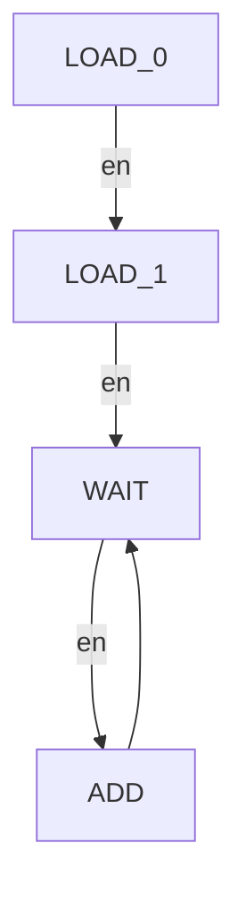

<div style="text-align:center;font-size:2em;font-weight:bold">中国科学技术大学计算机学院</div>

<div style="text-align:center;font-size:2em;font-weight:bold">《计算机组成原理实验报告》</div>


<div style="display:flex;justify-content:center;font-size:2em">
<div>
<p>实验题目：运算器及其应用</p>
<p>学生姓名：刘良宇</p>
<p>学生学号：PB20000180</p>
<p>完成时间：2022. 3. 17</p>
</div>
</div>

<div style="page-break-after:always"></div>

## 实验题目

运算器及其应用

## 实验目的

- 熟练掌握算术逻辑单元 (ALU) 的功能
- 掌握数据通路和控制器的设计方法
- 掌握组合电路和时序电路，以及参数化和结构化的 Verilog 描述方法
- 了解查看电路性能和资源使用情况

## 实验环境

- VLAB：vlab.ustc.eud.cn
- Vivado
- Nexys4DDR

## 实验步骤

### ALU 模块的逻辑设计和仿真

首先需要写一个 ALU

```verilog
module alu #(parameter WIDTH = 32)
            (input [WIDTH - 1: 0] a,
             input [WIDTH - 1: 0] b,      // 两操作数
             input [2:0] s,               // 功能选择
             output reg [WIDTH - 1: 0] y, // 运算结果
             output reg [2:0] f);         // 标志

    wire a_s, b_s;
    assign a_s = ~a[WIDTH - 1];
    assign b_s = ~b[WIDTH - 1];

    always @(*) begin
        f = 3'b000;
        y = 0;
        case (s)
            3'b000: y = a - b;
            3'b001: y = a + b;
            3'b010: y = a & b;
            3'b011: y = a | b;
            3'b100: y = a ^ b;
            3'b101: y = a >> b;
            3'b110: y = a << b;
            3'b111: y = ($signed(a)) >>> b;       // signed
        endcase
        if (s == 3'b000) begin
            f[0] = (a == b ? 1'b1 :1'b0);
            f[1] = {a_s, a} < {b_s, b} ? 1'b1 : 1'b0;
            f[2] = (a < b ? 1'b1 :1'b0);
        end
    end
endmodule
```

ALU 只有组合逻辑电路，写起来相对简单

这里如下两点需要注意：

- 算术右移需要显式指定
- 如何处理有符号数的大小比较

前者 Verilog 提供了内置语法 `>>>`，但需要注意的是需要显示指定前面的操作数为有符号类型，本模块使用了类型转换达成这一目的

对于有符号数的大小比较，这里回顾补码的相关知识，本质是一个抽象代数里的环，这里给正数和 0 的开头补一个 1 即可

下面考虑 ALU 模块的仿真，这里可以直接测试 32 位的 ALU 模块

因为 ALU 的测试单纯是组合逻辑，我们采用 verilator, 使用 C++ 编写 tb，可以实现 100% coverage 的测试

```cpp
// 生成随机数（固定种子确保可复现）
srand(1024);

// 功能函数数组，模拟每一种功能
int (*a[8])(int, int) = { _minus, _add, _and, _or, _xor,
                        l_rshift, lshift, a_rshift };

// 测试每一种功能
for (int s = 0; s < 8; s++) {
    // 测十次
    for (int i = 0; i < 10; i++) {
        top->a = get_rand_i32();	// input 值
        top->b = get_rand_i32();
        top->s = s;
        top->eval();				// 计算，以比较 output
        if (top->y != a[s](top->a, top->b)) {
            cout << "error test case\n";
            cout << "mode: " << s;
        }
        if (s == 0) {
            if (top->f != cmp_f(top->a, top->b)) {
                cout << "error cmp\n";
            }
        }
        tfp->dump(main_time);
        main_time++;
    }
}

std::cout << "test finished\n";
```

测试：


证明功能实现良好

当然常规 testbench 能得到的波性文件 verilator 也是可以顺便生成的：


### 6 位 ALU 的下载测试

下载测试需要首先编写 `top` 模块

```verilog
`include "alu.v"
`include "btn_edge.v"

module top(input CLK,
           input CPU_RESETN,
           input BTNC,
           input [15:0] SW,
           output [15:0] LED);
    reg [5:0] a;
    reg [5:0] b;
    reg [2:0] s;

    wire en_edge;
    btn_edge get_edge(.clk(CLK), .button(BTNC), .button_edge(en_edge));

    always @(posedge CLK) begin
        if (!CPU_RESETN) begin
            a <= 6'b0;
            b <= 6'b0;
            s <= 3'b0;
        end
        else begin
            if (en_edge) begin
                s <= SW[15:13];
                a <= SW[11:6];
                b <= SW[5:0];
            end
        end
    end

    alu #(.WIDTH(6)) alu1(.a(a), .b(b), .s(s), .y(LED[5:0]), .f(LED[15:13]));
endmodule
```

时序逻辑部分依次判断复位和使能即可

注意对于按钮我们希望去毛刺并只取上升沿

这里编写了一个辅助模块：

```verilog
module btn_edge(input clk,
                input button,
                output button_edge);
    reg [3:0] cnt;

    always@(posedge clk)
    begin
        if (button == 1'b0) begin
            cnt <= 4'h0;
        end
        else begin
            if (cnt < 4'h8) begin
                cnt <= cnt + 1'b1;
            end
        end
    end

    reg button_1, button_2;
    always @(posedge clk) begin
        button_1 <= cnt[3];
        button_2 <= button_1;
    end

    assign button_edge = button_1 & ~button_2;
endmodule
```

利用计数器去毛刺，利用 `button_1 & ~button_2` 保证只会因为上升沿产生一个脉冲信号

下面生成比特流，上板子即可（这里线下检查时已经测试过，不再附图）

### FLS 设计仿真下载

首先需要明确如何计算斐波那契数列：

```python
a = int(input()); b = int(input())
for i in range(n):
    a, b = b, a + b
    print(b)
```

所以应该需要两个寄存器 `a` 和 `b` 分别储存这两个计算过程中需要的变量

状态机设计上，需要有状态使得输入值存到 `a`, 输入值存到 `b` 以及计算数列下一项

画出下列状态转换图：



进行编码：

```verilog
parameter S_LOAD_0 = 2'b00;		// 初始状态，等待载入第一个数
parameter S_LOAD_1 = 2'b01;		// 初始状态，等待载入第二个数
parameter S_WAIT = 2'b10;       // 等待新的使能信号
parameter S_ADD  = 2'b11;       // 执行加法
```

两段式状态机的组合逻辑部分就容易写出：

```verilog
always @(*) begin
    case (curr_state)
        S_LOAD_0: next_state = en? S_LOAD_1 : S_LOAD_0;
        S_LOAD_1: next_state = en? S_WAIT : S_LOAD_1;
        S_WAIT: next_state   = en? S_ADD : S_WAIT;
        S_ADD: next_state    = S_WAIT;
        default: next_state  = 2'b0;
    endcase
end
```

状态转换需要考虑复位：

```verilog
always @(posedge clk) begin
    curr_state <= (~rstn)? S_LOAD_0 : next_state;
end
```

下面根据状态处理输入输出即可。这里输出使用寄存器保存，采取同步更新策略

```verilog
// 输出逻辑
always @(posedge clk) begin
    if (curr_state == S_LOAD_0) begin
        f <= 0;
    end
    else if (curr_state == S_LOAD_1) begin
        f <= a;
    end
    else begin
        f <= b;
    end
end

// 载入逻辑
always @(posedge clk) begin
    case (curr_state)
        S_LOAD_0: a <= d;
        S_LOAD_1: b <= d;
        S_ADD: begin
            a <= b;
            b <= a + b;
        end
    endcase
end
```


## 总结与思考
