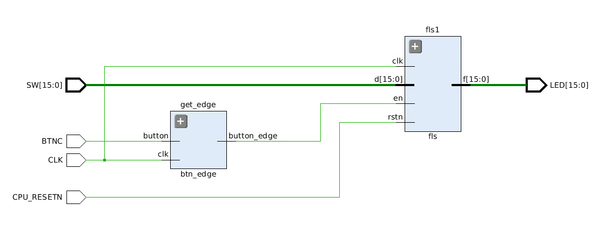

&nbsp;

<div style="text-align:center;font-size:2.5em;font-weight:bold">中国科学技术大学计算机学院</div>

&nbsp;

<div style="text-align:center;font-size:2.5em;font-weight:bold">《计算机组成原理实验报告》</div>

&nbsp;

&nbsp;

&nbsp;

&nbsp;

&nbsp;


&nbsp;

&nbsp;

&nbsp;

&nbsp;

<div style="display:flex;justify-content:center;font-size:2em">
<div>
<p>实验题目：运算器及其应用</p>
<p>学生姓名：刘良宇</p>
<p>学生学号：PB20000180</p>
<p>完成时间：2022. 3. 17</p>
</div>
</div>

<div style="page-break-after:always"></div>

## 实验题目

运算器及其应用

## 实验目的

- 熟练掌握算术逻辑单元 (ALU) 的功能
- 掌握数据通路和控制器的设计方法
- 掌握组合电路和时序电路，以及参数化和结构化的 Verilog 描述方法
- 了解查看电路性能和资源使用情况

## 实验环境

- VLAB：vlab.ustc.eud.cn
- Vivado
- Nexys4DDR

## 实验步骤

### ALU 模块的逻辑设计和仿真

首先需要写一个 ALU

```verilog
module alu #(parameter WIDTH = 32)
            (input [WIDTH - 1: 0] a,
             input [WIDTH - 1: 0] b,      // 两操作数
             input [2:0] s,               // 功能选择
             output reg [WIDTH - 1: 0] y, // 运算结果
             output reg [2:0] f);         // 标志

    wire a_s, b_s;
    assign a_s = ~a[WIDTH - 1];
    assign b_s = ~b[WIDTH - 1];

    always @(*) begin
        f = 3'b000;
        y = 0;
        case (s)
            3'b000: y = a - b;
            3'b001: y = a + b;
            3'b010: y = a & b;
            3'b011: y = a | b;
            3'b100: y = a ^ b;
            3'b101: y = a >> b;
            3'b110: y = a << b;
            3'b111: y = ($signed(a)) >>> b;       // signed
        endcase
        if (s == 3'b000) begin
            f[0] = (a == b ? 1'b1 :1'b0);
            f[1] = {a_s, a} < {b_s, b} ? 1'b1 : 1'b0;
            f[2] = (a < b ? 1'b1 :1'b0);
        end
    end
endmodule
```

ALU 只有组合逻辑电路，写起来相对简单

这里如下两点需要注意：

- 算术右移需要显式指定
- 如何处理有符号数的大小比较

前者 Verilog 提供了内置语法 `>>>`，但需要注意的是需要显示指定前面的操作数为有符号类型，本模块使用了类型转换达成这一目的

对于有符号数的大小比较，这里回顾补码的相关知识，本质是一个抽象代数里的环，这里给正数和 0 的开头补一个 1 即可

下面考虑 ALU 模块的仿真，这里可以直接测试 32 位的 ALU 模块

因为 ALU 的测试单纯是组合逻辑，我们采用 verilator, 使用 C++ 编写 tb，可以实现 100% coverage 的测试

```cpp
// 生成随机数（固定种子确保可复现）
srand(1024);

// 功能函数数组，模拟每一种功能
int (*a[8])(int, int) = { _minus, _add, _and, _or, _xor,
                        l_rshift, lshift, a_rshift };

// 测试每一种功能
for (int s = 0; s < 8; s++) {
    // 测十次
    for (int i = 0; i < 10; i++) {
        top->a = get_rand_i32();	// input 值
        top->b = get_rand_i32();
        top->s = s;
        top->eval();				// 计算，以比较 output
        if (top->y != a[s](top->a, top->b)) {
            cout << "error test case\n";
            cout << "mode: " << s;
        }
        if (s == 0) {
            if (top->f != cmp_f(top->a, top->b)) {
                cout << "error cmp\n";
            }
        }
        tfp->dump(main_time);
        main_time++;
    }
}

std::cout << "test finished\n";
```

这里使用了以下函数模拟 `f` 输出的表现：

```cpp
int cmp_f(int a, int b) {
    // 类似实现 f 的功能
    int res = 0;
    if (a == b)
        res += 1;
    if (a < b)
        res += 2;
    if ((unsigned)a < (unsigned)b) {
        res += 4;
    }
    return res;
}
```

测试：


证明功能实现良好

当然常规 testbench 能得到的波性文件 verilator 也是可以顺便生成的：


### 6 位 ALU 的下载测试

下载测试需要首先编写 `top` 模块

```verilog
module _top(input CLK,
           input CPU_RESETN,
           input BTNC,
           input [15:0] SW,
           output reg [15:0] LED);
    reg [5:0] a;
    reg [5:0] b;
    reg [2:0] s;

    wire en_edge;
    btn_edge get_edge(.clk(CLK), .button(BTNC), .button_edge(en_edge));

    always @(posedge CLK) begin
        if (!CPU_RESETN) begin
            a <= 6'b0;
            b <= 6'b0;
            s <= 3'b0;
        end
        else begin
            if (en_edge) begin
                s <= SW[15:13];
                a <= SW[11:6];
                b <= SW[5:0];
            end
        end
    end

    wire [5:0] out_wire_y;
    wire [2:0] out_wire_f;
    alu #(.WIDTH(6)) alu1(.a(a), .b(b), .s(s), .y(out_wire_y), .f(out_wire_f));

    always @(posedge CLK) begin
        if (!CPU_RESETN) begin
            LED[5:0] <= 6'b0;
            LED[15:13] <= 3'b0;
        end
        else begin
            LED[5:0] <= out_wire_y;
            LED[15:13] <= out_wire_f;
        end

    end

endmodule
```

时序逻辑部分依次判断复位和使能即可

注意对于按钮我们希望去毛刺并只取上升沿

这里编写了一个辅助模块：

```verilog
module btn_edge(input clk,
                    input button,
                    output button_edge);

    reg [15:0] cnt;

    always@(posedge clk) begin
        if (button == 1'b0) begin
            cnt <= 0;
        end
        else begin
            if (cnt < 16'h8000) begin
                cnt <= cnt + 1'b1;
            end
        end
    end

    reg button_1, button_2;
    always @(posedge clk) begin
        button_1 <= cnt[15];
        button_2 <= button_1;
    end

    assign button_edge = button_1 & ~button_2;
endmodule
```

利用计数器去毛刺，利用 `button_1 & ~button_2` 保证只会因为上升沿产生一个脉冲信号

查看 RTL 电路图：


使用资源报告：


性能报告：


下面生成比特流，上板子即可（这里线下检查时已经测试过，不再附图）

### FLS 设计仿真下载

首先需要明确如何计算斐波那契数列：

```python
a = int(input()); b = int(input())
for i in range(n):
    a, b = b, a + b
    print(b)
```

所以应该需要两个寄存器 `a` 和 `b` 分别储存这两个计算过程中需要的变量

状态机设计上，需要有状态使得输入值存到 `a`, 输入值存到 `b` 以及计算数列下一项

画出下列状态转换图：


进行编码：

```verilog
parameter S_LOAD_0 = 2'b00;		// 初始状态，等待载入第一个数
parameter S_LOAD_1 = 2'b01;     // 等待载入第二个数
parameter S_WAIT   = 2'b10;     // 等待使能
```

两段式状态机的组合逻辑部分就容易写出：

```verilog
always @(*) begin
    case (curr_state)
        S_LOAD_0: next_state = en? S_LOAD_1 : S_LOAD_0;
        S_LOAD_1: next_state = en? S_WAIT : S_LOAD_1;
        S_WAIT:   next_state = S_WAIT;
        default:  next_state = S_LOAD_0;
    endcase
end
```

状态转换需要考虑复位：

```verilog
always @(posedge clk) begin
    curr_state <= (~rstn)? S_LOAD_0 : next_state;
end
```

下面根据状态处理输入输出即可。输出根据状态判断连到哪个寄存器即可

```verilog
// 输出逻辑
always @(*) begin
    case (curr_state)
        S_LOAD_1 :
            f = a;
        S_WAIT:
            f = b;
        default:
            f = 0;
    endcase
end

// 载入逻辑
always @(posedge clk) begin
    if (en) begin
        case (curr_state)
            S_LOAD_0:
                a <= d;
            S_LOAD_1:
                b <= d;
            S_WAIT: begin
                a <= b;
                b <= a + b;
            end
        endcase
    end
end
```

接下来考虑该 FLS 模块的仿真，还是使用 verilator，这里我们进行 16 位 FLS 的测试

编写测试文件，测试初始载入两个值 1, 2 后的模块表现，并测试复位

```cpp
// 初始化，默认有效
top->rstn = 1;
main_time = 3;
top->eval();
tfp->dump(main_time);

while (!Verilated::gotFinish() && main_time < sim_time / 2 + 1) {
    top->en = main_time % 12 < 2 ? 1 : 0;  // 每一定时间产生使能信号
    top->clk = main_time % 2;              // 模拟时钟
    top->d = main_time < 20 ? 1 : 2;        // 依次载入 1 和 2
    top->eval();                           // 仿真时间步进
    tfp->dump(main_time);                  // 波形文件写入步进
    main_time++;
}

top->clk = 1;
top->rstn = 0;  // 测试复位
top->eval();
tfp->dump(main_time);
main_time++;
top->rstn = 1;

while (!Verilated::gotFinish() && main_time < sim_time) {
    top->clk = main_time % 2;              // 模拟时钟
    top->en = main_time % 12 < 2 ? 1 : 0;  // 每一定时间产生使能信号
    top->eval();                           // 仿真时间步进
    tfp->dump(main_time);                  // 波形文件写入步进
    main_time++;
}

std::cout << "test finished\n";
```

从 $t=0$ 开始观察波形：


随着 `en` 每次触发， `f` 输出依次变为 1, 2, 3, 5, 8, 13... 符合条件

观察复位信号：


成功起到复位作用，开始计算 2, 2, 4, 6, 10, ...

接下来补上 `top` 模块后进行实际测试：

```verilog
module top(input CLK,
           input CPU_RESETN,
           input BTNC,
           input [15:0] SW,
           output [15:0] LED);

    // 去毛刺取边沿
    wire en_edge;
    btn_edge get_edge(.clk(CLK), .button(BTNC), .button_edge(en_edge));

    // 连接 fls 模块
    fls fls1(.clk(CLK), .rstn(CPU_RESETN), .en(en_edge), .d(SW), .f(LED));
endmodule
```

RTL 电路图：



使用资源报告：


性能报告：


下载过程已经线下检查，不再附图

### 32 位 ALU 的下载测试

为此需要设计如何读取数据

因为开关一共有 16 个，所以我们把数据分成五部分读入：

`a[15:0], a[31:16], b[15:0], b[31:16], s[2:0]`

考虑到 Nexys4 DDR 刚好有五个按钮，这里根据按下的是哪个按钮设置当前读入的是哪个寄存器

当没有按钮按下时，这个时候可以通过 LED 灯读出输出

sw[15], sw[14] 拉下代表显示高位，低位，如果二者都没有拉下，那么默认显示 f

因为思路比较简单，不涉及状态机，且此部分已经检查过，报告不再赘述，代码见附件

## 总结与思考

- 本次实验使我基本熟练掌握算术逻辑单元 (ALU) 的功能，复习组合电路和时序电路的一般设计方法，以及参数化和结构化的 Verilog 描述方法，了解查看电路性能和资源使用情况的方法
- 本次实验难易程度适中
- 本次实验任务量设置略有不合理，可以考虑直接设计 32 位 ALU
