&nbsp;

<div style="text-align:center;font-size:2.5em;font-weight:bold">中国科学技术大学计算机学院</div>

&nbsp;

<div style="text-align:center;font-size:2.5em;font-weight:bold">《计算机组成原理实验报告》</div>

&nbsp;

&nbsp;

&nbsp;

&nbsp;

&nbsp;


&nbsp;

&nbsp;

&nbsp;

&nbsp;

<div style="display:flex;justify-content:center;font-size:2em">
<div>
<p>实验题目：寄存器堆与存储器及其应用</p>
<p>学生姓名：刘良宇</p>
<p>学生学号：PB20000180</p>
<p>完成时间：2022. 3. 27</p>
</div>
</div>

<div style="page-break-after:always"></div>

## 实验题目

寄存器堆与存储器及其应用

## 实验目的

- 掌握寄存器堆和存储器的功能、时序及其应用
- 熟练掌握数据通路和控制器的设计和描述方法

## 实验环境

- VLAB：vlab.ustc.eud.cn
- Vivado
- Nexys4DDR

## 实验步骤

### 寄存器堆功能仿真

此部分需要完成 32x32 位的寄存器堆的功能仿真

- 寄存器堆的 0 号寄存器内容恒定为零
- 寄存器堆的写操作优先于读操作

在原有寄存器堆代码上稍作修改即可：

```verilog
// 保证异步读能做到写优先
assign rd0 = (ra0 == wa) && we ? wd : rf[ra0];
assign rd1 = (ra1 == wa) && we ? wd : rf[ra1];

// 0 号寄存器设置
always @(*) begin
    rf[0] = 0;
end

// 同步写
always @(posedge clk)
    if (wa !== 0 && we)
        rf[wa] <= wd;
```

完成之后即可进行仿真。这里使用 Verilator, 具体仿真文件及波形可以见附件，这里贴上最后波形：

根据 `we` ，依次写入 02，04，06 等位置，这里可以观察到 `rd1` 和 `wd` 是一致的，具备写优先

同时 `rd0` 是延后了一个周期观察到数据，可以看到是正常的

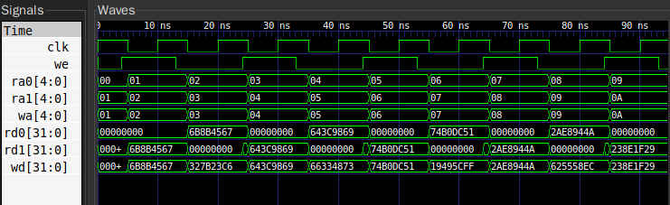

后续再次从 0 开始读内存值，保持了一开始写的值：

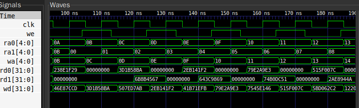

### RAM IP 核的功能仿真和对比

此部分要求分别使用分布式和块式的 RAM IP 核，进行功能仿真，并对比

- 分布式和块式存储器的读操作
- 块式存储器写操作优先和读操作优先

这里我们选择一个模块里例化三个 ip 核，并对该模块仿真

例化过程实验文档已经给出，故这里不再展示

模块代码：

```verilog
module ram_ip(
  input clk,
  input we,
  input [7:0] a,
  input [15:0] d,
  output [15:0] spo,
  input ena,
  output [15:0] spo1,
  output [15:0] spo2);
    
  dist_mem_single dist (
    .a(a),      // input wire [7 : 0] a
    .d(d),      // input wire [15 : 0] d
    .clk(clk),  // input wire clk
    .we(we),    // input wire we
    .spo(spo)   // output wire [15 : 0] spo
  );
  
  blk_single_write_first blk_write (
    .clka(clk),   // input wire clka
    .ena(ena),    // input wire ena
    .wea(we),     // input wire [0 : 0] wea
    .addra(a),    // input wire [7 : 0] addra
    .dina(d),     // input wire [15 : 0] dina
    .douta(spo1)  // output wire [15 : 0] douta
  );
  
  blk_mem_read_first blk_read (
    .clka(clk),    // input wire clka
    .ena(ena),     // input wire ena
    .wea(we),      // input wire [0 : 0] wea
    .addra(a),     // input wire [7 : 0] addra
    .dina(d),      // input wire [15 : 0] dina
    .douta(spo2)   // output wire [15 : 0] douta
  );
endmodule
```

下面编写仿真文件：

```verilog
module ram_ip_sim();

reg clk, we;
reg [7:0] a;       // address
reg ena;           // only for block mem
reg [15:0] d;      // data

wire [15:0] spo;   // dis
wire [15:0] spo1;  // blk_write_first
wire [15:0] spo2;  // blk_read_first

ram_ip test_top (.clk(clk), .we(we), .a(a), .ena(ena), .d(d), .spo(spo), .spo1(spo1), .spo2(spo2));

// 时钟，周期为 10
initial begin
    clk = 1;
    forever begin
        #5 clk = ~clk;
    end
end

// 地址，每两个周期更新一次
initial begin
    a = 0;
    #13 a = 1;
    forever begin
        #20 a = a + 1;
    end
end

// 地址使能，这里我们需要观察储存器情况，所以直接置换 1
initial begin
    ena = 1;
end

// 16 位数据
initial begin
    d = $urandom();
    #13 d = $urandom();
    forever begin
        #20 d = $urandom();
    end
end

// 写使能，两个周期一组，取第一组的上升沿
initial begin
    we = 1;
    #3 we = 0;
    forever begin
        #10 we = ~we;
    end
end

endmodule
```

下面直接对波形文件进行分析：

`spo, spo1, spo2` 分别是分布式，写优先块和读优先块：

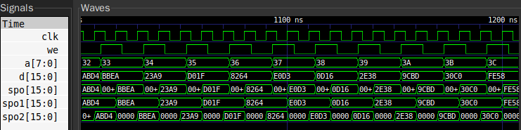

可以看到：

- 对于分布式 ram，spo 是异步读取的，相当于组合逻辑，而写入是同步的，写入之后，读取 spo 得到的是刚刚写入的值（相当于原先值直接被同步的写入操作覆盖了）

- 块式存储器的 spo 是同步读取，如果当前上升沿有写使能，那么
  - 写操作优先读出的是正在写的数据
  - 读操作优先读出的是对应地址之前的数据
  
  并且二者的值都会稳定持续一个周期

### 排序电路

#### 总览

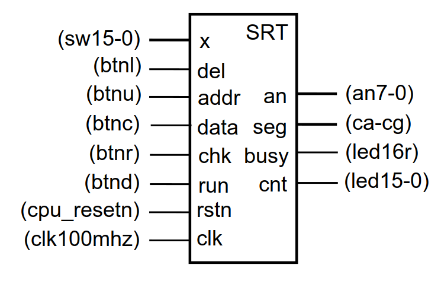

本部分要求：

- 采用分布式双端口存储器保存数据，例化时可以初始化数据
- 利用 chk 查看数据，数码管显示存储器的地址和数据
- 利用 x、del、addr、data 设置地址和修改数据
- run 启动排序, 同时启动时钟计数 cnt，busy 置 1
- 排序时不能人工查看和修改数据
- 排序结束后停止计数，busy 清零

这里先看一下最后的文件结构

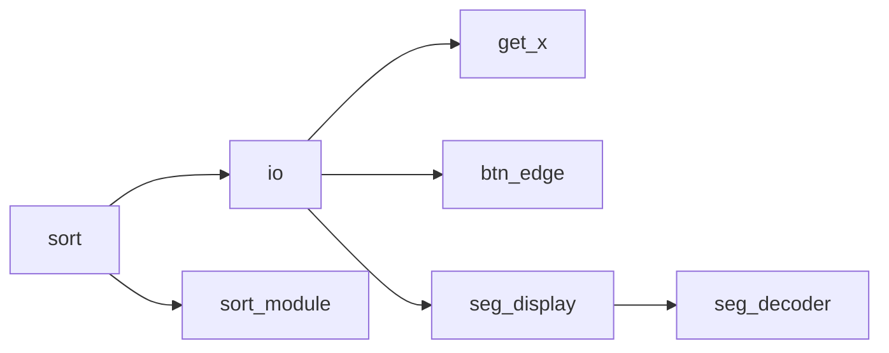

总排序模块分为排序逻辑和 io 逻辑两部分，这两个部分都需要使用 RAM 读取 / 写入数据，所以总 sort 模块便根据当前的状态调配 RAM 的端口归哪一部分使用

io 部分需要根据当前的地址和数据，取按钮，开关数据，并正确在数码管，LED 上显示内容，这一部分逻辑比较庞杂，因此编写了一些辅助模块

sort_module 本身的工作比较清晰，只需要操作一个 RAM，完成对它内部数据的排序即可

两个部分彼此之前的切换通过在完成了各自的工作后发送脉冲信号，交由主 sort 模块调配实现

#### 输入输出

此时显示的地址和值都可以被修改，故使用 reg 型，初始置值为 0

但值默认应该是从地址处读出的数据，只有当有输入时才会显示寄存器中的值

所以设默认状态 $S_0$ ，显示的数据是 RAM 读出的数据，显然 chk 操作并不会改变状态，仅仅切换内存地址

但如果输入了 x ，之后就是显示可以修改的寄存器数字的状态，此时 del 有意义，可以操作寄存器值

方便起见，认为用户在输入完之后只有两种操作，data 或者 addr，data 会在写入数据后，进入下一个地址，并回到 $S_0$ 状态，addr 则会更改地址寄存器的值后进入 $S_0$

此外，还需要一个 $S_2$ 状态，此时在等待排序，相当于默认的复位状态，无法使用 RAM 资源，默认显示全零

所以可以得出以下的状态转换图：

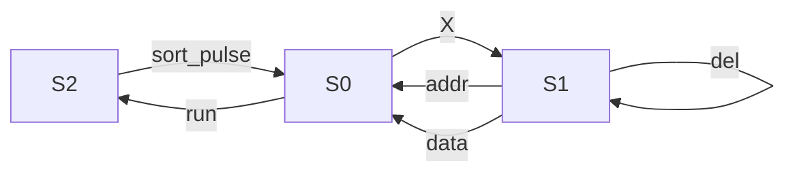

此外，因为 $S_2$ 正好就是等待排序完成的状态，所以排序所用时钟周期也可以在这里统计

具体代码见附件，这里不再完整贴上，只附上状态机的转换逻辑：

```verilog
parameter S_CHK     = 2'b00;		// 初始状态，查看数据
parameter S_INPUT   = 2'b01;		// 输入数据状态
parameter S_WAIT    = 2'b10;		// 等待排序结束状态

always @(*) begin
    case (cur_state)
        S_INPUT: begin
            nxt_state = (set_addr_IO || set_data_IO)? S_CHK : S_INPUT;
        end
        S_WAIT: begin
            nxt_state = sort_end ? S_CHK : S_WAIT;
        end
        default: begin  // S_CHK
            if (x_pulse)
                nxt_state = S_INPUT;
            else if (run_IO)
                nxt_state = S_WAIT;
            else
                nxt_state = S_CHK;
        end
    endcase
end
```

#### 排序模块

默认是等待用户按下 run 按钮的的 $S_0$ 状态，接收到 run 后进入排序状态，之后等待排序完成，回到 $S_0$ 状态并发送一个脉冲信号 finish

排序的算法有多种方案：

- 原地排序，比如冒泡排序。好处：只会带来 $O(1)$ 的空间开销，坏处是速度比较慢
- 并行全比较排序。好处：充分利用硬件资源和 FPGA 的并行特性，坏处是占用空间过大
- 基数排序等其他排序算法，速度比冒泡排序快，只占用 $O(n)$ 以下的额外空间

经过综合比较后，考虑对于当前数据规模，采取冒泡排序这一原地排序算法比较合理，不占用过多存储资源：

```cpp
void bubble_sort(int* a, int n) {
    for (bool sorted = false; sorted = !sorted; n--)
        for (int i = 1; i < n; i++)
            if (a[i - 1] > a[i]) {
                swap(a[i - 1], a[i]);
                sorted = false;
            }
}
```

需要额外三个寄存器，n, i 和 sorted 记录排序状态

这里 n 默认是 255， n1 如果下标和 n 相等那么这一轮循环就结束了。下面给出状态图：

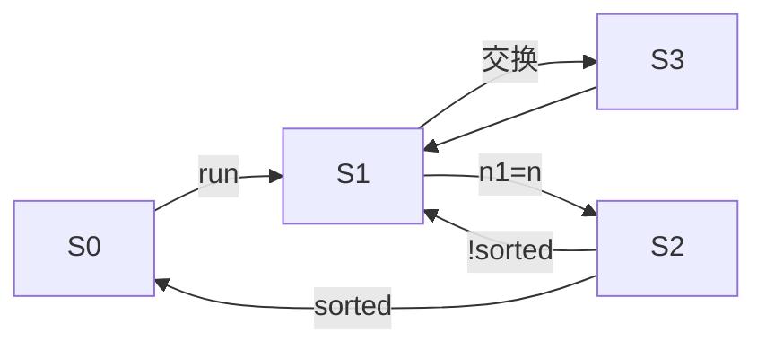

$S_0$ 是初始状态，$S_1$ 是比较状态，比较状态每次下标都会自增，当 n1=n 时跳转进入 $S_2$ ，根据这一次循环有没有出现交换判断是缩减 n，继续下一轮循环还是直接结束

对于交换，因为需要写入两个数字，所以必须额外多一个状态 $S_3$

这一部分是实验的核心，附上一些代码：

状态机转换：

```verilog
parameter S_WAIT   = 2'b00;		// 等待数据写入，初始状态
parameter S_CMP    = 2'b01;		// 主要的比较状态
parameter S_LOOP   = 2'b10;     // 每次循环结束后判断
parameter S_EXCH   = 2'b11;     // 交换状态

always @(*) begin
    case (cur_state)
        S_WAIT:
            nxt_state = run? S_CMP : S_WAIT;
        S_CMP: begin
            if (i1 == n)
                nxt_state = S_LOOP;
            else if (cmp_left > cmp_right)
                nxt_state = S_EXCH;
            else
                nxt_state = S_CMP;
        end
        S_LOOP:
            nxt_state = sorted? S_WAIT : S_CMP;
        S_EXCH:
            nxt_state = S_CMP;
    endcase
end
```

核心交换逻辑，这里因为我们只有两个周期的时间，所以必须抓紧利用，对于时序上的一些问题采取额外寄存器解决：

```verilog
// i1 和 temp, 当需要交换的时候延缓一个周期，先更改 i1 处的值
always @(posedge clk) begin
    if (!rstn || LOOP_END)
        i1 <= 8'b0;
    else if (cur_state == S_CMP) begin
        if (cmp_left <= cmp_right)
            i1 <= i1 + 1;
        else begin
            temp <= cmp_left;
        end
    end
    else if (cur_state == S_EXCH) begin
        i1 <= i1 + 1;
    end
end

// d 和 we
always @(posedge clk) begin
    if (cur_state == S_CMP && cmp_left > cmp_right && i1 !== n) begin
        d <= cmp_right;
        we <= 1;
        ex_pulse <= 0;
    end
    else if (cur_state == S_EXCH) begin
        d <= temp;
        we <= 1;
        ex_pulse <= 1;
    end
    else begin
        d <= 16'b0;
        we <= 0;
        ex_pulse <= 0;
    end
end
```

对于交换逻辑而言：

- 排序状态结束，i1 并不增加，这样下一个上升沿可以写入 i1
- 交换状态结束，i1 在交换状态增加，这样下一个上升沿可以写入第二个数字
- 再次回到排序状态，这个时候 spo 读到的还是 RAM 原来的值，而不是新写入的值，所以需要 ex_pulse 来通知排序状态具体用什么数字比较

```verilog
reg ex_pulse;           // 交换产生一个脉冲，告诉 cmp 应该用 d 代替 spo
wire [15:0] cmp_left = ex_pulse? d : spo;
wire [15:0] cmp_right = dpo;
```

#### top

接下来分析一下顶层的 sort 模块

顶层也有一个状态机，但只有两个状态，比较简单，分别是读取状态和排序状态

```verilog
parameter S_IO     = 1'b0;		// 等待数据写入，初始状态
parameter S_SORT   = 1'b1;		// 排序状态
always @(posedge clk) begin
    if (!rstn)
        cur_state <= S_IO;
    else
        cur_state <= nxt_state;
end

always @(*) begin
    case (cur_state)
        S_IO: begin
            if (run_IO)
                nxt_state = S_SORT;
            else
                nxt_state = S_IO;
        end
        S_SORT: begin
            if (sort_end)
                nxt_state = S_IO;
            else
                nxt_state = S_SORT;
        end
    endcase
end
```

接收到子模块发送的脉冲信号后切换状态

之所以要区分状态主要是为了规划 RAM 读写端口的使用：

```verilog
assign a = cur_state == S_IO? a_IO : a_sort;
assign d = cur_state == S_IO? d_IO : d_sort;
assign we = cur_state == S_IO? we_IO : we_sort;
```

总状态图：

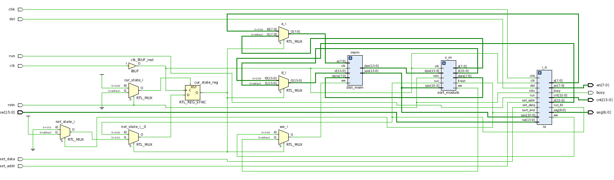

性能报告：

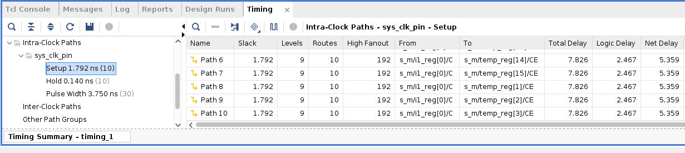

至此设计部分结束，下面开始仿真和实际测试

#### 仿真模拟

由于实际测试已经线下完成，此部分仅就 sort_module 这一排序的核心模块进行仿真测试

为此需要编写一个辅助的 sort_sim.v ，仅仅把排序模块和寄存器连接：

```verilog
module sort_sim (
        input  clk,         // clk
        input  rstn,        // cpu_rstn
        input  run,		    // btnd, 启动排序
        input  init,     // 是否由仿真器控制寄存器
        input  [7:0] v_a,
        input  [15:0] v_d,
        input  v_we,
        output sort_end
    );
    wire [7:0] dpra;
    wire [15:0] spo, dpo;          // 这些不存在竞争问题
    wire [7:0] a, a_sort;
    wire [15:0] d, d_sort;
    wire we, we_sort;
    assign a = init? v_a : a_sort;
    assign d = init? v_d : d_sort;
    assign we = init? v_we : we_sort;
    dist_mem mem (
                 .a(a),        // read/write address input
                 .d(d),        // write data input
                 .dpra(dpra),  // read address input
                 .clk(clk),    // input wire clk
                 .we(we),      // input wire we
                 .spo(spo),    // output wire [15 : 0] spo
                 .dpo(dpo)    // output wire [15 : 0] dpo
             );
    sort_module s_m (.clk(clk), .rstn(rstn), .run(run), .spo(spo), .dpo(dpo), .a(a_sort), .d(d_sort), .we(we_sort), .dpra(dpra), .finish(sort_end));
endmodule
```

使用 Verilator 仿真，仿真代码：

```cpp
// 仿真过程
top->clk = (main_time % 10) < 5 ? 1 : 0;  // 时钟
top->rstn = main_time <= 1 ? 0 : 1;       // 初始复位
// 一开始需要 256 个周期写入随机数，2560 tick
top->run = (main_time > 2565 && main_time < 2575) ? 1 : 0;
top->init = (main_time < 2565) ? 1 : 0;
top->v_we = 1;
top->v_a =
    (main_time > 5 && main_time < 2565) ? (main_time - 5) / 10 : 0;
top->v_d = get_vd(main_time);
```

其中 vd 是随机生成的数字，用来写入 RAM：

```cpp
int get_vd(vluint64_t time) {
    // 每上升沿周围保持稳定（如 5 到 15）
    // 返回的是一个 32 位的随机数
    if (time >= 2565)
        return 0;
    static int res = 0;
    if (time % 10 == 5)
        res = rand() + (rand() % 2 ? (1 << 31) : 0);
    return res;
}
```

仿真总过程如图所示（这里一个周期 10ps），前 256 周期写入数据，之后到 50000 周期左右排序完毕

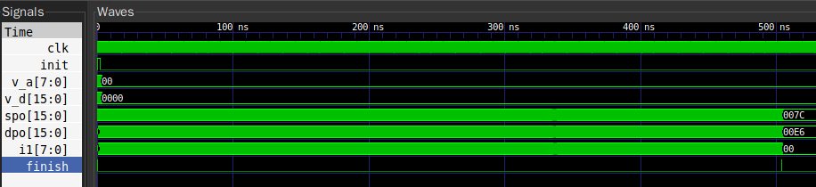

查看排序最后几个周期，应该是因为该次遍历元素已然有序才退出的：

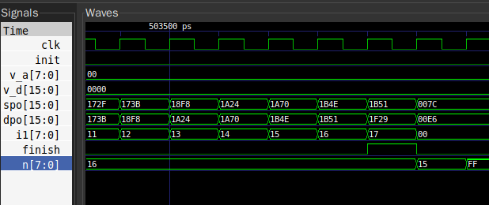

的确如此，注意最后时刻 n = 16，i1 在遍历了 0 到 16 后确认这些相邻数对之间已经全部有序，（spo 已经全部小于 dpo），所以产生了 finish 信号，n 和 i1 也正常复位

#### 复杂度分析

- 最坏情况，数组完全逆序，需要 $n^2/2$ 次交换，注意本文代码对于非交换耗费一个周期，交换则是两个周期，所以最坏恰好 $n^2=65536$ 个周期
- 近乎有序时，当排完就会触发 sorted ，所以这个时候最短可能只需要 256 个周期遍历一遍
- 平均复杂度 $O(n^2)$

#### 改进思考

事实上还可以充分利用 RAM 可以双端口读的特性，对相邻几个数已经有序的情形做进一步的优化，但那样会大大增加状态机的复杂度，故本文没有实现

## 总结与思考

- 本次实验增强了我的数据通路设计和代码编写及调试能力
- 本次实验难度较大，与上一个实验之间的跨度不太合理
- 本次实验文档说明不够清晰，希望可以改进
- 本次实验任务量设置较大
