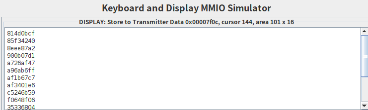

&nbsp;

<div style="text-align:center;font-size:2.5em;font-weight:bold">中国科学技术大学计算机学院</div>

&nbsp;

<div style="text-align:center;font-size:2.5em;font-weight:bold">《计算机组成原理实验报告》</div>

&nbsp;

&nbsp;

&nbsp;

&nbsp;

&nbsp;


&nbsp;

&nbsp;

&nbsp;

&nbsp;

<div style="display:flex;justify-content:center;font-size:1.8em;line-height:2em">
<div>
<p style="padding-bottom:5px">实验题目：</p>
<p style="padding-bottom:5px">学生姓名：</p>
<p style="padding-bottom:5px">学生学号：</p>
<p style="padding-bottom:5px">完成时间：</p>
</div>
<div style="text-align: center;">
<p style="border-bottom: 1px solid; padding-bottom:4px">汇编程序设计</p>
<p style="border-bottom: 1px solid; padding-bottom:4px">刘良宇</p>
<p style="border-bottom: 1px solid; padding-bottom:4px">PB20000180</p>
<p style="border-bottom: 1px solid; padding-bottom:4px">2022. 4. 1</p>
</div>
</div>


<div style="page-break-after:always"></div>

## 实验题目

汇编程序设计

## 实验目的

- 了解汇编程序的基本结构，以及汇编程序仿真和调试的基本方法
- 熟悉 RISC-V 常用 32 位整数指令的功能，掌握简单汇编程序的设计，以及 CPU 下载测试方法和测试数据 (COE 文件) 的生成方法

## 实验环境

- Ubuntu 21.10
- RARS 533d3c0
  - Memory-Mapped Input and Output

## 实验练习

### 指令功能测试

#### 汇编程序设计

需要测试 add, addi, sub, auipc, lw, sw, beq, blt, jal, jalr

下面编写示例程序单步查看以进行测试：

首先使用 lw 读入，然后依次测试 add, addi, sub, auipc

在测试这些指令的间隙插入对跳转指令 beq, blt, jal, jalr 的测试

最后测试 sw，观察存储器的值

故编写汇编程序如下：

```assembly
.data
NUMBER0:  .word  0xffffffff		# 第一个字
NUMBER1:  .word  0x000000ff		# 第二个字

.text
lw	t0, NUMBER0
lw	t1, NUMBER1
add 	t2, t0, t1
addi	t2, t2, -0xff
SUB:
sub	t3, t0, t1
beq	t0, t1, SUB
beq	t0, t0, NEXT
nop
NEXT:
auipc	t4, 16
auipc   t6, 0
addi	t6, t6, 24
ble	t1, t0, NEXT2
ble	t0, t1, NEXT2
NEXT2:
jal	t5 NEXT3
NEXT3:
jalr 	t6			# 应该跳转到下一条指令
sw	t1, NUMBER0, t6
sw	t0, NUMBER1, t6
```

下面使用单步执行查看结果

|          <span style="font-weight:normal">lw</span>          |         <span style="font-weight:normal">add</span>          |
| :----------------------------------------------------------: | :----------------------------------------------------------: |
|  |  |
|                             addi                             |                             sub                              |
|  |  |
|                 auipc（保存左移 12 位加 pc）                 |                      beq（相等才跳转）                       |
|  |  |
|                    blt（小于等于才跳转）                     |                     jal（保存地址到 t5）                     |
|  |  |
|            jalr（根据寄存器存的地址跳转，并链接）            |                      sw（成功保存交换）                      |
|  |  |

#### COE 文件生成

参考 PPT 步骤即可


### 汇编程序实现数组排序

- 对存储器例化时初始化的数组排序，并将结果输出到显示器
- 选项：随机生成或键盘输入数组（第一个数是数组的大小，随后为数组的数据）

#### 排序设计

参考冒泡排序：

```cpp
void bubble_sort(int* a, int n) {
	for (bool sorted = false; sorted = !sorted; n--)
		for (int i = 1; i < n; i++)
			if (a[i - 1] > a[i]) {
				swap(a[i - 1], a[i]);
				sorted = false;
			}
}
```

仿照翻译成汇编即可

```assembly
.data
.word 0x814d0bcf
.word 0x900b07d1
.word 0xc5246b59
.word 0x85f34240
.word 0xf0648f06
.word 0xa726af47
.word 0x59e970a2
.word 0x79f57ff2
.word 0x4dd57a20
.word 0x6ffe43a2
.word 0x8eee87a2
.word 0xa96ab6ff
.word 0x3bbbd029
.word 0xaf1b67c7
.word 0xaf3401e6
.word 0x35336804

.text
andi	t1, t1, 0	# sorted
addi	t0, zero, 17	# set n to array size + 1
OUTER:
addi	t0, t0, -1
xori	t1, t1, 1
beqz	t1, END
addi	t2, zero, 0	# i = 0
INNER:
addi	t2, t2, 1	# init: i = 1
bge	t2, t0, OUTER
addi	t5, t2, -1
slli	t5, t5, 2
lw	t3, (t5)
slli	t6, t2, 2
lw	t4, (t6)
ble	t3, t4, INNER	# 否则需要交换
sw	t3, (t6)
sw	t4, (t5)
addi	t1, zero, 0
j	INNER
j	OUTER
END:
nop			# sorted
```

这里是对 16 个数据进行冒泡排序

排序结果：


随后需要将结果逐个输出到显示器：

```assembly
READY: .word 0x00007f08
DATA:  .word 0x00007f0c
......

# 遍历数组，ready bit 为 1 时写入数据
andi	t0, t0, 0	# t0 =  &a[0]
DISP:
# 小于 64, 则取出这个数，存到 t5
srli	t4, t0, 6
bnez	t4, FINISH
lw	t5, (t0)
# 依次右移 28, 24, ...0 后取低 4 位
addi 	t3, zero, 28
BYTE:
blt	t3, zero, LF
srl	t4, t5, t3
andi	t4, t4, 15
# 根据 t4 的值判断写出什么
addi	t6, zero, 10
blt	t4, t6, NUMBER
# 这里写出 a 到 f
addi	t4, t4, 87
j	DISBYTE
NUMBER:
# 这里写出数字
addi	t4, t4, 48
DISBYTE:
# t4 已经存 ascii，等待 READY
WAIT:
lw	t1, READY
lw	t1, (t1)
beqz	t1, WAIT
lw	t1, DATA
sw	t4, (t1)
addi	t3, t3, -4
j BYTE
# 写入换行
LF:
lw	t1, READY
lw	t1, (t1)
beqz	t1, LF
addi	t2, zero, 10
lw	t1, DATA
sw	t2, (t1)
addi	t0, t0, 4	# next number
j	DISP
FINISH:
nop
```

测试结果：



## 总结与思考

- 本次实验使我基本熟悉了 risc-v 汇编程序的设计
- 实验文档说明不够清晰
