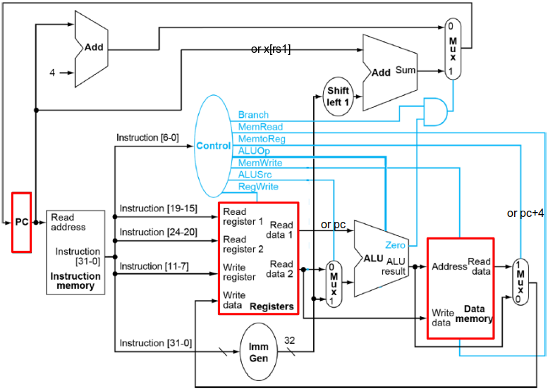
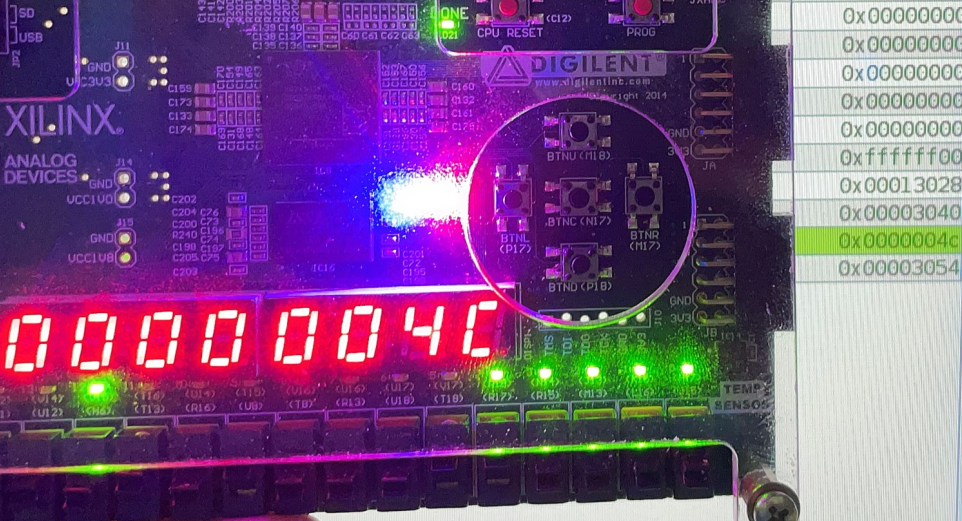
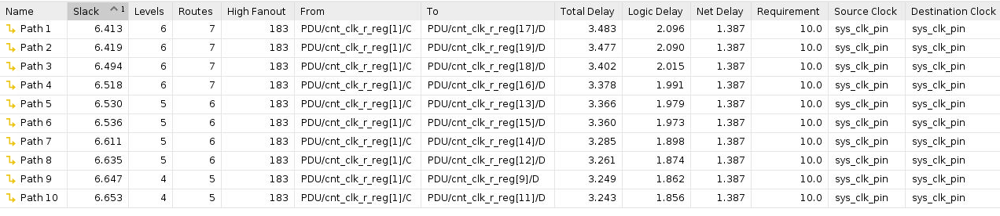

&nbsp;

<div style="text-align:center;font-size:2.5em;font-weight:bold">中国科学技术大学计算机学院</div>

&nbsp;

<div style="text-align:center;font-size:2.5em;font-weight:bold">《计算机组成原理实验报告》</div>

&nbsp;

&nbsp;

&nbsp;

&nbsp;

&nbsp;


&nbsp;

&nbsp;

&nbsp;

&nbsp;

<div style="display:flex;justify-content:center;font-size:1.8em;line-height:2em">
<div>
<p style="padding-bottom:5px">实验题目：</p>
<p style="padding-bottom:5px">学生姓名：</p>
<p style="padding-bottom:5px">学生学号：</p>
<p style="padding-bottom:5px">完成时间：</p>
</div>
<div style="text-align: center;">
<p style="border-bottom: 1px solid; padding-bottom:4px">单周期 CPU 设计</p>
<p style="border-bottom: 1px solid; padding-bottom:4px">刘良宇</p>
<p style="border-bottom: 1px solid; padding-bottom:4px">PB20000180</p>
<p style="border-bottom: 1px solid; padding-bottom:4px">2022. 4. 11</p>
</div>
</div>


<div style="page-break-after:always"></div>

## 实验题目

单周期 CPU 设计

## 实验目标

- 理解单周期 CPU 的结构和工作原理
- 掌握单周期 CPU 的设计和调试方法
- 熟练掌握数据通路和控制器的设计和描述方法

## 实验环境

- Ubuntu 21.10
- Vlab
- Vivado 2019.1

## 实验练习

### 设计单周期 CPU 及逐条指令功能测试

- add, addi, sub, auipc, lw, sw, beq, blt, jal, jalr

- 指令存储器和数据存储器采用 IP 例化的分布式存储器，容量均为 256x32 位，使用 LabH3 实验步骤 1 生成的 COE 文件初始化
- 寄存器堆和数据存储器各增加一个用于调试的读端口
- MMIO 的起始地址为 0

#### 单周期 CPU 的设计



在原有数据通路的基础上略做修改，主要是为了适应 auipc, jal, jalr 指令

为此，需要微调控制信号 control_alu_src1, control_alu_src2, control_pc_add_src, control_wb_reg_src 

此外，alu_op 需要区分加法和减法，所以这里 control 模块还额外增添了 IR[30] 的输入

control_jump 的增加用于实现 jal 和 jalr，与分支不同，这两条指令一定会进行跳转

整体文件结构如下：

```plaintext
top_cpu.v
├── cpu.v
│   ├── imm_extend.v
│   ├── mem_wrapper.v
│   ├── register_file.v
│   ├── alu.v
│   └── control.v
└── pdu.v
```

- imm_extend.v 立即数拓展，判断完拓展类型后即可对照处理

  ```verilog
  wire [31:0] imm12_i = {{20{ir[31]}}, ir[31:20]};
  wire [31:0] imm12_r = {{20{ir[31]}}, ir[31:25], ir[11:7]};
  wire [31:0] imm13_b = {{20{ir[31]}}, ir[7], ir[30:25], ir[11:8], 1'b0};
  wire [31:0] imm21_j = {{12{ir[31]}}, ir[19:12], ir[20], ir[30:21], 1'b0};
  wire [31:0] imm32_u = {ir[31:12], 12'b0};
  ```

- mem_wrapper.v 数据寄存器和 mmio 的包装，用于对于数据通路上的数据寄存器部分

- register_file.v 寄存器文件，之前实验内容，此处不再赘述

- control.v 生成控制信号，控制信号做的修改上文已经叙述，这个模块只要分别对每个指令判断即可

  ```verilog
  wire is_branch = (ir == 7'b1100011);
  wire is_lw     = (ir == 7'b0000011);
  wire is_sw     = (ir == 7'b0100011);
  wire is_jal    = (ir == 7'b1101111);
  wire is_jalr   = (ir == 7'b1100111);
  wire is_auipc  = (ir == 7'b0010111);
  wire is_sub    = (ir == 7'b0110011);
  wire is_addi   = (ir == 7'b0010011);
  
  assign control_branch     = is_branch;                              // 是否是跳转指令
  assign control_mem_read   = is_lw;                                  // 是否读数据主存
  assign control_mem_write  = is_sw;                                  // 是否写数据主存
  assign control_pc_add_src = is_jalr;                                // 是否 pc 从寄存器堆获取数据
  assign control_alu_src1   = is_auipc;                               // auipc, alu 需要 pc 和 imm 运算
  assign control_alu_src2   = is_auipc | is_addi | is_lw | is_sw;     // 立即数运算
  assign control_reg_write  = ~(is_branch | is_sw);                   // 是否写回寄存器
  
  reg [1:0] wb_signal;
  assign control_wb_reg_src = wb_signal;
  always@(*) begin
      wb_signal = 0;                  // 默认 0, 用 alu 运算结果
      if (is_lw) wb_signal = 2'b01;   // 访存
      else if (is_jal | is_jalr) begin 
          wb_signal = 2'b10;          // 用下一个 pc
      end
  end
  
  assign control_alu_op = ((is_sub & ir30) | is_branch)? 3'b0 : 3'b1;
  ```

- cpu.v 实例化以上模块后连接即可。详细见附件

#### 逐条指令测试

直接根据 coe 文件对照下载测试即可，这里附上实际测试结果和 RARS 结果进行比对

|  |  |  |
| ------------------------------------------------------------ | ------------------------------------------------------------ | ------------------------------------------------------------ |

表现符合预期

### 排序程序测试

- 使用 LabH3 实验步骤 2 生成的 COE 文件初始化
- MMIO 的起始地址为 0xff00
- 查看电路资源使用情况和电路性能

#### 功能展示

这里我们展示查询式输出（MMIO）

|  |  |
| ------------------------------------------------------------ | ------------------------------------------------------------ |
|  |  |

随着拨动开关，数字有序输出

完整检查过程已于线下完成，这里不再赘述

#### 电路资源使用


#### 综合电路性能



## 总结与思考

- 本次实验使我理解了单周期 CPU 的设计，加深了对数据通路的理解
- 本次实验实验文档模糊，数据通路 + 控制器的图片不切合实际，模块接口说明不够清晰，PDU 模块在实验中途才给出，希望能够改进
- 优化与实验 3 的衔接。实验 3 的 MMIO 起始地址为 0x7f00 而不是 0xff00，并且在输出时需要转为 ASCII 码后输出，与本实验的要求有较大出入，且第一问的 MMIO 起始地址为 0 似乎没有意义，可以和 7f00 统一

